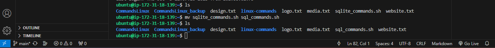
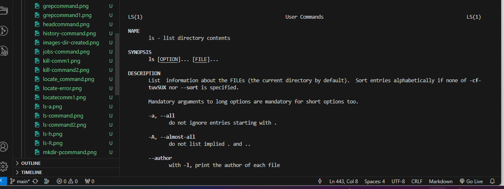

# LINUX PRACTICE PROJECTS - BY OLADEJI OKUNEYE

## Introduction:
This repository has been created to showcase the activity carried out by me to practice the linux commands as given in the linux practice projects. It also contains screenshots of each activity and command executed in  a step-wise manner.
The activities include File Manipulation as well as File permissions and Ownership.

## Pre-requisites:
- Tools:	Git bash/ Microsoft Visual Studio Code, Linux machine running on AWS, Github.
- Knowledge:	Simple File and directory creation knowledge, Basic linux commands, Basic Git operations.

## Content

### FILE MANIPULATION
Below shows a list of commands executed to practice and understand file manipulation, including screenshots of each command executed.

On the terminal, a virtual linux machine was connected to and the following commands were practiced.
 
1. **sudo command**:	

    The sudo command is a common linux command that allows users to run commands with privileges that only root users have. It helps users to do tasks with administrative power without logging in as the root user.

-    `sudo apt upgrade`

       

2. **pwd command**:	`pwd`

    This command is used to check or find the path of the present working directory.

    On the git bash terminal, I created a directory titled 'linux-commands', navigated into the directory and ran the `pwd` command to check and verify the actual active directory as shown below:

    

3. **cd command**: `cd`

    This is used to navigate through files and directories in linux.

-    `cd CommandsLinux`

       To execute this command, first, I created a directory named "CommandsLinux" as it did not exist prior to its creation, and used the `cd CommandsLinux` command to move into the new directory from the home directory.

        

-    `cd ..`
    
        This command was entered to move up one directory from linuxtest to CommandsLinux.

       

-    `cd` command:		- this 'cd' command was run without an option to return to the home directory.

        

4. **ls command**:	

-   `ls`

    

    The ls command was run to check the list of directories and files within the system. The ls was run without a flag and also with flags '-R', '-a' and '-lh' as shown below:

-    `ls /home/ubuntu`

       

-    `ls -R`		- lists all the files in the subdirectories.

       

-    `ls -a`		- shows hidden files in addition to the visible ones.

       

-    `ls -lh`	- shows the file sizes in easily readable formats, such as K, MB, GB and TB. In this case the size is 8.0K.

       

5. **cat command**: `cat`

    The 'cat' command also known as the concatenate command is frequently used in Linux. It reads data from the file and gives its content as output. It helps to create, view and concatenate files. It lists, combines and writes file content to the standard output.

    I ran the following cat commands below:

-    `cat sqlite_commands.sh`

       

-    `cat logos.txt Media.txt > Website.txt`

       To execute this command above successfully, the two text files to be merged were first created.

        

        Then, both files were merged into an output titled "website.txt"; using the cat command: -
    
-    `cat logos.txt Media.txt > Website.txt` as shown below:

     

-    `tac website.txt`

       This command was run to display the content of the file website.txt in reverse order.

        

6. **cp command**: 

-   `cp sqlite_commands.sh /home/ubuntu/linux-commands`

    I copied the file "sqlite_commands.sh" from the current directory to the linux-commands directory as shown below:

     

-    `cp logo.txt media.txt /home/ubuntu/CommandsLinux`

	    

-    `cp logo.txt design.txt` 

       I ran this command above to copy the contents of the logo.txt file into a design.txt file which was automatically created in the same home directory.

        

-    `cp -R /home/ubuntu/CommandsLinux /home/ubuntu/CommandsLinux_backup`

        I ran this commmand above to copy the entire CommandsLinux directory into the new directory titled CommandsLinux_backup, using the '-R' flag with the cp command.

        

7. **mv command**: `mv`

    This command is used to move and rename files and directories, although it does not give an output upon execution.

    I ran the following `mv` commands below:

-    `mv sqlite_commands1.sh /home/ubuntu/CommandsLinux`

        

    
- `mv sqlite_commands.sh sql_commands.sh`

    I used this command above to rename the file "sqlite_commands.sh" to "sql_commands.sh".

    

8. **`mkdir` command**:

- `mkdir Music`			:-	This command was run to create a directory called 'Music'

    

- `mkdir Music/Songs`		:-	This command was run to create a new directory called Songs inside the Music directory.

    

- `mkdir -p Music/2020/Songs`:-	

    I entered this command to create a directory named '2020' in-between the Music directory and the Songs directory. The flag '-p' is particularly vital to this command. 

    

9. **`rmdir` command**:- This is used to permanently delete an empty directory.

- `rmdir -p Music/2020/Songs` 

    I ran this command to remove the empty directory 'Songs' and the parent directories '2020' and 'Music'.

    

10. **`rm` command**:

    I ran the `rm` command to remove multiple files as shown below:

- `rm design.txt logo.txt website.txt`

    

    In the same way, i used the rm command to remove a single file as well.

- `rm media.txt`

    

11. **`touch` command**:

    This command is used to create an empty file or to generate and modify a timestamp in the Linux command line.

- `touch Web.html`

    I ran the command `touch Web.html` in the Documents directory to create the Web.html file. Prior to that, I had to create a Documents folder/directory on the home directory of the linux machine.

    

12. **`locate` command**:

    In order to find a file in the database system, the `locate` command is used. By adding the '-i' argument to the locate command, case sensitivity gets turned off making it easier to search for a file even if you don't remember the exact name of that file.

- `locate -i school`

    

    Note: Before i could run this command, i had to run an update using the `sudo apt update` command and after that, i had to install the locate function on my ubuntu machine using the command `sudo apt install mlocate` as the locate function was not pre-installed on my ubuntu version at the time.

13. **`find` command**:

    This command is used to search for files within a specific directory. It performs a deeper search than the locate command.

- `find /home -name sql_commands.sh`

    

14. **`grep` command**:

    Grep means global regular expression print and it lets you find a word by searching through all the texts in a specific file.

- `grep value sql_commands.sh`

    

15. **`df` command**:

    In order to check the amount of the system's disk space used, expressed in percentage and kilobyte (kb); the df command is used.

- `df -h` 
    
    This command was run on the system to give the output below:

    

- `df -m`

    This command displays information on the file system usage in MBs.

    

- `df -k`:

    This displays the file system usage in KBs

    

16. **`du` command**: 

    If you need to check how much space a file or a directory takes up, then you can use the du command.

    For example, i ran the command below to check which part of the system uses the storage excessively. 

    

    NB: When using the du command, always specify the directory path.

    Below, i tried the du command with some flags to check their output.

    

17. **`head` command**:

    This command is used to view the first ten lines of a text, and it is also used to output piped data to the cli.

- `head deploy1.yml`

    

18. **`tail` command**:

    This displays the last ten lines of a file. It can be used to check if a file has new data or to read error messages.

- `tail -n deploy1.yml`

    

19. **`diff` command**:

    This is used to compare two contents of a file line by line, and display the parts that do not match after analyzing them. Diff is short form for difference. 

- `diff deploy1.yml deploy2.yml`

    

- `diff -c deploy1.yml deploy2.yml`

    I ran this command above with the '-c' flag to display the difference between the two files in a context form.

    

- `diff -u deploy1.yml deploy2.yml`

    I ran this command as the 'u' flag helps to display the output without redundant information.

    

- `diff -i deploy1.yml deploy2.yml`

    This makes the diff command case insensitive.

    

20. **`tar` command**:

    The tar command is used to archive multiple files into a TAR file with optional compression.

    I ran the command below to create a new TAR archive named newarchive.tar in the /home/ubuntu directory.

- `tar -cvf newarchive.tar /home/ubuntu`

    

### FILE PERMISSIONS AND OWNERSHIP

The following commands below were run to practise and gain an understanding of file permissions and ownership.

21. **`chmod` command**:

    The chmod command modifies a file or directory's read, write and execute permission. There are three user classes files are associated with in linux and they are: - Owner, group member and others.

    Owner is usually the only one with full permissions and can grant read, write and execute permissions to the group members and others by changing the permissions on specified file to the read, write, execute (-rwxrwxrwx) permission type. The numeric value for this type of permission is 777.

- `chmod 777 deploy2.yml`

    

    NB: The command `ls -ltr` was first run to view the files and their permissions before I ran the chmod command to grant full permissions to the deploy2.yml file.

22. **`chown` command**:

    To change ownership of a file, directory or symbolic link to a specified username, the chown command is used.

    Below, I made the linuxuser2 the owner of 'filename.txt' by first creating the file 'filename.txt', then i created the new user 'linuxuser2' before then giving it ownership of the 'filename.txt' file using the command below:

- `chown linuxuser2 filename.txt`

    

23. **`jobs` command**:

    This displays all the running processes with their statuses. It is only available in csh, bash, tcsh and ksh shells.

- `jobs`

    

    The output of the `jobs` command shows there are no background processes currently running.

24. **`kill` command**:

    This command is used to kill an unresponsive program manually. To use this command to effectively terminate or kill a program, one must know the process identification number (PID)

    In order to know the process id, i ran the command `ps ux`.

- `kill -9 46324`

    

    

25. **`ping` command**:

    The ping command is used to check whether a network or server is reachable.

    I ran the command below to check connectivity to google and measure its response time.

- `ping -c5 google.com`

    

    NB: I used the option '-c5' to specify results to stop after the fifth count.

26. **`wget` command**:

    The wget command can be used to download files from the internet. It retrieves files using HTTP, HTTPS and FTP protocols.

    I ran the following command to download the latest version of WordPress.

- `wget https://wordpress.org/latest.zip`

    

27. **`uname` command**:

    The uname is also called unix name command and is used to print detailed information about your linux system and hardware.

    The following options are acceptable for use with the uname command:

    '-a' prints all the system information, -s prints the kernel name and -n prints the system's node hostname.

- `uname`

    

28. **`top` command**:

    This displays all the running processes and a dynamic real-time view of the current system. It sums up the resource utilization, from CPU to memory usage, and also helps you identify and terminate a process that may use too many system resources.

- `top`

    

29. **`history` command**:

    With the history command, the system is able to make a list of up to 500 previously executed commands, allowing these commands to be easily re-used without having to re-type them over and over again.

    It can also be used with the following options:

    '-c' clears the complete history list, -d offset deletes the history entry at the OFFSET position, and -a appends history lines.

    

30. **`man` command**:

    It provides a user manual of any commands or utilities you can run in the terminal, including the name, description, and options.

    It consists of nine sections:

    Executable programs or shell commands, System calls, Library calls, Games, Special files, File formats and conventions, System administration commands, Kernel routines, and Miscellaneous. 

    I entered the command below, to display the complete manual for the ls command:

- `man ls`

    

31. **`echo` command**:

    The echo command is a command that outputs the strings that are passed to it as arguments. It is a built-in utility.

- `echo this is a test`

    

32. **`zip`, `unzip` commands**:

    The zip command is used to compress files into a ZIP file, and it automatically chooses the best compression ratio. It can also be used for archiving files and directories and reducing disk usage.

- `zip archive.zip note.txt`

    Below, I compressed the note.txt file into the archive.zip.

    NB: I had to install the zip utility before running the command.

    

    

    The unzip command extracts the zip files from an archive. Below,  i moved the archive into the Documents folder and unzipped the archive.zip file into the directory.

33. **`hostname` command**:

    I ran the `hostname` command to check the system's hostname, and also used the option '-i' to check the ip address.

    

34. **`useradd`, `userdel` commands**:

    `useradd` command is used to create a new account or user and it also requires the creation of a password using the `passwd` command. 

    NB: Only those with root privileges or sudo can run the useradd command.

    I ran the following commands below to create a new user 'John' and created a password.

- `sudo useradd John` and `sudo passwd 12345678`

    

    Using the `cat /etc/passwd/` command, i was able to verify that the user 'John' was created.

    

    The `userdel` command is used to delete a user account.

- `sudo userdel John` was run by me to remove or delete the newly created user 'John'.

    

35. **`apt-get` command**:

    This is a command line tool used for handling Advanced Package Tool (APT). It is used to retrieve information and bundles from authenticated sources to manage, update, remove and install software and its dependencies.

    This command requires the use of sudo or root privileges.

    I ran the following to practise the command:

- `sudo apt-get update`: - to synchronize the package files from their sources.

    

- `sudo apt-get upgrade`: - to install the latest version of all installed packages.

    

- `sudo apt-get check`: - to update the package cache and check broken dependencies.

    

36. **`nano`, `vi`, `jed` commands**:

    These are linux text editors which allow for file editing and management. Nano and vi come with the operating system but jed has to be installed.

    Below, I used the nano command on the note.txt file.

- `nano note.txt`

    

    

    I also used the `vi` command on the same note.txt file as shown below:

- `vi note.txt`

    

- `jed`:

    In the case of jed, there is a drop-down menu interface that allows users to perform actions without entering keyboard combinations or commands.

    Before using the jed, i installed it.

    

    

37. **`alias`, `unalias` commands**:

* **alias command** allows for the creation of a shortcut with the same functionality as a command, file name or text. It instructs the shell to replace one string with another when executed.

-  `alias k='kill'`

    I ran this command to make 'k' the alias for the kill command.

    

* **unalias command** deletes an existing alias, as shown in the command i ran below:

- `unalias k`

    

38. **su command**:

    The su command or switch user command allows you to run a program as a different user. It changes the administrative account in the current log-in session.

- `su Tolu`

    I ran this command to switch from the user 'ubuntu' to the newly created user 'Tolu' as shown below.

    

39. **`htop` command**:

    This is an interactive program that monitors system resources and server processes in real time. It is an improvement of the top command.

- `htop`

    

40. **`ps` command**:

    This means process status command and it is run to produce a snapshot of all running processes in your system

    

Linux practice project completed.

