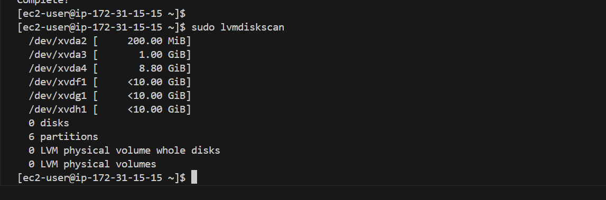
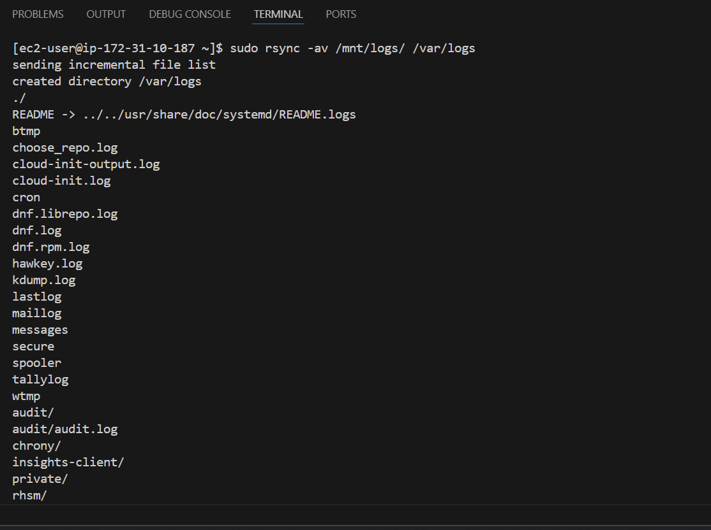
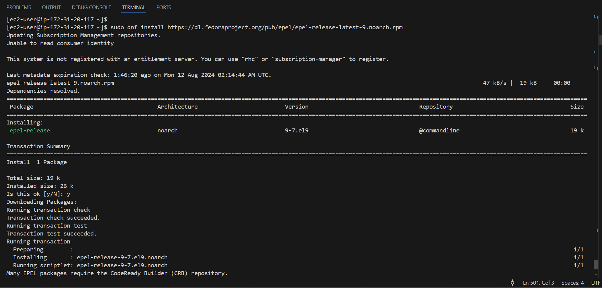
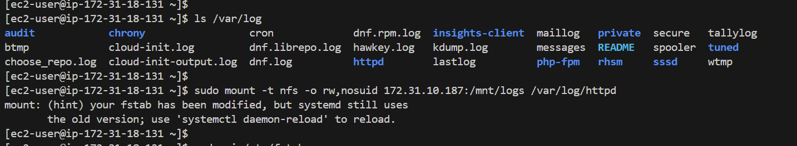
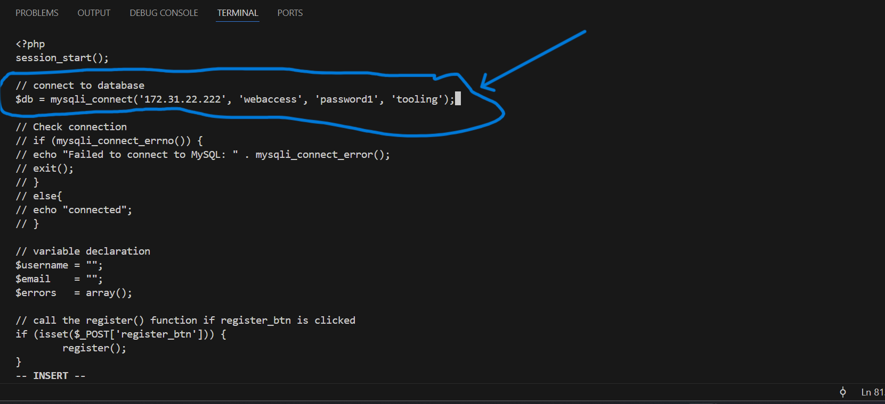
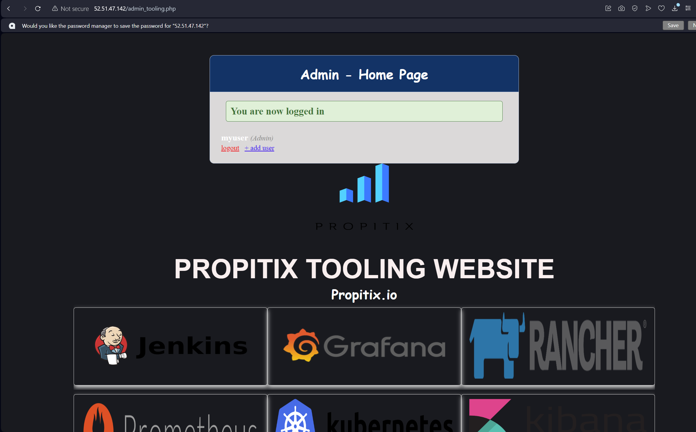

# DEVOPS TOOLING WEBSITE SOLUTION

## OBJECTIVE:
The objective of this project is to build a comprehensive DevOps tooling website solutiion.

In this project, I will be implementing a solution that consists of the following components:

i. **Infrastructure:** AWS  
ii. **Webserver Linux:** Red Hat Enterprise Linux 9  
iii. **Database Server:** Ubuntu 22.04 + MySQL  
iv. **Storage Server:** Red Hat Enterprise + NFS Server  
v. **Programming Language:** PHP
vi. **Code Repository:** Github

## IMPLEMENTING A BUSINESS WEBSITE USING NFS FOR THE BACKEND FILE STORAGE

### Step 1: PREPARING THE NFS SERVER:

#### 1. Spinning up a new EC2 instance with RHEL 9 Operating system.

**NOTE:** 3 EBS volumes attached to NFS Server:

#### 2. Creating single partitions on the EBS volume disks:

#### 3. Configuring lvm on the NFS server instance:

   i. Checking available partitions:
   
   `sudo lvmdiskscan`
   
   

   ii. Using `pvcreate` utility to mark the 3 disks as physical volumes:

   `sudo pvcreate /dev/xvdf1`

   `sudo pvcreate /dev/xvdg1`

   `sudo pvcreate /dev/xvdh1`

   
   
   

   iii. Creating volume group (webdata-vg) and adding all the physical volumes to the volume group using the `vgcreate` utility:

   `sudo vgcreate webdata-vg /dev/xvdh1 /dev/xvdg1 /dev/xvdf1`

   

   iv. Creating 3 logical volumes named lv-opt, lv-apps, and lv-logs using the `lvcreate` utility:
   
   `sudo lvcreate -n lv-opt -L 9G webdata-vg`
   
   `sudo lvcreate -n lv-apps -L 9G webdata-vg`
   
   `sudo lvcreate -n lv-logs -L 9G webdata-vg`
   
   

   v. Verifying the entire setup:
   
   `sudo vgdisplay -v #view complete setup - VG, PV, and LV`
   
   `sudo lsblk`
   
   
   
   

vi. Using `xfs` to format the 3 logical volumes:

`sudo mkfs -t xfs /dev/webdata-vg/lv-opt`

`sudo mkfs -t xfs /dev/webdata-vg/lv-apps`

`sudo mkfs -t xfs /dev/webdata-vg/lv-logs`

vii. Creating directories and mount points:

Directories created with `sudo mkdir`:

`sudo mkdir -p /mnt/apps`

`sudo mkdir -p /mnt/logs`

`sudo mkdir -p /mnt/opt`

- Mounts For the webservers:  

    `sudo mount /dev/webdata-vg/lv-apps /mnt/apps`

    

- Mounts For the webserver logs:

    `sudo mount /dev/webdata-vg/lv-logs /mnt/logs`

    

- Mounts For the Jenkins server:

    `sudo mount /dev/webdata-vg/lv-opt /mnt/opt`
    
    

 

**Backing up files in the log directory:**
We will use the rsync utility to backup all the files in the log directory /var/log into /mnt/logs (This step is important and required before we mount the file system).

`sudo rsync -av /var/log/. /mnt/logs`

 

**Mounting the log directory on the logical volume:**  
Next, we mount /var/log on logs-lv logical volume.  
**Note:** that all the existing data on /var/log will be deleted.

`sudo mount /dev/webdata-vg/lv-logs /var/log`

 

After this, next we restore the log files back into /var/log directory.

`sudo rsync -av /mnt/logs/ /var/logs`

**Updating the `/etc/fstab` file:**

- `sudo blkid`

    

Identify the specific UUIDs for the apps, logs and opt, just as given below, and enter it into the :

    opt: UUID=1390d830-d954-4b2f-ae2d-931ae4e82bf1 /mnt/opt xfs defaults 0 0
    apps: UUID=9a3e146c-1177-47be-b42a-c9d8238e2b14 /mnt/apps xfs defaults 0 0
    logs: UUID=f64f262d-ef53-4986-a661-2609ad97a8a2 /mnt/logs xfs defaults 0 0

- `sudo vi /etc/fstab`

    

 

**Testing the configuration:**

- `sudo mount -a`

**Reloading the configuration:**

 `sudo systemctl daemon-reload`

#### 4. **Installing the NFS Server:**

Here, we will be installing the NFS Server and configuring to start on reboot, while also making sure it is up and running.

To do this, we run the following sets of commands below:

    sudo yum -y update
    sudo yum install nfs-utils -y
    sudo systemctl start nfs-server.service
    sudo systemctl enable nfs-server.service
    sudo systemctl status nfs-server.service

`sudo yum -y update`

`sudo yum install nfs-utils -y`

`sudo systemctl start nfs-server.service`
`sudo systemctl enable nfs-server.service`

`sudo systemctl status nfs-server.service`

    
 

#### 5. **Exporting the mounts of the webservers' `subnet cidr` to connect as clients:**

In order to make this easy to implement, we will install all our 3 webservers inside the same subnet, but in the production setup, we would probably want to separate each tier inside its own subnet for higher level of security. To check our subnet cidr, we will have to open our EC2 details in AWS Web Console and locate 'Networking' tab and open a subnet link, as shown below:

 

Next, we need to make sure we set up permissions that will allow our webservers to read, write and execute files on NFS, using the commands below:

**Changing ownership:**

    sudo chown -R nobody: /mnt/apps
    sudo chown -R nobody: /mnt/logs
    sudo chown -R nobody: /mnt/opt

**Setting permissions:**

    sudo chmod -R 777 /mnt/apps
    sudo chmod -R 777 /mnt/logs
    sudo chmod -R 777 /mnt/opt

**Restarting the nfs-server service:**

    sudo systemctl restart nfs-server.service

 

**Configuring access to NFS for clients within the same subnet (subnet CIDR for NFS Server - 172.31.0.0/20):**

This is done by doing the following below:

`sudo vi /etc/exports`

    /mnt/apps 172.31.0.0/20(rw,sync,no_all_squash,no_root_squash)
    /mnt/logs 172.31.0.0/20(rw,sync,no_all_squash,no_root_squash)
    /mnt/opt 172.31.0.0/20(rw,sync,no_all_squash,no_root_squash)

Then we exit the editor by entering the following command:

    Esc + :wq!

To export this, we run the following command below:

    sudo exportfs -arv
 

#### 6. Now, we check which port is used by NFS and open it using Security Groups (add new Inbound rule):

`rpcinfo -p | grep nfs`

**NOTE:** It is important to note that for the NFS server to be accessible from our client, we must also open the following ports as shown below:

    Custom TCP port 111
    Custom UDP ports 111 and 2049
    NFS TCP port 2049

 

## CONFIGURING BACKEND DATABASE AS PART OF 3 TIER ARCHITECTURE

### Step 2: Configuring the database server:

#### 1. **Installing the mysql server:**

- **Updating the package manager:**

    `sudo apt update -y`
    
    
    
    

- **Installing the mysql-server:**

    `sudo apt install mysql-server y`
    
    

- **Verifying the service is up and running:**

    `sudo systemctl status mysqld`

    

#### **2. Creating a database and naming it `tooling`:**
#### 3. Creating a database user and naming it `webaccess`
#### 4. Granting permissions to `webaccess` user on `tooling` database to do anything only from the webservers' `subnet-cidr`:

- To execute the actions expected in item 2,3 and 4 above, first, we log into the mysql database using the command below:

`sudo mysql`

To create user and set passwords, we follow a common set of commands as shown below, but then we enter or specific usernames and passowrds:

    sudo mysql
    CREATE DATABASE tooling;
    CREATE USER `myuser`@`<NFS-Server-Subnet CIDR-IP-Address>` IDENTIFIED BY 'mypass';
    GRANT ALL ON tooling.* TO 'myuser'@'<NFS-Server-Subnet CIDR-IP-Address>';
    FLUSH PRIVILEGES;
    SHOW DATABASES;
    exit

With the step above, we can now define our database and then create our users.

**NOTE:** The symbol **`%`** is used to denote or specify any IP range as acceptable.

Hence, we run the following sets of commands into our database environment:

    CREATE DATABASE tooling;
    CREATE USER 'webaccess'@'172.31.0.0/20' identified by 'password1';
    GRANT ALL on tooling.* to 'webaccess'@'172.31.0.0/20';
    FLUSH PRIVILEGES;
    SHOW DATABASES;
    exit;

To check the list of created users in MySQL database, we run the following command below:

`SELECT User, Host FROM mysql.user;`

#### **5. Changing bind address:**

Next, we change the bind-address and mysqlx-bind-addresses to 0.0.0.0 by running the command below:

    sudo vi /etc/mysql/mysql.conf.d/mysqld.cnf

 

#### **6. Restart the mysql and check the status:**

    sudo systemctl restart mysql
    sudo systemctl status mysql

 

### Step 3: Preparing the Webservers:

In implementing this, we need to ensure that our webservers can serve the same content from shared storage solutions, (in this case, it is the NFS server and Mysql database). One database DB can be accessed for `reads` and `writes` by multiple clients. For storing the shared files that our webservers will use, we will utilize NFS and mount the previously created Logical volume `lv-apps` to the folder where apache stores files to be served to the users (/var/www/).  
This approach will make the webservers `stateless`, and this means that we will be able to add new ones or remove them whenever we need, and the integrity of the data (in the NFS and in the database) will be preserved.

To implement this, we will do the following:

- Configure NFS client (done on all 3 servers)
- Deploy a tooling application to our webservers into a shared NFS folder.
- COnfigure the webservers to work with a single Mysql database.

#### 1. Launching a new EC2 instance with RHEL 9 Operating system.

- Then run the command below:

    sudo dnf update -y

##### Resolving low memory issue before installations:

Due to the low memory availability of the EC2 instance, it is important to perform the following below, to avoid the instance having hanging issues during installations:

To resolve this issue, we do the following:

a. **Create Swap Space:**

We create a swap space by doing the following steps:

- **Create a 1GB swap file**

    sudo fallocate -l 1G /swapfile

b. **Set the correct permissions**

    sudo chmod 600 /swapfile

c. **Set up the swap area**

    sudo mkswap /swapfile

d. **Enable the swap file**

    sudo swapon /swapfile

**Verify Swapfile:** Using the command `free -h`

e. **Make Swap Space Permanent:**

To ensure the swap space is available after a reboot, we will add it to /etc/fstab using the command below:

    echo '/swapfile swap swap defaults 0 0' | sudo tee -a /etc/fstab

 

#### 2. Installing NFS client.

`sudo yum install nfs-utils nfs4-acl-tools -y`

#### 3. Mounting `/var/www/` and targeting the NFS server's export for apps, using the commands below:

    sudo mkdir -p /var/www
    
    sudo mount -t nfs -o rw,nosuid <NFS-Server-Private-IP-Address>:/mnt/apps /var/www

With this, we first identify and then fill in the private IP address of the NFS server into the command below:

`sudo mkdir -p /var/www`

`sudo mount -t nfs -o rw,nosuid 172.31.10.187:/mnt/apps /var/www`

**NOTE:** Because my webservers fall into a different subnet, I have had to update the NFS servers `/etc/exports` file with a new subnet which is `172.31.0.0/16`. This is to allow access to a broader range of IP addresses.

Next, we will re-export the NFS Directories and Restart the NFS Server:

    sudo exportfs -arv
    sudo systemctl restart nfs-server

Now, we will try re-mounting on the Web Server:

    sudo mount -t nfs -o rw,nosuid 172.31.10.187:/mnt/apps /var/www

#### 4. Verifying NFS was mounted successfully using the command `df -h`, and ensuring  that the changes persist on the webserver after reboot.

`df -h`

**Updating the `/etc/fstab` file**

`sudo vi /etc/fstab`

`<NFS-Server-Private-IP-Address>:/mnt/apps /var/www nfs defaults 0 0`

We fill in the actual private IP address of the NFS server, as shown below:

    172.31.10.187:/mnt/apps /var/www nfs defaults 0 0

- Next, we test the configuration and reload the daemon after making changes to the `/etc/fstab` file with the commands below:

    sudo mount -a
    sudo systemctl daemon-reload

#### **5. Installing Remi's repository, Apache and PHP:**

We do this by running the following commands below:

##### **Install Apache:**

    sudo yum install httpd -y

##### **Enable EPEL Repository:**

    sudo dnf install https://dl.fedoraproject.org/pub/epel/epel-release-latest-$(rpm -E %rhel).noarch.rpm -y

OR

    sudo dnf install https://dl.fedoraproject.org/pub/epel/epel-release-latest-9.noarch.rpm

##### **Install Remi Repository for RHEL 9:**

    sudo dnf install https://rpms.remirepo.net/enterprise/remi-release-9.rpm

=======================================================================================

**NOTE:** In case you encounter challeneges where your terminal freezes and can no longer allow commands to be entered, while the installation process remains stuck, then you will need to do the following:

- **Clear DNF Cache:**

`sudo dnf clean all`

- **Manually add the Remi repository configuration file:**

`sudo vi /etc/yum.repos.d/remi.repo`

- **Add the Following Configuration into the file or repo:**

        [remi]
        name=Remi's RPM repository for Enterprise Linux 9 - $basearch
        baseurl=https://rpms.remirepo.net/enterprise/9/remi/$basearch/
        enabled=1
        gpgcheck=1
        gpgkey=https://rpms.remirepo.net/RPM-GPG-KEY-remi

=======================================================================================

##### **Enabling the Remi Repository:**

`sudo dnf config-manager --set-enabled remi`

To confirm that the Remi repo has been enabled, we use the command below:

`dnf repolist all | grep remi`

##### **Enabling PHP module from Remi:**

`sudo dnf module reset php`

**NOTE:** You can use the command `sudo dnf module list` to check the list of available modules.
 

`sudo dnf module enable php:remi-7.4`

##### **Installing PHP and extensions:**

`sudo dnf install php php-opcache php-gd php-curl php-mysqlnd`

##### **Starting and enabling the PHP-FPM:**

`sudo systemctl start php-fpm`

`sudo systemctl enable php-fpm`

**Set SELinux Boolean:**

`sudo setsebool -P httpd_execmem 1`

### **Now, to prepare the remaining two webserver instances, we repeat these steps 1-5**

#### **6. Next, we verify that apache files and directories are available on the webserver in `/var/www` and also on the NFS server in `/mnt/apps`:**

If we can see the same files, it means that the NFS is mounted correctly.
We can try to create a new file named `test.txt` from one server and check if the same file is accessible from other webservers.

##### Creating test file on Webserver 1:
We go into the `/var/www` directory on `web-1` and create a test file named "test.txt".  

    touch test.txt

**Verifying test file on the NFS Server:**
- Next we log into our NFS server and navigate to the `/mnt/apps` directory to verify that the file also exists on it.

**Verifying test file on the Webserver 2:**

**Verifying test file on the Webserver 3:**

In the above screenshot, we can see that the test file created on `webserver 1 (web-1)` is visible on the `NFS server`, the `webserver 2 (web-2)` and `webserver 3 (web-3)` as well.

#### **7. Mounting the Apache's log folder of the webservers to NFS server's export for logs:**

Now, we will locate the log folder for Apache on the webserver and mount it to NFS server's export for logs. We will repeat step number 4 to make sure the mount point will persist after reboot.

**On the Web-1 Server:**

    sudo mount -t nfs -o rw,nosuid 172.31.10.187:/mnt/logs /var/log/httpd

**On the Web-2 Server:**
    sudo mount -t nfs -o rw,nosuid 172.31.10.187:/mnt/logs /var/log/httpd

**On the Web-3 Server:**

    sudo mount -t nfs -o rw,nosuid 172.31.10.187:/mnt/logs /var/log/httpd

Next, we update the `/etc/fstab` files for the 3 servers with the parameters/configuration below:

    172.31.10.187:/mnt/logs /var/log/httpd nfs defaults 0 0

Then we test the configuration and reload the daemon with the commands below:

    sudo mount -a
    sudo systemctl daemon-reload

#### **8. Forking the tooling website from Darey.io Github account:**

##### **Install git:**

    sudo dnf install git -y

##### **Next, we clone the repository from Darey.io's Github Account:**

    git clone https://github.com/darey-io/tooling.git

    
#### **9. Deploying the Tooling website's code:

Now, we will deploy the tooling website's code to the webserver. While doing this, we need to ensure that the **`html`** folder from the repository is deployed to the **`/var/www/html`** on the webserver.  
To carry out this deployment, we will do the following:

##### First, we will navigate to the tooling directory on the webserver, and then run the next set of commands as shown below:

    cd tooling                             #(Navigates to the tooling directory)

    sudo cp -R html/. /var/www/html/       #(Copies contents of the tooling html folder into the /var/www/html directory)

    ls /var/www/html                       #(lists the contents of the /var/www/html directory)

    ls html/                               #(lists the contents of the tooling's html directory)

##### Next, we will set ownership and permissions on all three webservers, to ensure that Apache can serve the files properly:

    sudo chown -R apache:apache /var/www/html

    sudo chmod -R 755 /var/www/html

**NOTE 1:** We must not forget to open TCP port 80 on the three webservers, as shown below (we do not need to open port 80 on the NFS server as its purpose is to only share files among the webservers):

 

**NOTE:** If you encounter a `403 Error`, then you will need to check permissions for your `/var/www/html` folder and also disable `SELinux`using the command below:

    sudo setenforce 0

Finally, to make this change you have just made permanent, you will need to open the following configuration file using the commands below:

    sudo vi /etc/sysconfig/selinux
    

And then after doing this above, you will need to **set** the selinux to disabled by setting the parameter in the file as shown below:

    SELINUX=disabled

After doing all these, then you can restart Apache httpd using the command below:

    sudo systemctl restart httpd

Check the status of the Apache server:

    sudo systemctl status httpd

##### Changing bind address on the MySQL server:

Next, we have to change the bind address on the MySQL server to `0.0.0.0`

To do this, we run the command below:

    sudo vi /etc/mysql/mysql.conf.d/mysqld.cnf

Then we change the bind address and mysqlx-bind-address to `0.0.0.0`

#### **10. Updating the website's configuration:**

At this stage, we will update the website's configuration to connect to the database (in `/var/www/html/functions.php` file). We will apply `tooling-db.sql` script to our database using the command below:

    mysql -h <database-private-ip> -u <db-username> -p <db-password> <db-name> <tooling-db.sql

which will give us:

    mysql -h 172.31.22.222 -u webaccess -p password1 tooling <tooling-db.sql

    mysql -h 172.31.22.222 -u admin -ppassword1 < tooling-db.sql

**On the Webservers:**

    sudo vi /var/www/html/functions.php

Then we modify the line starting with `$db = mysqli_connect(......) with the following details below, (The database's private IP, database user, password and database name):

    $db = mysqli_connect('172.31.22.222', 'webaccess', 'password1', 'tooling');

**Before modifying the website's configuration file:**

**After modifying the website's configuration file:**

**On the Mysql Server:**

- Create the user on the mysql database using the following command:

    CREATE USER 'webaccess'@'%' IDENTIFIED BY 'password1';
    GRANT ALL PRIVILEGES ON *.* TO 'webaccess'@'%' WITH GRANT OPTION;
    FLUSH PRIVILEGES;

We will now apply `tooling-db.sql` script to our database using the command below:

- Since we want to execute this from the webserver, we have to first install mysql client on the webservers to enable easy connection to the database server from the webserver:

        sudo yum install mysql

- Next, we navigate to the location of the repository where the `tooling-db.sql` file is located by running the command:

        cd tooling

Then we run the following command below, after putting in the database private IP address, username, password and database name, as shown below:

    mysql -h <database-private-ip> -u <db-username> -p <db-password> <tooling-db.sql
 

    mysql -h 172.31.22.222 -u webaccess -ppassword1 tooling < tooling-db.sql

**NOTE:** The `-p` flag should be followed by the password without any space. When you add a space after the `-p` flag, MySQL interprets `password1` as the database name instead of the password.

So we should always remember to either use this:

    mysql -h 172.31.22.222 -u webaccess -ppassword1 tooling < tooling-db.sql

OR better still, use the command without stating the password for security reasons:

    mysql -h 172.31.22.222 -u webaccess -p tooling < tooling-db.sql
    

**NOTE:** 

`-h 172.31.22.222`: is used to connect to the MySQL server at the specified IP address.
`-u webaccess`: means use the username webaccess to connect.
`-ppassword1`: means use the password password1 to connect (without a space between -p and the password).
`tooling`: refers to the database where you want to apply the script.
`< tooling-db.sql`: This is the SQL script file to be executed.

 

#### *11. Creating new admin user in MySQL:**

Next, we will create in MySQL a new admin user with username `myuser` and password: `password`, using the command below in the mysql database:

**On the MySQL datatbase:** run the following command:

Through the webserver, log in to the MySQL database using the command below:

    mysql -h 172.31.22.222 -u webaccess -p tooling

Then create the new admin user by running the command below:

    INSERT INTO 'users' ('id', 'username', 'password', 'email', 'user_type', 'status') VALUES
    -> (1, 'myuser', '5f4dcc3b5aa765d61d8327deb882cf99', 'user@mail.com', 'admin', '1');

OR 

If you wish to let MySQL handle the auto increment of the id column by itself rather than manually inserting it, you can use the command below:

    INSERT INTO `users` (`username`, `password`, `email`, `user_type`, `status`) VALUES
('myuser', '5f4dcc3b5aa765d61d8327deb882cf99', 'user@mail.com', 'admin', '1');

**Verify that the user has been added:**

    SELECT * FROM users WHERE username = 'myuser';

#### **12. Testing and Logging in to the website:**

We will open the website in our web browser using `http://<Web-Server-Public-IP-Address-or-Public-DNS-Name>/index.php, and make sure that we can log in to the website with the `myuser` user.

# END OF PROJECT 10