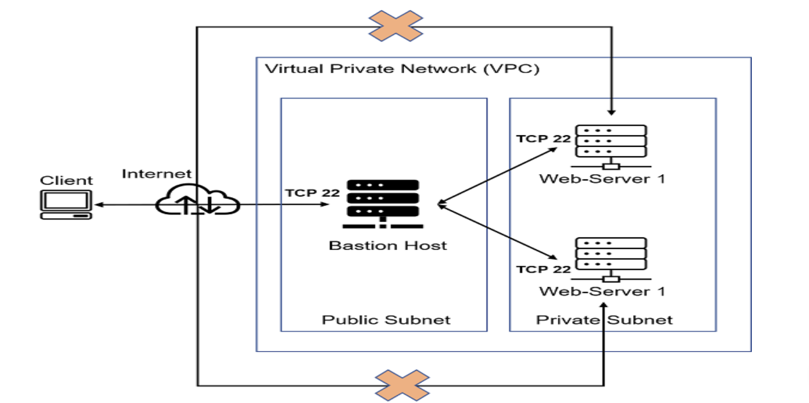

# ANSIBLE-AUTOMATE PROJECT

## OBJECTIVE:

The objective of this project is to implement automation using Ansible.

### TASKS:

- Installation and configuration of an ANsible client to act as a **`Jump Server`**/**`Bastion Host`**.
- Creation of a simple Ansible playbook to automate servers' configuration.

 

## WHAT IS ANSIBLE?

Ansible is an open-source automation tool used for configuration management, application deployment, task automation, and orchestration. It allows users to automate IT processes and manage systems in a simple and efficient manner. Key features of Ansible include:

**Agentless Architecture:** Ansible does not require any agents to be installed on the target machines, making it easy to manage systems.

**Playbooks:** Ansible uses YAML-based files called playbooks to define automation tasks in a human-readable format.

**Modules**: It has a wide range of built-in modules that can be used to perform various tasks, such as managing packages, services, files, and more.

**Idempotency:** Ansible ensures that tasks are executed in a way that does not change the system state if it is already in the desired state.

**Inventory Management:** Ansible can manage and organize hosts in an inventory file, allowing for easy targeting of specific machines.

**Extensibility:** Users can create custom modules and plugins to extend Ansible's functionality.

Overall, Ansible is widely used for automating repetitive tasks and improving the efficiency of IT operations.

## ANSIBLE CONFIGURATION MANAGEMENT

**Overview of Configuration Management**

Configuration management ensures that IT systems, such as servers and applications, remain in a desired state despite changes over time. It allows administrators to set up and maintain consistent configurations across multiple systems using specialized tools. These tools help identify and rectify deviations from the desired state through assessments and drift analyses.

**Importance of Configuration Management**

In enterprise environments, proper configuration management prevents costly issues stemming from misconfigurations, which can lead to security vulnerabilities and system outages. It establishes a systematic approach to documentation, maintenance, and change control, ensuring consistent system configurations.

**Automation in Configuration Management**

Automating configuration management enhances reliability and efficiency, reducing manual errors and enabling consistent deployment across various environments, including data centers and cloud setups. Automation helps manage infrastructure, cloud resources, network devices, and security systems, minimizing complexity and costs.

**Key Features of Configuration Management Tools**

An effective configuration management tool should offer:

- Flexibility for managing diverse environments (datacenters, clouds, edge).
- Support for various use cases (networking, security, applications).
- Integration with third-party platforms.
- A declarative structure for defining desired states.
- Drift detection to monitor and compare system configurations.

 

### ANSIBLE CLIENT AS A JUMP SERVER (Bastion Host)

A **Jump Server** (sometimes also referred to as **Bastion Host**) is an intermediary server through which access to internal network can be provided.
If we consider our previous project, which is the **`DevOps Tooling Website Solution`**; basically a 3-tier web application architecture, ideally the webservers should be inside a secured network which cannot be reached directly from the internet. This means that even `DevOps enginners` should not be able to `SSH` into the webservers directly. They should only be able to access it through a **`Jump Server`**.   This **`Jump Server`** provides better security and resuces the `attack surface`.

In the diagram below, the Virtual Private Network (VPC) is divided into **`two subnets`**:

- **`The Public Subnet:`** The public subnet has public IP addresses.
- **`Private Subnet:`** The private subnet is only reachable via private IP addresses.

 

## **INSTALLING AND CONFIGURING ANSIBLE ON EC2 INSTANCES:**

### Prerequisites:
To install and configure Ansible Client to act as a Jump Server/Bastion Host and also create a simple Ansible Playbook to automate server configuration, the follwoing are needed:

1. NFS Server
2. Web Server 1
3. Web Server 2
4. Load Balancer
5. Database Server
6. Jenkins Server

