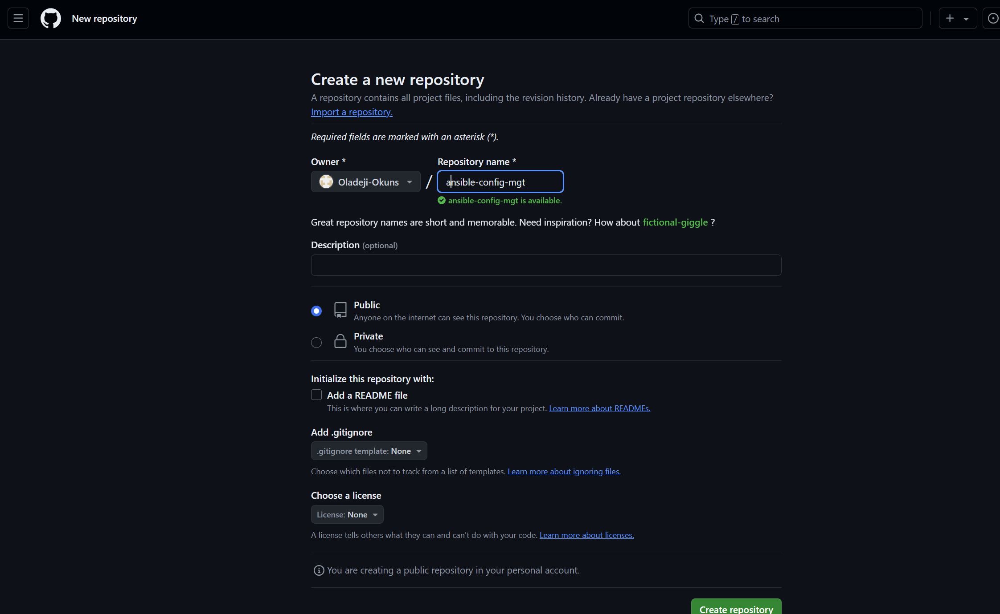

# ANSIBLE-AUTOMATE PROJECT

## OBJECTIVE:

The objective of this project is to implement automation using Ansible.

### TASKS:

- Installation and configuration of an ANsible client to act as a **`Jump Server`**/**`Bastion Host`**.
- Creation of a simple Ansible playbook to automate servers' configuration.

 

## WHAT IS ANSIBLE?

Ansible is an open-source automation tool used for configuration management, application deployment, task automation, and orchestration. It allows users to automate IT processes and manage systems in a simple and efficient manner. Key features of Ansible include:

**Agentless Architecture:** Ansible does not require any agents to be installed on the target machines, making it easy to manage systems.

**Playbooks:** Ansible uses YAML-based files called playbooks to define automation tasks in a human-readable format.

**Modules**: It has a wide range of built-in modules that can be used to perform various tasks, such as managing packages, services, files, and more.

**Idempotency:** Ansible ensures that tasks are executed in a way that does not change the system state if it is already in the desired state.

**Inventory Management:** Ansible can manage and organize hosts in an inventory file, allowing for easy targeting of specific machines.

**Extensibility:** Users can create custom modules and plugins to extend Ansible's functionality.

Overall, Ansible is widely used for automating repetitive tasks and improving the efficiency of IT operations.

## ANSIBLE CONFIGURATION MANAGEMENT

**Overview of Configuration Management**

Configuration management ensures that IT systems, such as servers and applications, remain in a desired state despite changes over time. It allows administrators to set up and maintain consistent configurations across multiple systems using specialized tools. These tools help identify and rectify deviations from the desired state through assessments and drift analyses.

**Importance of Configuration Management**

In enterprise environments, proper configuration management prevents costly issues stemming from misconfigurations, which can lead to security vulnerabilities and system outages. It establishes a systematic approach to documentation, maintenance, and change control, ensuring consistent system configurations.

**Automation in Configuration Management**

Automating configuration management enhances reliability and efficiency, reducing manual errors and enabling consistent deployment across various environments, including data centers and cloud setups. Automation helps manage infrastructure, cloud resources, network devices, and security systems, minimizing complexity and costs.

**Key Features of Configuration Management Tools**

An effective configuration management tool should offer:

- Flexibility for managing diverse environments (datacenters, clouds, edge).
- Support for various use cases (networking, security, applications).
- Integration with third-party platforms.
- A declarative structure for defining desired states.
- Drift detection to monitor and compare system configurations.

 

### ANSIBLE CLIENT AS A JUMP SERVER (Bastion Host)

A **Jump Server** (sometimes also referred to as **Bastion Host**) is an intermediary server through which access to internal network can be provided.
If we consider our previous project, which is the **`DevOps Tooling Website Solution`**; basically a 3-tier web application architecture, ideally the webservers should be inside a secured network which cannot be reached directly from the internet. This means that even `DevOps enginners` should not be able to `SSH` into the webservers directly. They should only be able to access it through a **`Jump Server`**.   This **`Jump Server`** provides better security and resuces the `attack surface`.

In the diagram below, the Virtual Private Network (VPC) is divided into **`two subnets`**:

- **`The Public Subnet:`** The public subnet has public IP addresses.
- **`Private Subnet:`** The private subnet is only reachable via private IP addresses.

 

## **STEP 1. INSTALLING AND CONFIGURING ANSIBLE ON EC2 INSTANCES:**

### Prerequisites:

To install and configure Ansible Client to act as a Jump Server/Bastion Host and also create a simple Ansible Playbook to automate server configuration, the following are needed:

1. NFS Server
2. Web Server 1
3. Web Server 2
4. Load Balancer
5. Database Server
6. Jenkins Server

### Install and Configure Ansible on EC2 Instance

1. Update the Name tag on your Jenkins EC2 Instance to Jenkins-Ansible. We will use this server to run playbooks.

2. Create new repository named `ansible-config-mgt` into your github account.

3. Install Ansible:

Log in or SSH into the Jenkins_Server we created previously and install ansible on it. 

        sudo apt update

        sudo apt install ansible

 

Check your ansible version by running 

    ansible --version

4. Next, we will log into Jenkins and create a new Freestyle Project called `ansible` or `project-ansible` (in this case we chose `project-ansible`) and point it to our `ansible-config-mgt` repository. This is to ensure that the project automatically builds the source codes in the `ansible-config-mgt` after every commit and push takes place. 
To get this done, we do the following:

- Access the configuration settings for the project or job titled `ansible` or `project-ansible` in the Jenkins console. 
- Navigate to `Source Code Management`, choose `Git`, and 
- Copy the URL for `ansible-config-mgt` into the `Repository URL` field. 

**NOTE:** Ensure that the branch in Jenkins matches the one in `ansible-config-mgt`; in my case,I had to change my branch from `/master` to `/main` in Jenkins configuration.

 

Scroll down to the **`Build Triggers' field`**, select **`GitHub hook trigger for GITScm polling ?`**:

 

- Adding **`Build Steps`:**

Add a `build` step before the `post-build` actions:  
Select **`Add build steps`** > **`Execute shell`**.
Then enter the command below:
    
     cp -r $WORKSPACE/* /mnt/apps/

OR, we can use the script commands below instead, so that it appears as a block on its own:

    #!/bin/bash
    JOB_NAME=$(basename "$JOB_NAME")
    cp -R "$WORKSPACE" "/mnt/apps/$JOB_NAME"

This script copies the entire workspace (which includes all the job files) to /mnt/apps under a directory named after the job.

With the second step using the script, the job appear as `/mnt/apps/project-ansible` and this will allow us to be able to define a server block specific to the job-name without having a situation of conflicting html files (meaning we can have multiple websites defined for the servers defined). Then click `Save`.

OR

**Next**, we need to make sure that `/mnt/apps` is mounted to our NFS server. We can do this by editing the `/etc/fstab` file on our Jenkins server to include an entry for our NFS server:

    nfs_server_ip:/path/to/nfs /mnt/apps nfs defaults 0 0

which becomes

    172.31.10.187:/mnt/apps /mnt/apps nfs defaults 0 0

**NOTE:** Since `/mnt/apps` is mounted to our NFS server, any files we copy to `/mnt/apps` will automatically be available on the NFS server.

**NEXT:**

**Choose `Archive the Artifacts`:

In the Post Build Action step, choose `Archive the artifacts` from the dropdown menu, then enter `**` to archive all files, and save your changes.  
Finally, we test this configuration by writing a brief description of our objectives in the `README.md` file

 

**NOTE:** Don't forget, you will need to create a webhook for this new repository in Github. It is important to ensure that a webhook exists or is created for every new repository created in github, regardless of even if we will be making use of the same Jenkins server. Also, for your new repo, you may need to set the global config settings for the `user.name` and `user.email` on the terminal. Next, ensure to run the command below to set the remote URL for the `ansible-config-mgt` repository:

    git remote set-url origin git@github.com:yourusername/project-ansible.git

After doing all these, we can then test our configuration by making changes to the `README.md` file and push the changes to our github repository.

**Verifying Built Artifacts:**

Jenkins saves the files (**built artifacts**) in the following folder below:

    ls /var/lib/jenkins/jobs/ansible/builds/<build_number>/archive/

Hence,
    
    ls /var/lib/jenkins/jobs/project-ansible/builds/1/build.xml

With this, we can see that our artifacts are saved locally on the server.

 

### **New Architecture Set up:**

With all our configurations done so far, our new architecture now looks like this as shown below:

 

**NOTE:** Because we are using a free tier with no fixed public IP, it is important to note that every time we stop/start our  `Jenkins-Ansible` server, we will have to configure our Github webhook to a new IP address, this is because the IPs change once a `start/stop` action is performed on the instance.
To avoid this issue, it makes sense to allocate an `elastic IP` to our `Jenkins-Ansible` server.

To allocate an Elastic IP address to our free-tier EC2 instance, we can follow these steps:

1. **Log in to the AWS Management Console**: We go to the AWS website and sign in to our account.

2. **Navigate to EC2 Dashboard**: In the AWS Management Console, we find and select "EC2" under the "Services" menu.

3. **Allocate an Elastic IP**:
   - In the EC2 Dashboard, look for the "Network & Security" section in the left sidebar.
   - Click on "Elastic IPs."
   - Click the "Allocate Elastic IP address" button.
   - Choose the options available (usually the default settings are fine) and click "Allocate."

4. **Associate the Elastic IP with Your Instance**:
   - After allocation, select the newly created Elastic IP from the list.
   - Click on the "Actions" dropdown and select "Associate Elastic IP address."
   - Choose your instance from the dropdown list and click "Associate."

5. **Verify the Association**: Check that the Elastic IP is now associated with our instance.

### Important Notes:
- **Cost**: While allocating an Elastic IP is free, AWS charges for Elastic IP addresses that are not associated with a running instance. Ensure your Elastic IP is associated to avoid charges or release the elastic IP for EC2 instance we intend to terminate.
- **Free Tier Limits**: Make sure you stay within the limits of the AWS Free Tier to avoid any unexpected charges.

With these steps our EC2 instance should be accessible via the Elastic IP address, but for now, we will not make use of the elastic IP yet.

 

## **STEP 2. PREPARING OUR DEVELOPMENT ENVIRONMENT USING VISUAL STUDIO CODE:**

DevOps involves `Dev` and `Ops`. The `Dev` refers to `development`, therefore we will be required to write some codes, hence it  is important that we have the proper tools that will make our coding and debugging comfortable. For this to be possible, we will need an `Integrated Development Environment (IDE)` or `Source-code Editor`. 
In this stage of the project, we will be using `Visual Studio Code` as our `IDE` to start coding for Ansible.
To prepare our environment, we have to do the following:

- Download and install Visual Studio Code.
- Install git-bash for use in Vscode.
- Configure Github on VScode (configure `git config` global settings for `user.name` and `user.email`), and connect the VScode to our newly created Github repository (ansible-config-mgt).
- Clone down the `ansible-config-mgt` repository into our `Jenkins-ansible` server instance using VScode.

We can clone the repository using the command syntax below:

    git clone <ansible-config-mgt repo link>

Now, let's begin development by writing our ansible playbooks.

 

## **STEP 3: BEGIN ANSIBLE DEVELOPMENT:**

1. **Creating Branch for development:**

    To begin, we will first create a new branch in our `ansible-config-mgt` github repository which will be used for the development of a new feature.

    **NOTE:** You need to give your branches descriptive and comprehensive names, for example if you use `Jira` or `Trello` as a project management tool - include ticket numbers (e.g `PRJ-145`) in the name of your branch and add a topic and a brief description of what this branch is about; whether it is a `bugfix`, `hotfix`, `feature`, `release`.  
    In this case, I will be naming the branch we create as `feature/PRJ-201`

    To do this, we do the following:

    - Go to your GitHub repository (ansible-config-mgt).
    - Click on the Branch dropdown (usually shows main or master).
    - Type in your new branch name (`feature/PRJ-201`)

    

2. **Checking out the newly created feature branch on the local machine and start building your code and directory structure:**

    To execute this, we do the following:
    - We open our terminal (gitbash in VSCode) on local computer or PC, and navigate to the directory where we want to clone the repository.
    - Then, we clone the `ansible-config-mgt` repository from Github using the command below:

            git clone https://github.com/<your-username>/ansible-config-mgt.git

         

    - After this, we navigate to the `ansible-config-mgt` repository on our `Jenkins-Ansible` server or local computer using the command:
    
            cd ansible-config-mgt

    - Next, we fetch and check Out the new branch:

        Using the commands below, we will fetch the latest branches and checkout from the remote repos branch:

            git fetch

            git checkout feature/PRJ-201

        

        

    **NOTE:** In a situation like this, where the branch doesn't show on the terminal prompt, you can adjust or modify your terminal to show it. This is to enable you be aware of the actual branch you are working on, to avoid actively working on or modifying the main branch directly. We can configure or customize our shell prompt to include the current branch name by modifying the `.bashrc` or the `.bash_profile` to include the branch name, by doing the following steps:

        vi ~/.bashrc
        
    OR
        
        vi ~/.bash_profile
        
    Then, we modify the `.bashrc` file by adding the following function or sets of commands at the bottom of the file:

        # Add this function to your .bashrc or .bash_profile
        parse_git_branch() {
        git branch 2>/dev/null | grep '*' | sed 's/* //'
        }

        # Modify your PS1 variable to include the branch name
        export PS1="\u@\h:\w \[\e[32m\]\$(parse_git_branch)\[\e[m\]\$ "
        
     
    
    After adding this, run the following on the terminal to apply the changes:
    
        source ~/.bashrc`
        
    OR
        
        source ~/.bash_profile

    

 

3. **Setting Up Directory Structure:**

    Now that we have the repository on our local machine, we will follow the steps below to create the directory structure and files:

    - We need to create a directory and name it `playbooks` - it will be used to store all our playbook files.

    - We will create another directory and name it `inventory` - it will be used to keep our hosts organised. 

    We will implement all these above as shown below:

    **i. Creating the playbooks directory:**

        mkdir playbooks

    **ii. Create the inventory directory:**

        mkdir inventory

    

 

4. **Creating my First Playbook:**

    - Within the playbooks folder, we will create our first `playbook`, and name it `common.yml`:

    Navigate to the playbooks directory and do the following:

        cd playbooks

    Create the common.yml playbook

        touch common.yml

    

 

5. **Creating Inventory Files for Each Environment:**

    Within the `inventory` folder, we will create an inventory file () for each environment (Development, Staging Testing and Production) dev, staging, uat, and prod respectively. These inventory files use `.ini` languages style to configure Ansible hosts.
    
    We do the following:

    - **Navigate back to the inventory directory:**

            cd ../inventory

    - **Create inventory files for each environment:**

        - **Development:**

                touch dev.ini

        - **Staging:**

                touch staging.ini

        - **UAT:**

                touch uat.ini

        - **Production:**

                touch prod.ini

            
    
The directory structure we have created is shown in the image above.

 

## **STEP 4: SET UP AN ANSIBLE INVENTORY:**

An **Ansible inventory** defines the hosts and groups of hosts upon which commands, modules, amd tasks in a playbook operate
An **inventory file** in Ansible is essentially a text document or text file that outlines the hosts (like servers or network devices) that Ansible will manage.  
This file is instrumental in defining target machines and organizing them into distinct groups. Ansible utilizes the data contained within the inventory (inventory data) to ascertain the appropriate locations and methods (where and how) for executing tasks as specified in playbooks.  

Since our intention is to execute Linux commands on remote hosts, and ensure that it is the intended configuration on a particular server that occurs, it is important to have a way to organize our hosts in such an Inventory.

Also, by default, Ansible uses TCP port 22 meaning it must or connect to target servers via SSH from the Ansible server, in this case, our `Jenkins-ansible` host/server (for this we will implement the concept of `ssh-agent`).  
When establishing an SSH connection, a security key must be provided; however, there is no need to specify the location of the required security key(s) for connecting to the target machines.  

**User Key Generation:**  
You can use the `.pem` key file you got from generating the key pair while creating the server's instance, but in some other instances, you can generate the key files using the Ed25519 algorithm, run the following command from a PowerShell or cmd prompt on your client:

    ssh-keygen -t ed25519

You can press Enter to accept the default settings or specify a path and/or filename for generating your keys. At this stage, you will be asked to create a passphrase to encrypt your private key files. While the passphrase can be left blank, it is not advisable. The passphrase, in conjunction with the key file, provides two-factor authentication. For this example, we will leave the passphrase empty.

You now have a public/private ed25519 key pair in the specified location. The files with a .pub extension are public keys, while those without an extension are private keys.

Keep in mind that private key files are akin to passwords and should be protected accordingly. Use ssh-agent to securely store your private keys within a Windows security context linked to your Windows account. To ensure the ssh-agent service starts with each reboot and to use ssh-add for storing the private key, execute the following commands from an elevated PowerShell prompt on your server:

    # By default the ssh-agent service is disabled. Configure it to start automatically.
    # Make sure you're running as an Administrator.
    Get-Service ssh-agent | Set-Service -StartupType Automatic

    # Start the service
    Start-Service ssh-agent

    # This should return a status of Running
    Get-Service ssh-agent

    # Now load your key files into ssh-agent
    ssh-add $env:USERPROFILE\.ssh\id_ed25519

    OR use the command below on powershell to load the key file:

    ssh-add $env:USERPROFILE\.ssh\Jenkins-project.pem

Once you've added the key to the ssh-agent on your client, the ssh-agent will automatically retrieve the local private key and pass it to your SSH client.

 

You can also simpply follow the steps below:

    eval `ssh-agent -s`
    ssh-add <path-to-private-key>

Use the command below, to confirm or verify the key has been added to the ssh agent:

    ssh-add -l
 

### SSH-ING INTO THE JENKINS-ANSIBLE SERVER:

We use the command below to ssh into the Jenkins-Ansible server.

    ssh -A ubuntu@public-public-ip

### SETTING UP THE ANSIBLE DIRECTORY: 
On the Ansible Server, we must set up a directory to hold the key files. It is important to remember that these key files are sensitive files and should not be kept in a Git repository due to security concerns. For this project, I will be saving my key files in the newly created directory located at `/home/keys/`.

    mkdir keys

Next, we will update our `inventory/dev.yml` file with this snippet of code below:

    all:
        hosts:
            webserver_1:
                ansible_host: 172.31.29.64
                ansible_user: ec2-user
                ansible_ssh_private_key_file: /home/keys/project10-key.pem
            webserver_2:
                ansible_host: 172.31.18.131
                ansible_user: ec2-user
                ansible_ssh_private_key_file: /home/keys/project10-key.pem
            webserver_3:
                ansible_host: 172.31.20.4
                ansible_user: ec2-user
                ansible_ssh_private_key_file: /home/keys/project10-key.pem
        db:
                ansible_host: 172.31.22.222
                ansible_user: ubuntu
                ansible_ssh_private_key_file: /home/keys/project10-key.pem
        nfs:
                ansible_host: 172.31.10.187
                ansible_user: ec2-user
                ansible_ssh_private_key_file: /home/keys/Jenkins-projectkey.pem

    children:
        webservers:
            hosts:
                webserver_1:
                webserver_2:
                webserver_3:
        dbservers:
            hosts:
                db:
        nfsserver:
            hosts:
                nfs:
        org:
            children:
                nfsserver:
                dbservers:
                webservers:

Or update in the `inventory/dev.ini` file as below:

    [webservers]
    webserver_1 ansible_host=172.31.29.64 ansible_user=ec2-user ansible_ssh_private_key_file=/home/ubuntu/keys/project10-key.pem
    webserver_2 ansible_host=172.31.18.131 ansible_user=ec2-user ansible_ssh_private_key_file=/home/ubuntu/keys/project10-key.pem
    webserver_3 ansible_host=172.31.20.4 ansible_user=ec2-user ansible_ssh_private_key_file=/home/ubuntu/keys/project10-key.pem

    [dbservers]
    db ansible_host=172.31.22.222 ansible_user=ubuntu ansible_ssh_private_key_file=/home/ubuntu/keys/project10-key.pem

    [nfsserver]
    nfs ansible_host=172.31.10.187 ansible_user=ec2-user ansible_ssh_private_key_file=/home/ubuntu/keys/Jenkins-project.pem

    [org:children]
    webservers
    dbservers
    nfsserver

## **STEP 5: CREATING A COMMON PLAYBOOK:**

Now, it is time to start giving Ansible the instructions on what we need to be performed on all servers listed in inventory/dev.
In common.yml playbook we will write configuration for repeatable, re-usable, and multi-machine tasks that is common to systems within the infrastructure.

We will update our `playbooks/common.yml` file with following code:

    ---
    - name: update web, nfs and db servers
      hosts: webservers, nfs, db
      become: yes
      tasks:
        - name: ensure wireshark is at the latest version
          yum:
            name: wireshark
            state: latest
   

    - name: update LB server
      hosts: lb
      become: yes
      tasks:
        - name: Update apt repo
          apt: 
            update_cache: yes

    - name: ensure wireshark is at the latest version
      apt:
        name: wireshark
        state: latest

OR, in the case of our architecture that is without a Loadbalance, we use the snippet below:

    ---
    - name: Update web, nfs and db servers
      hosts: webservers:nfs
      become: yes
      tasks:
        - name: Ensure wireshark is at the latest version (web/nfs)
           yum:
        name: wireshark
        state: latest

    - name: Update DB server
      hosts: db
      become: yes
      tasks:
        - name: Update apt repo
          apt:
            update_cache: yes

        - name: Ensure wireshark is at the latest version (db)
          apt:
            name: wireshark
            state: latest

When we examine the playbook above carefully, we can see that this playbook is divided into two parts by design, to perform two simple tasks:
- To install wireshark utility if not already installed (on our RHEL 8 and Ubuntu servers), or 
- Update it to the latest if installed, but not running the latest version.  
It uses `root` user to perform this task and respective package manager: `yum` for RHEL 9 and `apt` for Ubuntu.
 

**Copying the key file contents to Jenkins-Ansible server:**

Since we have pointed to the location of the keys which should be used to access all the servers, we will need to ensure we make those keys available and accessible on the server as well by copying the key file contents from the local machine and pasting into the created key files in the `keys` directory on the Jenkins-Ansible server.

On the Jenkins-Ansible Server:

    cd keys

    sudo vi <key-file-name.pem>

Then copy the contents into the key files and save.

 

**Set permissions on the copied key files:**

- **Navigate to the Directory with Key Files:**

        cd /path/to/your/keys

- **Set Permissions for the Key Files:**   
    The recommended permission for private keys is `600` but you can set `400` which is more restrictive and ensures that the owner can only view the key file but cannot write or modify it, so also other users cannot.

        sudo chmod 600 project10-key.pem
        sudo chmod 600 Jenkins-project.pem

- **Optional - Change Ownership:**  
    Optionally, if we need the keys to be owned by the Jenkins-Ansible user, we can change the ownership using the command below:

        sudo chown jenkins:jenkins project10-key.pem
        sudo chown jenkins:jenkins Jenkins-project.pem

Although in this case, we have not changed the ownership yet.

- **Verify Permissions:**  
To verify that the permissions and ownership are set correctly, use:

        ls -l project10-key.pem Jenkins-project.pem

## **Step 6: UPDATE GIT WITH THE LATEST CODE:**

Now all of our directories and files live on our machine and we need to push changes made locally to GitHub.
In the real world, we will be working within a team of other DevOps engineers and developers. It is important to learn how to collaborate with the help of GIT.  

 In many organisations there is a development rule that does not allow anyone to deploy any code before it has been reviewed by an extra pair of eyes - it is also called **"Four eyes principle"**.

Now we have a separate branch (`feature/PRJ-201`), we will need to know how to raise a `Pull Request` (PR), get our branch peer reviewed and merged to the main branch.

**Committing our code into GitHub:**

1. **We will use git commands to add, commit and push our branch to GitHub:**

        git status

        git add <selected files>

        git commit -m "commit message"

Now we save the changes to the `ansible-config-mgt` repository on our local machine, commit and push the changes to GitHub.

2. **Create a Pull request (PR):**

To do this, we will go to our GitHub repository in a web browser, navigate to the "Pull Requests" section, and create a new pull request from our feature branch to the master/main branch. Alternatively, once we push to our github repo, a pull request would have been created, which then requires approval.

Make sure to add a description for the pull request.

We can approve this pull request by adding a collaborator to our github repo and then having the collaborator approve the request to merge to `main` as shown below.

We do this by following these steps:

- Navigate to the specific github repository which we pushed to.
- Click on the `settings` option of the repository which is above.
- Locate the `Access` Field and click on `Collaborators`.
- Add or invite new collaborators.
- Navigate to `Actions` in the left side panel and click on it.
- You will see a dropdown with two options named `General` and `Runners`.
- Click on `General`, then scroll down to where you have the `Workflow permissions` field.
- Then select or click on the option that says `Read and write permissions`.

These steps will allow write access or approve rights for any collaborator we assign to do such task.

3. **Assigning a Reviewer or Acting as a Reviewer:**

Next we will assign our chosen collaborator to as a reviewer so as to be able to review and approve the pull request.
To do this, we do the following:

- Click on `pull requests` and select the specific pull request you want.
- In the page that follows, click on the gear icon for `Reviewers`
- Then select who you want to be the reviewer of the particular request (This person or collaborator will then have the rights to review and approve the pull request).

**Get the Reviewer to approve the pull request and merge the code to the `main` branch:**

- Get the collaborator logged in with his or her user details to github and accept the invite to collaborate.
- Then let the collaborator navigate to the `ansible-config-mgt` repository and click on `pull requests`.
- Next, the collaborator clicks on `Files changed` and then locates the `Review changes` button towards the right. 
- Then the collaborator or reviewer can insert or post comments based on the request and can also either `approve` the pull request or `request changes`. 

Once our code changes appear in `main` branch - Jenkins will do its job and save all the files (build artifacts) to `/var/lib/jenkins/jobs/ansible/builds/<build_number>/archive/` directory on Jenkins-Ansible server.

## **STEP 7: RUNNING OUR FIRST ANSIBLE TEST:**

**Testing:**

Before we begin executing our playbooks, let’s verify that the inventory file is correctly configured by pinging all the hosts. If we receive a success message, we can proceed.

First, SSH into your Ansible server to ensure all other servers are operational.

In your Ansible server, navigate to the cloned repository by running:

    cd ansible-config-mgt

Then, execute the following command:

    ansible all -m ping -i Inventory/dev.yml

You should see a success message, but you might also encounter a prompt asking, "Are you sure you want to continue connecting (yes/no/[fingerprint])?", If you want to avoid this prompt in the future, you can modify the Ansible configuration file by following the steps below

Configuring Ansible to stop asking this question every time:

- Switch to the root user by executing:

        sudo -i

- Next, navigate to the Ansible directory located at `/etc/ansible`:

        cd /etc/ansible

- Create a backup of the current ansible.cfg file with the command:

        cp ansible.cfg ansible.cfg_backup

- Now, open the configuration file using your preferred text editor and look for the line containing `host_key_checking=False`. 

- Uncomment that line and ensure the value is set to `False` if it isn’t already.

- Clear the screen and log out of the root user.

Finally, you can return to your cloned repository:

    cd ansible-config-mgt

Run the ping command to check all servers again:

    ansible all -m ping -i Inventory/dev.ini

From the screenshot above, we can see that all our servers gave pong responses to the ping requests.

**Running or executing our first ansible-playbook:**

Now, it is time to execute our ansible-playbook command and verify if our playbook actually works. We will do this by following the steps below:

1. Setup your VSCode to connect to your instance as earlier demonstrated. Now run your playbook using the command below:

        cd ansible-config-mgt

        ansible-playbook -i inventory/dev.ini playbooks/common.yml

    
    

**NOTE:** In case you encounter permission denied error or access issues into any of the servers, ensure to check the permissions on the public keys are correct. Also make sure you log into each of the servers directly from the Jenkins-Ansible server on the terminal to register or have the hosts to the list of known hosts on the Jenkins-ansible server. You can do that by using the commands below:

    ssh -i /home/ubuntu/keys/project10-key.pem ec2-user@172.31.29.64
    ssh -i /home/ubuntu/keys/project10-key.pem ec2-user@172.31.18.31
    ssh -i /home/ubuntu/keys/project10-key.pem ec2-user@172.31.20.4

    ssh -i /home/ubuntu/keys/project10-key.pem ec2-user@172.31.22.222

**Confirming or Verifying wireshark has been installed:**

To do this, we can run the command below on all the servers:

    wireshark --version

**Running the playbook again and observing changes:**

When we run the ansible-playbook `common.yml` again, we will observe that no changes were made to the webservers which are running on RHEL 9 OS, and this is because they are already running the latest version of wireshark.  
Meanwhile,  we will always see changes to the database server because we defined an update to our database server field in the play, which then ensures it updates the cache based on our definition of the playbook `update_cache: yes`. We will notice the webservers do not have this definition.

## **STEP 8: MODIFYING OUR PLAYBOOK AND TESTING IT:**

We can play around with ansible playbook by making modifications to our playbook and running it.

In this case, we will be having our ansible-playbook change the timezones, but before doing that, let us confirm the current time on our webservers using the command below:

    timedatectl

Then we can update our playbook with the following instructions below:

We can do either:

i. For changes to affect all the servers (web, nfs and db):

    ---
    - name: Common tasks for servers
      hosts: all
      become: yes  # Use sudo to execute tasks
      tasks:

        - name: Create new folders
          file:
            path: "/path/to/new/folder/{{ item }}"
            state: directory
            mode: '0755'
          loop:
            - folder1
            - folder2
            - folder3  # Add more folder names as needed

        - name: Change timezone on web, NFS, and database servers
          timezone:
            name: "America/New_York"  # Change this to your desired timezone
          when: "'web' in group_names or 'nfs' in group_names or 'database' in group_names"

OR,
We can do this (we shall implement this instead)

ii. For changes to affect only the web servers, add the script below into the existing `common.yml`:

    ---
    - name: Common tasks for web servers
      hosts: webservers  # Only target web servers
      become: yes  # Use sudo to execute tasks
      tasks:

        - name: Create Documents folder
          file:
            path: "/home/Documents"  # Path to create the folder
            state: directory
            mode: '0755'

        - name: Change timezone on web servers
          timezone:
            name: "America/New_York"  # Change this to your desired timezone

**NOTE:** After pushing the new changes to github and the build process is initiated on the Jenkins server's console, if you get an error `Permission denied`, it may be due to the fact that the location for the built artifacts to be written to lacks the necessary permission. We will resolve this by setting permissions and ownerships, as shown below:

    sudo chmod -R 755 /mnt/apps/project-ansible/project-ansible/.git

    sudo chown -R jenkins:jenkins /mnt/apps/project-ansible/project-ansible/.git
 

This action will resolve the issue.

Now lets test our new playbook by running the command below:

    ansible-playbook -i inventory/dev.ini playbooks/common.yml

Below is what our updated Ansible Architecture looks like:

In conclusion, we have successfully automated our routine tasks by implementing our first Ansible project.

