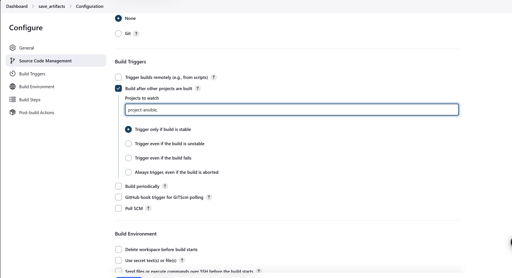
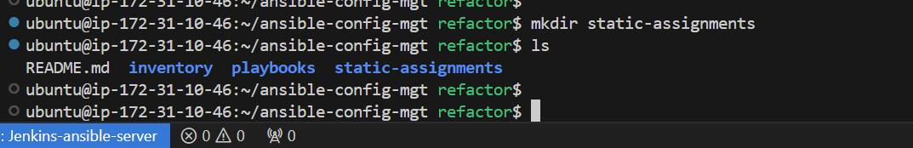

# ANSIBLE REFACTORING, ASSIGNMENTS AND IMPORTS

## OBJECTIVE:

The objective of this project is to elevate our ansible skills through refactoring, assignments and imports, thereby optimizing our automation workflows with advanced techniques. 
In this project, we will learn how to deploy and configure UAT Web Servers using Ansible imports and roles.

## OVERVIEW:

This project involves enhancing a Jenkins job, refactoring Ansible playbooks, and setting up a web server role for UAT environments.


## PREREQUISITES:

- Basic knowledge of Ansible and Jenkins
- Access to a Jenkins server and Ansible setup
- SSH access to EC2 instances


## ANSIBLE REFACTORING AND STATIC ASSIGNMENTS (IMPORTS AND ROLES)

In this project we will continue working with our `ansible-config-mgt` repository and make some improvements of our code. Now, we need to refactor our Ansible code, create assignments, and learn how to use the imports functionality.

 Ansible refactoring, assignments, and imports are concepts related to organizing and managing Ansible playbooks and roles effectively.

### **Ansible Refactoring:**
**Refactoring** in Ansible refers to the process of restructuring existing playbooks and roles to improve their readability, maintainability, and efficiency without changing their external behavior. This might involve:

- **Modularizing Code:** Breaking down large playbooks into smaller, reusable roles or tasks.
- **Removing Redundancies:** Identifying and eliminating duplicate tasks or variables.
- **Improving Naming Conventions:** Using clear and consistent naming for variables, tasks, and roles to enhance clarity.
- **Optimizing Performance:** Streamlining tasks to reduce execution time and resource usage. <br>

### **Assignments:**
In Ansible, **assignments** typically refer to the process of defining variables and their values within playbooks or roles. This can include:

- **Variable Assignment:** Setting variables using the vars section, set_fact, or by including variable files.
- **Inventory Variables:** Assigning host-specific variables in inventory files to customize behavior for different systems.
- **Defaults:** Using default variables in roles to provide fallback values if no specific value is provided.

### **Imports:**
Imports in Ansible are used to include other playbooks, roles, or tasks into a main playbook. This helps in organizing code and promoting reuse. Key points include:

**Importing Tasks:** Using `import_tasks` to include a set of tasks from another file. <br>
**Importing Roles:** Using `import_role` to include an entire role, which can encapsulate multiple tasks, handlers, and variables. <br>
**Static vs. Dynamic Imports:** `import_* statements` are processed at playbook parsing time, while `include_* statements` are processed at runtime, allowing for conditional inclusion of tasks.
Together, these concepts help in creating cleaner, more efficient, and maintainable Ansible code.

**Refactoring** is a general term in computer programming which means making changes to the source code without changing expected behaviour of the software. The main idea of refactoring is to enhance code readability, increase maintainability and extensibility, reduce complexity, add proper comments without affecting the logic.
In this project, we will move things around a little bit in the code, but the overall state of the infrastructure will remain the same.

Now, let us begin to improve our Ansible code.
<br>

## **REFACTORING ANSIBLE CODES BY IMPORTING OTHER PLAYBOOKS INTO `site.yml`**

### **STEP 1: - JENKINS JOB ENHANCEMENT:**

Before we start, we need to modify our Jenkins job. Currently, each code change creates a separate directory, which makes it inconvenient to run commands from a single location. Additionally, this approach takes up space on the Jenkins server with each new change. To improve this, we'll create a new Jenkins project/job and use the `Copy Artifact` plugin.


1. **Create a directory for Artifacts:** <br>
Access your Jenkins-Ansible server and create a directory named `ansible-config-artifact` which will use to store or copy all build artifacts to.


        sudo mkdir /home/ubuntu/ansible-config-artifact

<br>

2. **Setting permissions on the directory:** <br> 
Change the directory's permissions so Jenkins can save files there:

        chmod -R 0777 /home/ubuntu/ansible-config-artifact

    

<br>

3. **Install `Copy Artifact` plugin:** <br>
In the Jenkins web console, navigate to Manage Jenkins -> Manage Plugins, and in the Available tab, search for and install the Copy Artifact plugin **without restarting Jenkins**.

    

    

    

<br>

4. **Create a New Freestyle Project:** <br>
Create a new Freestyle project called **`save_artifacts`**. This `save_artifacts` job will be triggered by the completion of the `project-ansible` job created earlier.


<br>

5. Configure this project to trigger upon the completion of your existing Ansible project. You can also set a limit on the number of builds to keep, such as the last 2 or 5, to save space.

    To do this, we do the following:

- While creating the freestyle project,  in the configuration page, we need to scroll down to the section that says `Build Triggers` and select the option which says `Build after other projects are built`.
- Then we select the project titled `project-ansible`, which is the job that we want to watch, and then based on completion of this `project-absible`, we would like it to trigger a build.



- Now, we scroll up and locate the `General` section, select the field named `Discard Old builds`, and then select or type in `2` in the field named `Max # of builds to keep`.


6. **Configuring build step:**

The main idea of the `save_artifacts` project is to save artifacts in the `/home/ubuntu/ansible-config-artifacts` directory. To do this, add a Build step to copy artifacts from the ansible project to the target directory by following the steps below:.

- While we are still on the configuration page, we will scroll down to the `build steps` section and add a new build step. Choose "`Copy artifacts from another project`", select the project name (`project-ansible`), and pick the `latest successful build`. 
- In the Target directory field, we will enter `/home/ubuntu/ansible-config-artifacts`, and then save our changes.


<br>


7. **Testing the Setup:** <br>
We will test our setup by modifying the README.md file in our `ansible-config-mgt` repository on the master/main branch.

If both Jenkins jobs run successfully, you should see the updated files in the /home/ubuntu/ansible-config-artifact directory with each commit to the master branch, resulting in a more organized Jenkins pipeline.


<br>

**NOTE:** The screenshots above show that the `project-ansible` finished successfully, followed by the immediate execution of `save_artifacts`. This entire process occurred without any manual input. Additionally, if we check the `/home/ubuntu/ansible-config-artifact` directory, we will find that the artifacts have been copied automatically, as shown below:


With this done, now our pipeline is more neat and clean.


### **STEP 2: - REFACTORING ANSIBLE CODES USING IMPORTS OF OTHER PLAYBOOKS INTO OUR `site.yml`:**

#### **Understanding the Need for Refactoring:** <br>
Refactoring is essential for maintaining clean and efficient code. It allows you to:

- Simplify complex playbooks.
- Improve readability and maintainability.
- Facilitate easier collaboration with team members.


#### **Setting Up our Environment:**
Before we begin to refactor, it is important to ensure that we pull down the latest codes from the master/main branch, and then create a new branch which we will name as `refactor`.

- **Pull the Latest Code:** <br>
We will use the commands below to pull down the latest codes from the main branch of our github repository.

        git checkout main
        git pull origin main

    


- **Create a New Branch:**
After pulling the latest codes as shown above, we will create a new branch named `refactor` for our refactoring work using the command below:

      git checkout -b refactor

    

<br>

    NOTE: - `tree` installation on Linux servers (optional):
    For good organization and display of our directories and files, we can install `tree` plugin as shown below:

        sudo apt update
        sudo apt install tree


In our previous Ansible project, we focused on automating simple tasks and consolidated all tasks into a single playbook named `common.yml`. While this approach worked initially, it becomes impractical when managing numerous servers across various operating systems, each with unique requirements and tasks.

A more effective strategy is to organize our playbooks into multiple files based on logical categories. For example, we could create separate files for specific operating systems like Windows or RedHat, dedicated files for web servers, or files tailored to servers located in particular regions.

We can achieve this organization by utilizing Ansible’s import feature. <br> 
Here’s how to refactor our code:


#### **1. Create the `site.yml` Playbook:**
- **Create the site.yml File:** <br>
In the Playbooks directory, create a new file called `site.yml`. This will serve as the main entry point for our infrastructure, from which all other playbooks will be referenced.

        touch playbooks/site.yml

    

<br>

- **Import Existing Playbooks:** <br>
In the `site.yml`, import the `common.yml` playbook you created previously by doing the following:

    - Open the `site.yml` file using your preferred text editor (in this case, we use the vim editor).

          sudo vi playbooks/site.yml

    - Then, add the import statements below into the `site.yml` file:


            ---
            - hosts: all
            - import_playbook: ../static-assignments/common.yml

        

        

<br>

#### **2. Organize the playbooks:**
Next, we will organize the playbooks by doing the following below:

- **Create a Directory for Child Playbooks:** <br>
At the root level of our repository, we create a new directory named `static-assignments` to store all child playbooks. This is for easy organization of our work but it is not an ANsible concept, therefore we can choose how we want to organize our work.

        mkdir static-assignments

    

<br>

- **Move common.yml into the New Folder:**

    Move the existing `common.yml` (in Playbooks/common.yml) file into the newly created `static-assignments` directory. Your directory structure should now resemble the following:

        mv playbooks/common.yml static-assignments/

     
    
    <br>
    
    **Our directory structure now looks like this:**

    
    
    <br>

    To verify that everything is functioning correctly, execute the code below, just as we did in our previous project.

    Run ansible-playbook command against the dev environment:

        ansible-playbook -i inventory/dev.ini playbooks/site.yml

    

        We can also test the inventory parsing using the command below:

        ansible-inventory -i inventory/dev.ini --list


<br>

#### **3. Create a Playbook for Deletion:**

Since we need to apply some tasks to our dev servers and wireshark is already installed; we can go ahead and create another playbook under static-assignments and name it `common-del.yml`. In this playbook, we will configure deletion of wireshark utility. <br>
This playbook will handle the uninstallation of Wireshark and reset the timezone for the web servers to Asia/Tokyo. After that, we will update the site.yml file to include this new playbook and execute it.

We caary out this step by doing the following:

- **Create a New Playbook:**
Under static-assignments, create a new playbook called `common-del.yml` to handle the removal of the Wireshark utility.

        touch static-assignments/common-del.yml

    

- **Configure the Deletion Tasks:**
Add the following tasks to the created `common-del.yml`:

        ---
        - name: Update web, NFS, and DB servers
          hosts: webservers:nfs
          remote_user: ec2-user
          become: yes
          become_user: root
          tasks:
            - name: Delete Wireshark
              yum:
                name: wireshark
                state: removed

            - name: Set timezone to Asia/Tokyo
              command: timedatectl set-timezone Asia/Tokyo

        - name: Update DB server
          hosts: db
          remote_user: ubuntu
          become: yes
          become_user: root
          tasks:
            - name: Update apt repo
              apt:
                update_cache: yes

            - name: Delete Wireshark
              apt:
                name: wireshark
                state: removed

    

<br>

#### **4. Update site.yml for Deletion:**

Update the `site.yml` file to import the new `common-del.yml` playbook by pasting the code below into the `site.yml` file.

    ---
    - hosts: all
      import_playbook: ../static-assignments/common-del.yml


<br>

#### **5. Execute the Playbook:**

- **Run the Playbook:**
Navigate to the directory where your Ansible configuration is stored and execute the playbook against the development environment using the sets of commands below:

        cd /home/ubuntu/ansible-config-mgt/

        ansible-playbook -i inventory/dev.ini playbooks/site.yml

    

<br>

**Error observation:**
When this was run, the output below was gotten with an error for the `db` server due to the fact that the `state` parameter set for the `apt` module was wrongly defined as `removed`, whereas it should be defined as **`absent`**

    Also note that the output appeared long because two playbooks were combined in the `site.yml` file (common.yml and common-del.yml) and run. This method may be useful in instances where you may need to run multiple playbooks.

    In this case, now we will correct the wrong parameter definition for the apt module of the `db` server, and then we will specify only one playbook (common-del.yml) in the `site.yml` file, in order to ensure the output given will not be too long.


<br>

Now, we re-run the playbook after corrections have been made, and the output below is obtained:


**Verifying wireshark has been removed:**

We will verify that wireshark has been removed by SSHing into our webservers and running the command below:

    wireshark --version

**Confirming On Webserver1:**


The same results were observed on Webserver2 and Webserver3.


Now, we have learnt how to use `import_playbooks` module and we have a ready solution to **install/delete** packages on multiple servers with just one command.

<br>

### **STEP 3: - IMPLEMENTING OR MAKING USE OF ROLES IN ANSIBLE:**

**CONFIGURING UAT WEBSERVERS WITH A ROLE WEBSERVER:**

We now have our nice and clean `dev` environment, so let us put it aside and configure 2 new Web Servers as `uat`. We could write tasks to configure Web Servers in the same playbook, but it would be too messy, instead, we will use a dedicated role to make our configuration reusable. We do this by following the steps below:

#### **1. Launch EC2 Instances:**

- Launch or provision two fresh EC2 instances using the RHEL 9 image.
- Name the instances `Web1-UAT` and `Web2-UAT`.
- Ensure the instances are stopped when not in use to avoid extra charges. <br> <br>

    


#### **2. Create Webserver Role:**

Next, we will create a role. To create a role, we must create a directory called `roles/`, relative to the playbook file or in `/etc/ansible/` directory.

There are two ways we can create this folder structure:

We can either use an Ansible utility called `ansible-galaxy` inside `ansible-config-mgt/roles` directory (we need to create roles directory upfront) <br>
OR <br>
We can create this directory manually in our github, since we store all our codes in Github, rather than locally on the `Jenkins-Ansible` server.

<br>

- **Navigate to your Ansible configuration management directory:**

        cd ansible-config-mgt

<br>

- **Create a roles directory:** <br>
We do this by running the following commands:

        mkdir roles

        cd roles

    

<br>

- **Initialize the webserver role using `Ansible Galaxy`:** <br>
Run the following commands below to initialize the webserver role using `ansible galaxy`.

        ansible-galaxy init webserver

    

<br>

- **Creating the directory or file structure:** <br>
The entire directory structure should look like below:

```plaintext
    └── webserver
        ├── README.md
        ├── defaults
        │   └── main.yml
        ├── handlers
        │   └── main.yml
        ├── meta
        │   └── main.yml
        ├── tasks
        │   └── main.yml
        └── templates
        
```


But if you create it manually, you can skip creating `tests`, `files`, and `vars` or remove them if you used `ansible-galaxy`. <br>
In this case we used `ansible-galaxy`, hence we initially got the output below:


- **Delete unnecessary directories and files, keeping the following structure:** <br>
Now, we have to delete the `tests`, `files`, and `vars`, using the command below.

        cd webserver

        rm -r tests files vars 

    

Our new web directory structure in the screenshot above, now follows expected structure earlier specified above. 


#### **3. Update Inventory:**

Next, we update our inventory `ansible-config-mgt/inventory/uat.yml` file with IP addresses of our 2 UAT Web servers. <br>
Although, in this case we are making use of an **`ansible-config-mgt/inventory/uat.ini`** file.

    NOTE: Ensure you are using ssh-agent to ssh into the Jenkins-Ansible instance.

    As a reminder on how to do this, do the following:

    - Start the SSH Agent:

    `eval "$(ssh-agent -s)`

    - Add Your SSH Key:

    After starting the SSH agent, try adding your key (copy contents of your key from your system's download folder, create a key file with the same name, in your server's "~/.ssh/" folder and save, then paste the contents into it. Then you can run the command below to add your key):

    `ssh-add ~/.ssh/Jenkins-project.pem`

    - Check for existing agents:

    `ssh-add -l`


<br>

**Accessing the `Web1-UAT` on the terminal via the Jenkins-ansible server:**


 <br>

**Accessing the `Web2-UAT` on the terminal via the Jenkins-ansible server:**


<br>

Now, to carryout the activity of updating the inventory, we will do the following below:

- **First open the specific file using below command:**

        vi ansible-config-mgt/inventory/uat.ini


- **Then, update or paste into the `inventory/uat.ini` file with the sets of codes below:**

        [uat-webservers]
        <Web1-UAT-Server-Private-IP-Address> ansible_ssh_user='ec2-user'
        <Web2-UAT-Server-Private-IP-Address> ansible_ssh_user='ec2-user' 
        
        <br>
        
    In our case, it will appear as this below:

        [uat-webservers]
        172.31.20.13 ansible_ssh_user='ec2-user'
        172.31.30.223 ansible_ssh_user='ec2-user'

    

     

<br>

#### **4. Uncommenting/creating roles_path:**

In the `/etc/ansible/ansible.cfg` file, we will uncomment `roles_path` string and provide a full path to your roles directory `roles_path    = /home/ubuntu/ansible-config-mgt/roles`, so Ansible can know where to find configured roles.

Currently there is no `ansible.cfg` file anywhere on the server so we will be creating it.

NOTE: It is important to determine the locations to create the `ansible.cfg` file, and this will depend on if it is:

- **Project-specific:** ~/ansible-config-mgt/ansible.cfg
- **User-specific:** ~/.ansible.cfg
- **System-wide:** /etc/ansible/ansible.cfg

In this case, it is project specific so, we will create the file in the location `/etc/ansible/`.

For project-specific settings, it’s best to create the `ansible.cfg` file in the current working directory of our Ansible project. This allows us to customize configurations that are relevant only to the project without affecting other projects or users.

In this case, we have chosen to use `system-wide` location settings:

To do this, we do the following:

- Gain root access and use sudo to create or edit the `ansible.cfg` file:

        sudo mkdir /etc/ansible

        sudo touch /etc/ansible/ansible.cfg

        sudo vi /etc/ansible/ansible.cfg
        
    Then paste the following content into the file:

        [defaults]
        inventory = /home/ubuntu/ansible-config-mgt/inventory
        roles_path = /home/ubuntu/ansible-config-mgt/roles
        host_key_checking = False  # Optional

**NOTE:** Ensure you provide a full path to the` roles` directory in the `roles_path` section so that ansible can know where to find the configured roles.

<br>

#### **5. Tasks Configuration:**

Now, it's time to begin configuring our webservers and implementing some logic for the webserver role. We will navigate to the tasks directory and open the `main.yml` file. In there, we will write configuration tasks to accomplish the following:

- Install and set up the Apache (httpd) service.
- Clone the Tooling website from GitHub at https://github.com/<your-name>/tooling.git.
- Ensure that the tooling website code is deployed to /var/www/html on both UAT Web servers.
- Confirm that the httpd service is up and running.

<br>

In the `tasks/main.yml` file, add the following tasks below:

    cd ansible-config-mgt/roles/webserver/tasks

    sudo vi main.yml


```
---
- name: Install Apache
  become: true
  ansible.builtin.yum:
    name: "httpd"
    state: present

- name: Install Git
  become: true
  ansible.builtin.yum:
    name: "git"
    state: present

- name: Clone the Tooling Website
  become: true
  ansible.builtin.git:
    repo: https://github.com/darey-io/tooling.git
    dest: /var/www/html
    force: yes

- name: Copy HTML Content to One Level Up
  become: true
  command: cp -r /var/www/html/html/ /var/www/

- name: Start HTTPD Service
  become: true
  ansible.builtin.service:
    name: httpd
    state: started

- name: Remove Unnecessary Directory
  become: true
  ansible.builtin.file:
    path: /var/www/html/html
    state: absent

```

The output is given below:


### **STEP 4: - REFERENCE WEBSERVER ROLE:**

#### **1. Create a new assignment file for **`UAT web servers`** at `static-assignments/uat-webservers.yml`:**

This is where we will reference the role (the assignment file is `uat-webservers.yml`):

Paste the following code below into the file:
```
    ---
    - hosts: uat-webservers
      roles:
         - webserver

```
    
    touch static-assignments/uat-webservers.yml

    sudo vi static-assignments/uat-webservers.yml


#### **2. Update the site.yml file to include the new UAT assignment:**

Remember that the entry point to our ansible configuration is the `site.yml` file. Therefore, we need to refer our `uat-webservers.yml` role inside `site.yml`.
So, we should have this in `site.yml` as shown below.

```

---
- hosts: all
- import_playbook: ../static-assignments/common.yml

- hosts: uat-webservers
- import_playbook: ../static-assignments/uat-webservers.yml


```


### **STEP 5: - COMMIT AND TEST:**

**Now**, let us test the roles, and to get this done, we do the following:

**1. Commit Changes:**

From our local machine, we will save, commit and push the `ansible-config-mgt` repository to our GitHub.

We commit our changes to the GitHub repository using the following commands and ensure we are on the `refactor` branch:

```

git add .
git commit -m "Refactor Ansible code and implement UAT webserver role"
git push origin refactor


```

<br>

**2. Create a Pull Request:**

This involves merging the changes into the main branch.
To do this, we need to ssh into our `Jenkins-Ansible` server and pull the latest changes from Github to the the repository by creating a `Pull Request` and merging them to master/main branch. <br> 

We can do this using the commands below:

    git checkout master

    git pull origin main


Pull requests can alternatively be made in github:


```
NOTE: We need to make sure webhook triggers two consequent Jenkins jobs, runs them successfully and copies all the files to our Jenkins-Ansible server, into /home/ubuntu/ansible-config-mgt/ directory.

```

**3. Run the Playbook:**

Now we will run the playbook against our uat inventory and see what happens:
NOTE: Before running your playbook, ensure you have tunneled into your Jenkins-Ansible server via ssh-agent

    cd /home/ubuntu/ansible-config-mgt

    ansible-playbook -i inventory/uat.ini playbooks/site.yml

Make sure you do not put a `/` before your `inventory/uat.ini` as the `/` refers to the root directory of the file system instead.

<br>

**Note:** If your uat file is in yaml format, you can use the command below instead:

    ansible-playbook -i inventory/uat.ini Playbooks/site.yml

<br>

When the playbook was run, the error below was gotten and adjustments were made to the code in the `site.yml` file. This error is due to indentation and placement issues with the code. Also, `tasks` was supposed to have been defined right under `hosts` but it wasn't. <br>
Below is the correction code to be put into the `site.yml` file:

```
---
- hosts: all
  tasks:
    - import_playbook: ../static-assignments/common.yml

- hosts: uat-webservers
  tasks:
    - import_playbook: ../static-assignments/uat-webservers.yml

```


Also, the `uat.ini` file was modified according to include path to the key needed to access the webservers (`Web1-UAT` and `Web2-UAT`):

```
[uat-webservers]
172.31.20.13 ansible_ssh_user=ec2-user ansible_ssh_private_key_file=~/.ssh/Jenkins-project.pem
172.31.30.223 ansible_ssh_user=ec2-user ansible_ssh_private_key_file=~/.ssh/Jenkins-project.pem

```


<br>

**4. Re-run the ansible playbook:**

    ansible-playbook -i inventory/uat.ini playbooks/site.yml


<br>

**5. Access the Web Servers:**

Before accessing via the web browser, first ensure you open HTTP port 80 on both web browsers to allow access on the web browser.


After doing that, then open a web browser and navigate to:

```
http://<Web1-UAT-Public-IP>/index.php

```

In this case of our project, it will be:

For Web1-UAT:

    http://54.73.236.61/index.php
    


For Web2-UAT:

    http://3.254.59.199/index.php


With this, we have successfully learnt how to deploy and configure UAT Web Servers using Ansible imports and roles.


