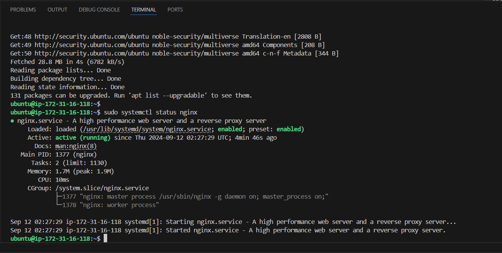
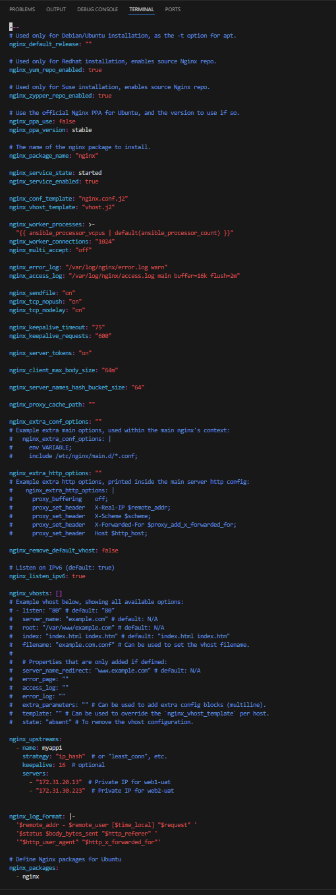
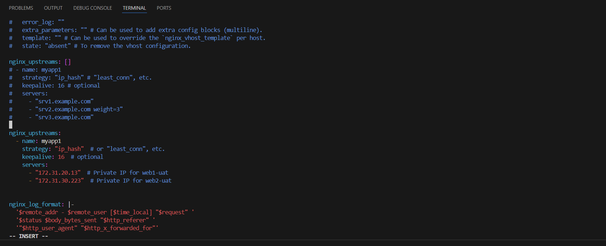
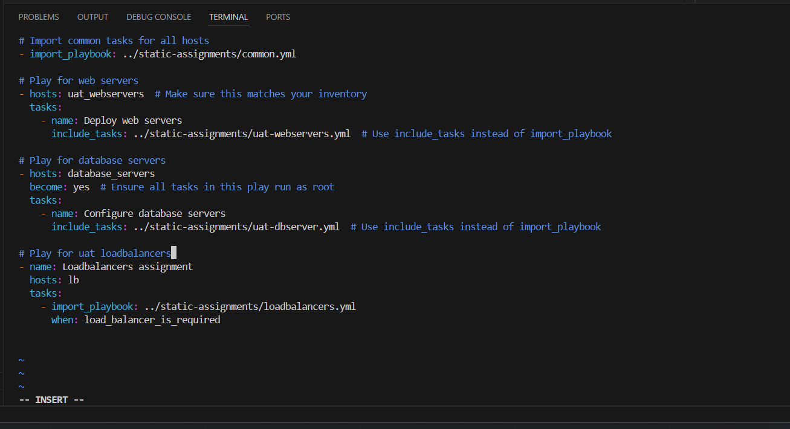
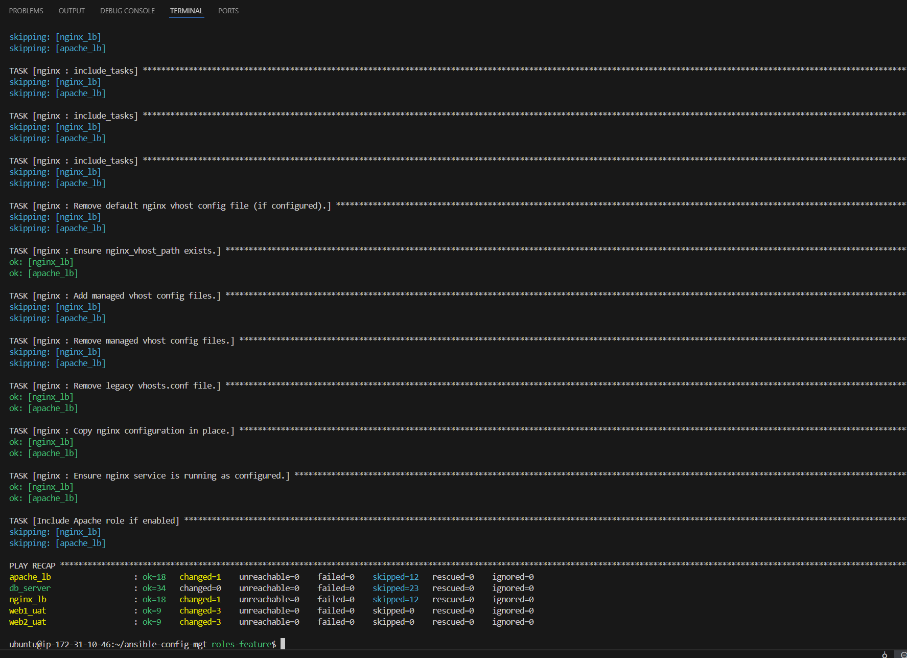

# ANSIBLE DYNAMIC ASSIGNMENTS (INCLUDE) AND COMMUNITY ROLES

## Project Overview
This project involves configuring UAT servers using Ansible, focusing on dynamic assignments with the include module and leveraging community roles for MySQL and load balancers. The goal is to manage multiple environments (dev, stage, uat, prod) efficiently by dynamically assigning variables and roles.

### Objectives

The following are objectives of the project:

- Understand the difference between `static` and `dynamic` assignments in Ansible.
- Implement dynamic variable assignments using the `include_vars` module.
- Utilize community roles for MySQL and load balancers (Nginx and Apache).
- Configure the UAT environment for a tooling web solution.

## Prerequisites
- Ansible installed on your Jenkins-ansible server.
- Access to AWS EC2 instances as specified in your project.
- A GitHub repository set up to manage your Ansible configuration.


## Introduction

In the previous two projects, we gained foundational knowledge and skills in Ansible, enabling us to perform configurations using playbooks, roles, and imports. Now, we will build on this knowledge by configuring our UAT servers while exploring new Ansible concepts and modules.

This project will focus on dynamic assignments through the use of the `include` module. You may be curious about the distinction between `static` and `dynamic` assignments. From Project 12, you already know that `static` assignments utilize the `import` module, while `dynamic` assignments are facilitated by the `include` module.

To clarify:

- **Import = Static**
- **Include = Dynamic**

When the `import` module is employed, all statements are pre-processed during the parsing of the playbook. This means that when you run the `site.yml` playbook, Ansible processes all referenced playbooks at that moment. Consequently, any changes made to those statements after parsing will not be recognized during execution, making it `static`.

In contrast, the `include` module processes statements only during the actual execution of the playbook. After parsing, any modifications to the statements encountered during execution will be applied, allowing for dynamic behavior.

While dynamic assignments can offer flexibility, it is generally advisable to use static assignments for most playbooks due to their reliability. The dynamic nature of the `include` module can complicate debugging, making it harder to identify issues within the playbook. However, dynamic assignments can be particularly useful for managing environment-specific variables, which we will explore further in this project.

<br>

## **Introducing Dynamic Assignment Into Our structure:**

### **Step 1: - Create a New Branch:**

- We will begin by first creating a new branch in our github repository `https://github.com/<your-name>/ansible-config-mgt` and name it `dynamic-assignments`.

We can also Start by creating a new branch for dynamic assignments from our terminal:

    git checkout -b dynamic-assignments


### **Step 2: - Create Dynamic Assignments Folder:**

- Create a new folder named `dynamic-assignments` and add `env-vars.yml` using the commands below:

        mkdir dynamic-assignments
        touch dynamic-assignments/env-vars.yml

<br>

- Add the following content to env-vars.yml:

```
---
- name: collate variables from env specific file, if it exists
  hosts: all
  tasks:
    - name: looping through list of available files
      include_vars: "{{ item }}"
      with_first_found:
        - files:
            - dev.yml
            - stage.yml
            - prod.yml
            - uat.yml
          paths:
            - "{{ playbook_dir }}/../env-vars"
      tags:
        - always

```

<br>

---
**NOTE:** 

**ANALYZING THE CODES ABOVE:**

Now, let’s analyze the code above to grasp its functionality:

The primary goal of this code is to load environment-specific variables dynamically, ensuring that the playbook utilizes the appropriate configurations for the target environment (such as dev, stage, prod, etc.).

<br>

- **Play Definition:**
The play is named **"collate variables from env specific file, if it exists"** and targets all hosts defined in the inventory.

- **Task Name:**
The task is labeled **"looping through list of available files,"** indicating its purpose of iterating over potential environment-specific variable files.

- **`include_vars:`** As mentioned earlier, this module is utilized to load variables from files dynamically during the execution of a playbook. The file name is dynamically assigned using `{{ item }}` during the loop.

- **`with_first_found:`** This line iterates through the file names (like dev.yml, stage.yml, etc.), looking for the first available file and storing it in the placeholder `{{ item }}`.

- **`files:`**
This section lists the variable files that the task will check for existence. The order is significant; it will check dev.yml first, followed by stage.yml, and so on.

- **`paths:`** This specifies the directory where `with_first_found` will look for the files. The path is constructed using `{{ playbook_dir }}`, which points to the directory of the currently running playbook, combined with `../env-vars`, indicating that the variable files are located in a sibling directory named `env-vars`.

- **`tags:`**
The task is tagged with always, meaning it will run regardless of whether specific tags are included when executing the playbook.

- **The `{{ playbook_dir }}` variable:** is a special Ansible variable that indicates the absolute path to the directory where the currently executing playbook is located.

---
<br>
<br>


So, we will add the content or codes by doing the following:

    cd dynamic-assignments
    sudo vi env-vars.yml

    Then paste the contents into it and save the file.


### Key Points to Note:
1. We utilized the `include_vars` syntax instead of `include` because Ansible developers chose to distinguish between different functionalities of the module. Starting from Ansible version 2.8, the `include` module has been deprecated, and we should now use the `include_*` variants, which include:

- `include_role`
- `include_tasks`
- `include_vars` 
<br>
    <br>
    Additionally, this version introduced several `import` variants, such as:

- `import_role`
- `import_tasks`

2. We are using special variables like `{{ playbook_dir }}` and `{{ inventory_file }}`. The `{{ playbook_dir }}` variable allows Ansible to identify the location of the currently running playbook, enabling it to navigate to other paths in the filesystem. Conversely, `{{ inventory_file }}` dynamically resolves to the name of the inventory file in use and appends `.yml` to locate the necessary file within the `env-vars` folder.


3. We are including variables through a loop. The `with_first_found` directive means that as we iterate through the list of files, the first one found will be used. This approach is beneficial because it allows us to set default values if a specific environment-related file is not available.

<br>

### **Step 3: - Update site.yml:**

Now, we will update site.yml file to make use of the dynamic assignment. (At this point, we cannot test it yet. We are just setting the stage for what is yet to come).

1. **Modify site.yml to include dynamic assignments:**

Paste the following into the `site.yml` file.

```
---
- hosts: all
  tasks:
    - name: Include dynamic variables 
      include: ../dynamic-assignments/env-vars.yml
      tags:
        - always

- hosts: webservers
  import_playbook: ../static-assignments/webservers.yml

```


    cd playbooks
    sudo vi site.yml

    Then paste the content into the site.yml file and save


---
**ANALYZING THE CODE PASTED INTO SITE.YML FILE:**

Let’s analyze the code in the `site.yml` file.

We have defined two distinct plays, each targeting different hosts and executing various tasks.

### Play 1:

- Targets all hosts.
- Executes the general task specified in the `common.yml` file using the `Import_playbook` module.
- Dynamically includes the variables defined in the `dynamic-assignments/env-vars.yml` file.
- **Tags:** The use of `always` here ensures that this task runs consistently.

### Play 2:

- Targets only the `uat-webservers`.
- Executes the task defined in the `static-assignments/uat-webservers.yml` file. Note that this file does not contain task definitions; instead, it uses the `role` module to invoke tasks defined in `webservers/task.main.yml`.

### Key Points:

- **Modularity:** The playbook is structured into separate plays for different objectives and target hosts.
- **Reusability:** It utilizes reusable playbooks (`common.yml` and `uat-webservers.yml`) for specific tasks aimed at different servers.

---


### **Step 4: - Create Environment Variable Files:**

Since we will be using the same Ansible setup to configure various environments, each of which will have distinct attributes like server names and IP addresses, we need a method to assign values to variables specific to each environment. 

To achieve this, we will create a directory to store the variable files for each environment. Thus, we will create a new folder called `env-vars`, and within it, create separate YAML files for each environment to define the variables.

Your directory structure should now appear as follows:

```
├── dynamic-assignments
│   └── env-vars.yml
├── env-vars
    └── dev.yml
    └── stage.yml
    └── uat.yml
    └── prod.yml
├── inventory
    └── dev
    └── stage
    └── uat
    └── prod
├── playbooks
    └── site.yml
└── static-assignments
    └── common.yml
    └── webservers.yml
```


To execute this, we will do the following:

1. **Create a folder named env-vars and add environment-specific YAML files using the commands below:**

        mkdir env-vars
        touch env-vars/{dev.yml,stage.yml,uat.yml,prod.yml}

    

<br>

2. **Populate these files with environment-specific variables as needed.**
This will be done automatically, thanks to the code which has been pasted into the `env-vars.yml` file.

<br>

## **Community Roles in Ansible:**

Ansible Community Roles are ready-made roles created and shared by the Ansible community via Ansible Galaxy. Ansible Galaxy serves as an online platform for discovering, sharing, and managing Ansible resources. It offers a centralized hub for roles, playbooks, and collections that users can utilize to automate various tasks and configurations.

While we have been developing our Ansible project code on our local machine, we will now be installing some community roles on our Jenkins Server. Therefore, we need to make sure that the cloned repository is set up to push changes to GitHub.

- On the Jenkins Server, access the `ansible-config-mgt` repository.

Next, configure the Jenkins Server to enable it to push commits to GitHub. You can achieve this by following the guidelines for Connecting to GitHub with SSH.

### **Step 5: - Download and Install MySQL Ansible Role:**

We will be using a MySQL role developed by **geerlingguy**.

**Hint:** To preserve your your GitHub in actual state after you install a new role - make a commit and push to master/main of your 'ansible-config-mgt' directory. Of course you must have git installed and configured on Jenkins-Ansible server and, for more convenient work with codes, you can configure Visual Studio Code to work with this directory. <br>
In this case, you will no longer need webhook and Jenkins jobs to update your codes on Jenkins-Ansible server, so you can disable it - we will be using Jenkins later for a better purpose. <br>
On Jenkins-Ansible server make sure that git is installed with `git --version`, then go to `ansible-config-mgt` directory and run the following below:

```
git init
git pull https://github.com/<your-name>/ansible-config-mgt.git
git remote add origin https://github.com/<your-name>/ansible-config-mgt.git
git branch roles-feature
git switch roles-feature

```


Inside roles directory create your new MySQL role with `ansible-galaxy install geerlingguy.mysql` and rename the folder to mysql

- **Navigate to Your Roles Directory:**

      cd roles

- **Download the MySQL Role:**

  If you're using Ansible Galaxy, you can install the MySQL role using the following command:

      ansible-galaxy install geerlingguy.mysql

- **Check the Installed Roles:**

      ls

- **Rename the folder to `mysql`:**

      mv geerlingguy.mysql/ mysql


  


- **Pushing changes to GitHub:** <br>
Now it is time to upload the changes into our GitHub: <br>
We push the changes to GitHub, and then pull the updates to our local machine. This will make it easier to write and modify the YAML code in VSCode.<br>
  <br>
Once you're back on your local machine and have pulled the newly created files, 
go to: <br>
`roles/mysql/defaults/main.yml` to make the following changes:

```
git add .
git commit -m "Commit new role files into GitHub"
git push --set-upstream origin roles-feature

```

  


Now, if we are satisfied with our codes, we can create a Pull Request and merge it to main branch on GitHub.

- Once we are back on your local machine and have pulled the newly created files, go to `roles/mysql/defaults/main.yml` to make the following changes:

- In the `main.yml` file, scroll down to the section where you can find **`# Databases` and `# Users`**, then carryout the following changes below:

  


```

# Databases.
mysql_databases: []
#   - name: tooling
#     collation: utf8_general_ci
#     encoding: utf8
#     replicate: 1

# Users.
mysql_users: []
#   - name: webaccess
#     host: 0.0.0.0
#     password: password1
#     priv: "*.*:ALL, GRANT"

```

  The code above creates a database called `tooling` and a user with the details specified.

- Next, we will provision a new database server instance running ubuntu 22.04 OS and add this host details to the `inventory/uat.ini` file.

Our `inventory/uat.ini` file will look like this below:

```

[all:vars]
# Default key file (can be overridden by specific groups)
ansible_ssh_private_key_file=~/.ssh/Jenkins-project.pem

[uat_webservers]
web1_uat ansible_host=172.31.20.13 ansible_user=ec2-user
web2_uat ansible_host=172.31.30.223 ansible_user=ec2-user

[database_servers]
db_server ansible_host=172.31.35.68 ansible_user=ubuntu ansible_ssh_private_key_file=/home/ubuntu/keys/project10-key.pem

[load_balancers]
nginx_lb ansible_host=172.31.16.118 ansible_user=ubuntu ansible_ssh_private_key_file=/home/ubuntu/keys/project10-key.pem
apache_lb ansible_host=172.31.27.224 ansible_user=ubuntu ansible_ssh_private_key_file=/home/ubuntu/keys/project10-key.pem

```

ALthough, if we were using a `uat.yml` file, it would like this below:

```

all:
  vars:
    ansible_ssh_private_key_file: ~/.ssh/Jenkins-project.pem

    # Static variables for UAT environment
    load_balancer_is_required: true

    # Nginx Specific Variables
    enable_nginx_lb: true  # Set to true to enable Nginx
    nginx_ppa_version: "stable"
    nginx_package_name: "nginx"

    # Apache Specific Variables
    enable_apache_lb: false  # Set to true to enable Apache
    apache_document_root: /var/www/html
    apache_server_name: 172.31.27.224
    apache_port: 80  # Default port for Apache
    apache_port: 8080

  children:
    uat_webservers:
      hosts:
        web1_uat:
          ansible_host: 172.31.20.13
          ansible_user: ec2-user
        web2_uat:
          ansible_host: 172.31.30.223
          ansible_user: ec2-user

    database_servers:
      hosts:
        db_server:
          ansible_host: 172.31.35.68
          ansible_user: ubuntu
          ansible_ssh_private_key_file: /home/ubuntu/keys/project10-key.pem

    load_balancers:
      hosts:
        nginx_lb:
          ansible_host: 172.31.16.118
          ansible_user: ubuntu
          ansible_ssh_private_key_file: /home/ubuntu/keys/project10-key.pem
        apache_lb:
          ansible_host: 172.31.27.224
          ansible_user: ubuntu
          ansible_ssh_private_key_file: /home/ubuntu/keys/project10-key.pem

```


<br>

- In the static-assignments directory, create a new file named `uat-dbserver .yml` for the mysql_role. Then, insert the following code into the `static-assignments/uat-dbserver.yml` file:

```

---
- hosts: database_servers
  roles:
    - mysql

```


**NOTE:** This code above specifies that the playbook will target the **database_servers** group and apply the mysql role to those hosts.


- Now, we will modify the `playbooks/site.yml` file to look like this:

```

---
- import_playbook: ../static-assignments/common.yml

- hosts: uat-webservers
  tasks:
    - name: Include web server playbook
      include_tasks: ../static-assignments/uat-webservers.yml

- hosts: database_servers
  tasks:
    - name: Include database server playbook
      include_tasks: ../static-assignments/uat-dbserver.yml


```


Finally, after doing this, we can save, commit our work and push to our changes to GitHub.

### **Step 6: - Testing our MySQL Ansible Role:**

Now, we need to test our MySQL role which we have created but before we do that, it is important that we check that our servers to be used are pinged to confirm that they are up and without connectivity or availability issues.
We can do this by running the following command below:

    ansible all -m ping -i inventory/uat.ini


- Next, we will run our ansible `playbooks/site.yml` file inorder to configure the `uat servers` using the command below:

      ansible-playbook -i inventory/uat.ini playbooks/site.yml

    


With this above, we have successfully configured our uat webservers and our uat database.

<br>
<br>


## **Manually Creating the Loadbalancers:**

### **1. Launch and Provision 2 Loadbalancer EC2 instances:**

We will first launch 2 EC2 instances to serve as the loadbalancers (one for nginx and the other for apache). In this case, we have chosen to use ubuntu 22.04 operating system.


### **2. Install the Nginx and Apache servers:**

- For Nginx:

Run the following commands below:

    sudo apt install nginx -y  # For Amazon Linux
    sudo systemctl start nginx
    sudo systemctl enable nginx


- For Apache:

Run the following commands below:

    sudo apt install apache2 -y  # For Amazon Linux (Ubuntu OS) 
    sudo systemctl start apache2 
    sudo systemctl enable apache2

**NOTE:** Since we are using ubuntu systems, the command for apache server installation is specified as **`apache2`** (`sudo apt install apache2`) instead of `httpd` which is the command specification used in RedHat operating systems (`sudo yum install httpd`)




<br>

### **3. Configure the Loadbalancers:**

We will configure the two loadbalancers by editing the configuration file to include the `UAT web servers`.

- **For Nginx, edit the `/etc/nginx/nginx.conf`:**

We will edit the `/etc/nginx/nginx.conf` file on the Nginx loadbalancer as shown below:

    sudo vi /etc/nginx/nginx.conf

Then paste the following script into the file:

```

http {
    upstream backend {
        server 172.31.20.13;  # web1-uat
        server 172.31.30.223;  # web2-uat
    }

    server {
        listen 80;

        location / {
            proxy_pass http://backend;
        }
    }
}

```

  - Save and exit

  - Then **restart the Load Balancer Service:**

        sudo systemctl restart nginx


<br>

**NOTE:** You will want to add your new configuration (just like the one above with specific server ips) within the existing `http { ... }`. <br>
When pasting the configuration, take note that the `http {` already exists in the configuration file, so just make sure you locate are only pasting the `upstream` and `server block` configuration inside the `http { ... }` block, just as shown below.


<br>

- **For Apache, we can configure in two ways:**

  - **Method 1:** We can either edit the `/etc/apache2/apache2.conf`:

        NOTE: If it is a RedHat system, then the apache configuration file would be located at `/etc/httpd/conf/httpd.conf`.

    To do this for the ubuntu sytem, we will locate our apache configuration file at `/etc/apache2/apache2.conf` and edit it with the following details below, just as we did on the nginx server:

      
    ```

    <Proxy *>
        Order deny,allow
        Allow from all
    </Proxy>

    ProxyPass / balancer://mycluster/
    ProxyPassReverse / balancer://mycluster/

    <Proxy balancer://mycluster>
        BalancerMember http://172.31.20.13
        BalancerMember http://172.31.30.223
    </Proxy>

    ```


<br>

Alternatively, we can also configure the apache2 on ubuntu by doing the following.

  - **Method 2:** By creating and editing a new configuration file.

    To configure our Apache server on Ubuntu with the provided proxy settings above, we need to make some adjustments to our Apache configuration with a few changes specifically needed for Apache on Ubuntu.

    1. **Enable Required Modules:**

        Before adding the configuration, ensure that the necessary modules are enabled. You will need the proxy, proxy_http, and proxy_balancer modules. You can enable them with the following commands:

            sudo a2enmod proxy
            sudo a2enmod proxy_http
            sudo a2enmod proxy_balancer
            sudo a2enmod lbmethod_byrequests  # Optional: Load balancing method

            sudo systemctl restart apache2

    2. **Create or Edit a Configuration File:**

        Instead of adding the proxy configuration directly into the apache2.conf, it's better practice to create a new configuration file in the sites-available directory. This way, it can be easily managed and enabled or disabled.

        We create the new configuration file using the command below:

            sudo vi /etc/apache2/sites-available/myproxy.conf

        <br>
        
        Add the script below into the file:

        ```
        <Proxy *>
            Require all granted
        </Proxy>

        ProxyPass / balancer://mycluster/
        ProxyPassReverse / balancer://mycluster/

        <Proxy balancer://mycluster>
            BalancerMember http://172.31.20.13
            BalancerMember http://172.31.30.223
        </Proxy>

        ```

        


    Then, **Save** and **Exit**.

    3. **Enable the New Site Configuration:**
    
      Now, we will enable the new site configuration by doing the following:

        sudo a2ensite myproxy.conf

    4. **Test the Configuration:**

      Before restarting Apache, test the configuration for any syntax errors:

        sudo apache2ctl configtest

    5. **restart the Load Balancer Service:**

        sudo systemctl restart apache2

Now, we have successfully added the proxy configuration to your Apache server on Ubuntu. 

<br>

## **Using Ansible playbooks and Configurations to create and configure our Load balancers:**

## **UPDATING ANSIBLE CONFIGURATION:**
### **1. Configuring LoadBalancer Roles:**

We want to be able to choose which Load Balancer to use, Nginx or Apache, so we need to have two roles respectively:

1. Nginx
2. Apache

With our experience on Ansible so far we can:

- Decide if we want to develop our own roles, or find available ones from the community
- Update both static-assignment and site.yml files to refer the roles

```
Important Hints:


- Since we cannot use both Nginx and Apache load balancer, we need to add a condition to enable either one - this is where we can make use of variables.

- Declare a variable in 'defaults/main.yml' file inside the Nginx and Apache roles. Name each variables enable_nginx_lb and enable_apache_lb respectively.

- Set both values to false like this `enable_nginx_lb: false` and `enable_apache_lb: false`.

- Declare another variable in both roles `load_balancer_is_required` and set its value to `false` as well

- Update both assignment and `site.yml` files respectively

```


#### **1. Create Nginx and Apache Roles:**

Decide whether to create your own roles or use community roles for Nginx and Apache.
If creating your own, declare the following variables in `defaults/main.yml` for both roles (Nginx and Apache):

```
enable_nginx_lb: false
enable_apache_lb: false
load_balancer_is_required: false

```

In this case, we will install the roles from the community. To do this, we will connect to the Jenkins-ansible Server via SSH and go to the `ansible-config-mgt` repository. We must make sure we are on the `roles-feature` branch.

Next, we will access the `roles` directory and install both the Nginx and Apache Roles with the following steps:

- **Navigate to your Ansible roles directory:**

      cd ansible-config-mgt/roles

- **Create a new role for Nginx and Apache:**

  We will do this by running the commands below:

      ansible-galaxy init nginx
      ansible-galaxy init apache

OR 

  In our case, we will be running the commands below:

      ansible-galaxy role install geerlingguy.nginx

      ansible-galaxy role install geerlingguy.apache


  


- **Change the directory names for both the nginx and apache roles:**


At this point, we can push our changes to GitHub and then pull it down on our local machine.


#### **2. Declaring Variables in `defaults/main.yml` file for both Nginx and Apache roles:**

We will declare the following variables in the `defaults/main.yml` for both roles:

- **In the Nginx role:**

      sudo vi roles/nginx/defaults/main.yml

  Once the file is opened in the editor, scroll to the bottom and add the following variables, then save and exit:

  
      enable_nginx_lb: false
      load_balancer_is_required: false

  


- **In the Apache role:**

      enable_apache_lb: false
      load_balancer_is_required: false

  


#### **3. Configuring the Nginx and Apache servers:**

**NOTE:** In case you haven't already installed your Nginx or Apache servers on your EC2 instances, you can do the following steps in order to get this done.

After creating a new role for Nginx and Apache, do the following to get your servers installed and running:

<br>

- **NGINX CONFIGURATION FOR UBUNTU:**

  Since the Nginx role has been created, you can navigate to the `nginx/tasks/main.yml` file in `roles` and add the script which will be given below to install and configure Nginx on the server instance.
  
  <br>

  **1. Edit nginx/tasks/main.yml**

    Navigate to the nginx/tasks/main.yml as shown below:

      cd roles/nginx/tasks

      sudo vi main.yml

  OR

    Simply run the command below in the `ansible-config-mgt/roles` directory to edit the file directly:

      sudo vi nginx/tasks/main.yml

    
    <br>
    
    Then, paste the following into the file:

```

---
# Variable setup.
- name: Include OS-specific variables.
  include_vars: "{{ ansible_os_family }}.yml"

- name: Define nginx_user.
  set_fact:
    nginx_user: "{{ __nginx_user }}"
  when: nginx_user is not defined

# Setup/install tasks.
- include_tasks: setup-RedHat.yml
  when: ansible_os_family == 'RedHat' or ansible_os_family == 'Rocky' or ansible_os_family == 'AlmaLinux'

- include_tasks: setup-Ubuntu.yml
  when: ansible_distribution == 'Ubuntu'

- include_tasks: setup-Debian.yml
  when: ansible_os_family == 'Debian'

- include_tasks: setup-FreeBSD.yml
  when: ansible_os_family == 'FreeBSD'

- include_tasks: setup-OpenBSD.yml
  when: ansible_os_family == 'OpenBSD'

- include_tasks: setup-Archlinux.yml
  when: ansible_os_family == 'Archlinux'

- include_tasks: setup-Suse.yml
  when: ansible_os_family == 'Suse'


# Vhost configuration.
# Vhost configuration.
- import_tasks: vhosts.yml
- import_tasks: vhosts.yml

# Nginx setup.
- name: Copy nginx configuration in place.
  template:
    src: "{{ nginx_conf_template }}"
    src: "{{ nginx_conf_template }}"
    dest: "{{ nginx_conf_file_path }}"
    owner: root
    group: "{{ root_group }}"
    mode: 0644
    mode: 0644
  notify:
    - reload nginx

- name: Ensure nginx service is running as configured.
  service:
    name: nginx
    state: "{{ nginx_service_state }}"
    enabled: "{{ nginx_service_enabled }}"


```

Upon viewing the `tasks/main.yml` file, we can see that some configurations already exist which point to `setup-Ubuntu.yml` for setting up ubuntu on server instances. This is so because we installed our nginx as well as our apache roles from a community using `ansible-galaxy role install geerlingguy.nginx`.

- **Navigate to and open the `setup-Ubuntu.yml` in the `nginx/tasks` directory:**

      sudo vi nginx/tasks/setup-Ubuntu.yml

    Then, move to the bottom of the file and paste the following script in addition to that which already exists in the file:


```

# New tasks for installation and configuration

# Check if Nginx is already installed
- name: Check if Nginx is installed
  command: nginx -v
  register: nginx_installed
  ignore_errors: true

# Install Nginx if not installed
- name: Install Nginx
  apt:
    name: nginx
    state: present
    update_cache: yes
  when: nginx_installed.rc != 0

# Start and enable Nginx
- name: Start and enable Nginx
  systemd:
    name: nginx
    state: started
    enabled: yes

# Copy nginx configuration in place
- name: Copy nginx configuration in place
  template:
    src: nginx.conf.j2  # Ensure this file exists in your templates directory
    dest: /etc/nginx/nginx.conf
    owner: root
    group: root
    mode: '0644'
  notify:
    - reload nginx

# Handler to reload Nginx
handlers:
  - name: reload nginx
    systemd:
      name: nginx
      state: reloaded

```

<br>

**Final Content in the setup-Ubuntu.yml file after modifying and optimizing:**

Next, you can optimize the configurations in the `setup-Ubuntu.yml file until you have something like this in your `setup-Ubuntu.yml` file, at the end of the day:

```
---
# Ensure dirmngr is installed (gnupg dependency for adding PPA)
- name: Ensure dirmngr is installed (gnupg dependency).
  apt:
    name: dirmngr
    state: present
  become: yes
  tags: nginx

# Add PPA for Nginx (if configured)
- name: Add PPA for Nginx (if configured)
  apt_repository:
    repo: 'ppa:nginx/{{ nginx_ppa_version }}'
    state: present
    update_cache: true
  register: nginx_ppa_added
  when: nginx_ppa_use | bool
  become: yes
  tags: nginx

# Ensure nginx will reinstall if the PPA was just added
- name: Ensure Nginx will reinstall if the PPA was just added
  apt:
    name: "{{ nginx_package_name }}"
    state: absent
  when: nginx_ppa_added is changed
  become: yes
  tags: ['skip_ansible_lint', 'nginx']

# Check if Nginx is installed
- name: Check if Nginx is installed
  command: nginx -v
  register: nginx_installed
  ignore_errors: true
  args:
    chdir: / # Ensure this is correct, or remove if not needed
  tags: nginx

# Install Nginx if not installed
- name: Install Nginx
  apt:
    name: "{{ nginx_package_name }}"
    state: present
    update_cache: true
  when: nginx_installed.failed
  become: yes
  tags: nginx

# Start and enable Nginx
- name: Start and enable Nginx
  service:
    name: nginx
    state: started
    enabled: yes
  become: yes
  tags: nginx

# Copy Nginx configuration
- name: Copy Nginx configuration in place
  template:
    src: nginx.conf.j2
    dest: /etc/nginx/nginx.conf
    owner: root
    group: root
    mode: '0644'
  notify:
    - reload nginx
  become: yes
  tags: nginx

# Validate Nginx configuration
- name: Validate Nginx configuration
  command: nginx -t -c /etc/nginx/nginx.conf
  changed_when: false
  become: yes
  tags: nginx

```


After pasting into the file, you can save and exit the editor.


- **APACHE CONFIGURATION FOR UBUNTU:**

When we view the list of files in the Apache role, we find that there is no `setup-Ubuntu.yml` file, so we will create it and set all configurations necessary.

    cd roles/apache/tasks
    touch setup-Ubuntu.yml
    sudo vi setup-Ubuntu.yml

  Then, we paste the following codes below into the file:


```

---
# tasks/setup-Ubuntu.yml

- name: Update apt cache
  apt:
    update_cache: yes
    cache_valid_time: 3600

# Check if Apache is already installed
- name: Check if Apache is installed
  command: apache2 -v
  register: apache_installed
  ignore_errors: true

# Ensure Apache is installed on Ubuntu if not already installed
- name: Ensure Apache is installed on Ubuntu
  apt:
    name: "{{ apache_packages }}"
    state: "{{ apache_packages_state }}"
  when: apache_installed.rc != 0

# Start and enable Apache
- name: Start and enable Apache
  systemd:
    name: apache2
    state: started
    enabled: yes
  when: apache_installed.rc == 0

# Copy Apache configuration
- name: Copy Apache configuration
  template:
    src: apache2.conf.j2  # Ensure this file exists in your templates directory
    dest: /etc/apache2/apache2.conf
    owner: root
    group: root
    mode: '0644'
  notify:
    - reload apache

# Handler to reload Apache
handlers:
  - name: reload apache
    systemd:
      name: apache2
      state: reloaded

```

Then save and exit.


---

**Explanation of the Code or script:**

**1. Checks if Apache is Installed:**

This task uses the `command` module to check for the Apache installation by running `apache2 -v`. It registers the result in `apache_installed` and ignores errors if Apache is not found.

**2. Conditional Installation:**

The task to ensure Apache is installed now has a condition (`when: apache_installed.rc != 0`). It will only run if Apache is not already installed.

**3. Conditional Start and Enable:**

The task to start and enable Apache will only run if Apache is already installed (`when: apache_installed.rc == 0`).


---


    With these changes, our `setup-Ubuntu.yml` file will first check if Apache is installed. If it is not, it will install Apache. If it is already installed, it will skip the installation step and proceed to start and enable the service, as well as copy the configuration. This ensures that our playbook is **idempotent** and only makes changes when necessary.

<br>

#### ***4. Update the Apache Main Task File with the newly created `setup-Ubuntu.yml` file:**

Since we created a new `setup-Ubuntu.yml`, we need to ensure that it is included in the `main.yml` task file of the apache role:

Check your current directory and then if needed, navigate to `roles/apache/tasks (in our case, we are already in this directory):

  sudo vi main.yml


Paste the following below into the `main.yml` file:

```

# Include setup tasks for Ubuntu specifically.
- name: Include setup tasks for Ubuntu.
  include_tasks: "setup-Ubuntu.yml"
  when: ansible_distribution == "Ubuntu"

```


  **NOTE:** There is no need to this this for the Nginx role, this is because the `setup-Ubuntu.yml` already exists for the `nginx/tasks`, and it has already been included in the `main.yml` file for nginx.


#### **5. Define Variables in apache `defaults/main.yml`

Define the variable `apache_packages` in the `defaults/main.yml` file in the apache role.

    # Define Apache packages for Ubuntu
    apache_packages:
      - apache2


The complete contents in the `roles/apache/defaults/main.yml file should be this below:

```

---
apache_service: apache2

apache_enablerepo: ""

apache_listen_ip: "*"
apache_listen_port: 80
apache_listen_port: 8080
apache_listen_port_ssl: 443

apache_create_vhosts: true
apache_vhosts_filename: "vhosts.conf"
apache_vhosts_template: "vhosts.conf.j2"

# On Debian/Ubuntu, a default virtualhost is included in Apache's configuration.
# Set this to `true` to remove that default.
apache_remove_default_vhost: false

apache_global_vhost_settings: |
  DirectoryIndex index.php index.html

apache_vhosts:
  # Additional properties:
  # 'serveradmin, serveralias, allow_override, options, extra_parameters'.
  - servername: "local.dev"
    documentroot: "/var/www/html"

apache_allow_override: "All"
apache_options: "-Indexes +FollowSymLinks"

apache_vhosts_ssl: []
# Additional properties:
# 'serveradmin, serveralias, allow_override, options, extra_parameters'.
# - servername: "local.dev",
#   documentroot: "/var/www/html",
#   certificate_file: "/path/to/certificate.crt",
#   certificate_key_file: "/path/to/certificate.key",
#   # Optional.
#   certificate_chain_file: "/path/to/certificate_chain.crt"

apache_ignore_missing_ssl_certificate: true

apache_ssl_no_log: true
apache_ssl_protocol: "All -SSLv2 -SSLv3"
apache_ssl_cipher_suite: "AES256+EECDH:AES256+EDH"

# Only used on Debian/Ubuntu/Redhat.
apache_mods_enabled:
  - rewrite
  - ssl
apache_mods_disabled: []

# Set initial apache state. Recommended values: `started` or `stopped`
apache_state: started

# Set initial apache service status. Recommended values: `true` or `false`
apache_enabled: true

# Set apache state when configuration changes are made. Recommended values:
# `restarted` or `reloaded`
apache_restart_state: restarted

# Define Apache packages for Ubuntu
apache_packages:
  - apache2

# Apache package state; use `present` to make sure it's installed, or `latest`
# if you want to upgrade or switch versions using a new repo.
apache_packages_state: present

```


<br>

#### **6. Define Variables in nginx `defaults/main.yml`

```
# Define Nginx packages for Ubuntu
nginx_packages:
  - nginx

```



<br>

#### **7. Configuring the upstream section of the `defaults/main.yml` file:**

We will now configure the upstream of the `defaults/main.yml` file as follows:

```

nginx_upstreams:
  - name: myapp1
    strategy: "ip_hash"  # or "least_conn", etc.
    keepalive: 16  # optional
    servers:
      - "172.31.20.13"  # Private IP for web1-uat
      - "172.31.30.223"  # Private IP for web2-uat

     
```



**NOTE:** We can also configure ports 80 or 8080 in the `defaults/main.yml` file.

<br>

#### **8. Configure Apache Port 8080:**

Next, we will configure apache to listen on port 8080 in the `defaults/main.yml` file as shown below:

    apache_listen_port: 8080


<br>

### **2. Update Load Balancer Assignment:**

#### **1. Create a `uat-loadbalancers.yml` file into the `static-assignments` directory:**

We will navigate to the `static_assigmnets` directory, and then create a `uat-loadbalancer.yml` file.
Then, we will paste the code below into it:

    cd static-assignments
    sudo vi uat-loadbalancer.yml

```

- hosts: lb
  roles:
    - { role: nginx, when: enable_nginx_lb and load_balancer_is_required }
    - { role: apache, when: enable_apache_lb and load_balancer_is_required }

```


#### **2. Update the site.yml:**

Now, we will update the `site.yml` file to refer the two roles (Nginx and Apache) respectively.

We will do this by adding the `load balancer assignment` to the `site.yml` file:

    sudo vi playbooks/site.yml

Paste the code below into the `site.yml` file.

```
     - name: Loadbalancers assignment
       hosts: load_balancers
         - import_playbook: ../static-assignments/loadbalancers.yml
        when: load_balancer_is_required 

```



<br>

#### **3. Configure Environment Variables in `env-vars/uat.yml`:**

Now, we will make use of `env-vars/uat.yml` file to define which loadbalancer to use in UAT environment by setting respective environmental variable to true. <br>

` **For Nginx:**

In env-vars/uat.yml, we will set the appropriate values as shown below:

```
enable_nginx_lb: true
enable_apache_lb: false
load_balancer_is_required: true

```
<br>

After re-arranging, the env-vars/uat.yml file contents will be:

```

all:
  vars:
    ansible_ssh_private_key_file: ~/.ssh/Jenkins-project.pem

    # Static variables for UAT environment
    load_balancer_is_required: true

    # Nginx Specific Variables
    enable_nginx_lb: true  # Set to true to enable Nginx
    nginx_ppa_version: "stable"
    nginx_package_name: "nginx"

    # Apache Specific Variables
    enable_apache_lb: false  # Set to true to enable Apache
    apache_document_root: /var/www/html
    apache_server_name: 172.31.27.224
    apache_port: 80  # Default port for Apache
    apache_port: 8080

  children:
    uat_webservers:
      hosts:
        web1_uat:
          ansible_host: 172.31.20.13
          ansible_user: ec2-user
        web2_uat:
          ansible_host: 172.31.30.223
          ansible_user: ec2-user

    database_servers:
      hosts:
        db_server:
          ansible_host: 172.31.35.68
          ansible_user: ubuntu
          ansible_ssh_private_key_file: /home/ubuntu/keys/project10-key.pem

    load_balancers:
      hosts:
        nginx_lb:
          ansible_host: 172.31.16.118
          ansible_user: ubuntu
          ansible_ssh_private_key_file: /home/ubuntu/keys/project10-key.pem
        apache_lb:
          ansible_host: 172.31.27.224
          ansible_user: ubuntu

```
<br>

    sudo vi env-vars/uat.yml

   


- **For the Apache:**

Adjust the `setup-Ubuntu.yml` file (which is responsible for installing and configuring the apache) in the `ansible-config-mgt/roles/apache/tasks/setup-Ubuntu.yml` to have the contents below:

Paste the following content below.

```
---
# tasks/setup-Ubuntu.yml

- name: Update apt cache
  apt:
    update_cache: yes
    cache_valid_time: 3600
  become: yes  # Requires sudo privileges to update package cache

# Check if Apache is already installed
- name: Check if Apache is installed
  command: apache2 -v
  register: apache_installed
  ignore_errors: true
  become: yes  # Running commands as root for package/service checks

# Ensure Apache is installed on Ubuntu if not already installed
- name: Ensure Apache is installed on Ubuntu
  apt:
    name: "{{ apache_packages }}"
    state: "{{ apache_packages_state }}"
  when: apache_installed.rc != 0
  become: yes  # Requires sudo to install packages

# Start and enable Apache
- name: Start and enable Apache
  systemd:
    name: "{{ apache_service }}"
    state: started
    enabled: yes
  when: apache_installed.rc == 0
  become: yes  # Requires sudo to manage system services

# Copy Apache ports configuration
- name: Copy Apache ports configuration
  template:
    src: ports.conf.j2
    dest: /etc/apache2/ports.conf
    owner: root
    group: root
    mode: '0644'
  become: yes  # Requires sudo to copy files to system directories
  notify:
    - restart apache

# Copy Apache global configuration
- name: Copy Apache global configuration
  template:
    src: apache2.conf.j2
    dest: /etc/apache2/apache2.conf
    owner: root
    group: root
    mode: '0644'
  become: yes  # Requires sudo to modify system config files
  notify:
    - restart apache

# Copy default virtual host configuration
- name: Copy default virtual host configuration
  template:
    src: 000-default.conf.j2
    dest: /etc/apache2/sites-available/000-default.conf
    owner: root
    group: root
    mode: '0644'
  become: yes  # Requires sudo to copy files to system directories
  notify:
    - restart apache

# Define a handler to restart Apache
- name: restart apache
  service:
    name: "{{ apache_service }}"
    state: "{{ apache_restart_state }}"
  become: yes  # Ensure apache restarts with sudo

```


After pasting it, the new configuring should look like this:


### **3. Update `site.yml` with loadbalancer plays:**

Finally, we update our `site.yml` with the loadbalancer plays as shown below:


### **4. Update `inventory/uat.ini`:**

Update the `inventory/uat.ini` file with the following details below:

```

[all:vars]
# Default key file (can be overridden by specific groups)
ansible_ssh_private_key_file=~/.ssh/Jenkins-project.pem

[uat-webservers]
web1-uat ansible_host=172.31.20.13 ansible_user=ec2-user
web2-uat ansible_host=172.31.30.223 ansible_user=ec2-user

[database_servers]
db_server ansible_host=172.31.35.68 ansible_user=ubuntu ansible_ssh_private_key_file=/home/ubuntu/keys/project10-key.pem

[load_balancers]
nginx_lb ansible_host=172.31.16.118 ansible_user=ubuntu ansible_ssh_private_key_file=/home/ubuntu/keys/project10-key.pem
apache_lb ansible_host=172.31.27.224 ansible_user=ubuntu ansible_ssh_private_key_file=/home/ubuntu/keys/project10-key.pem

```


<br>

### **4. Run and test the playbook:**

Now, we can run and test the playbook using the command below:

    ansible-playbook -i inventory/uat.ini playbooks/site.yml

    ansible-playbook -i env-vars/uat.yml playbooks/site.yml





