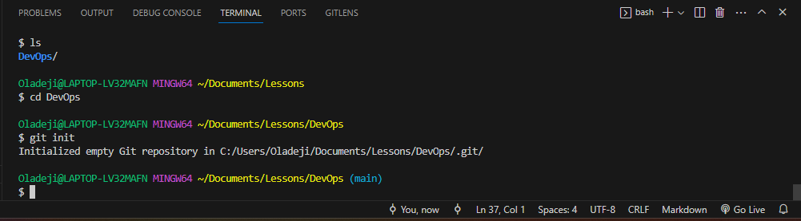
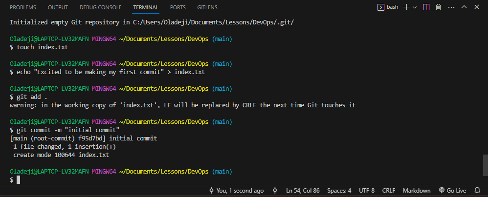
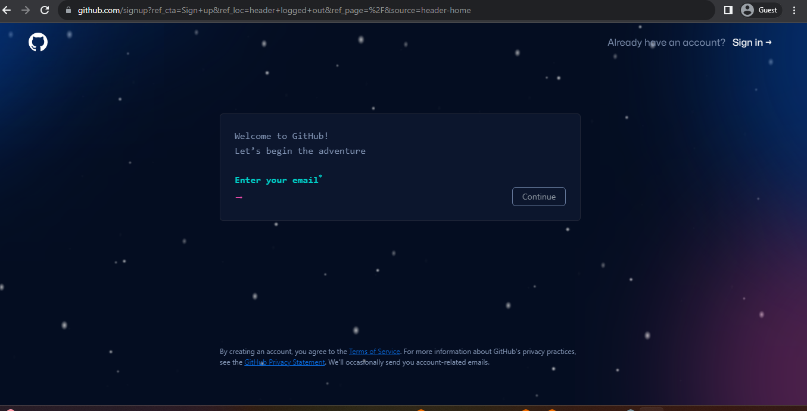
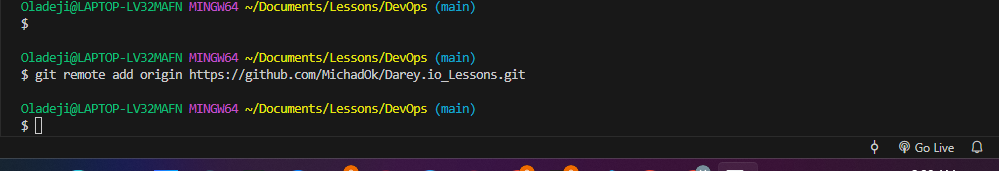
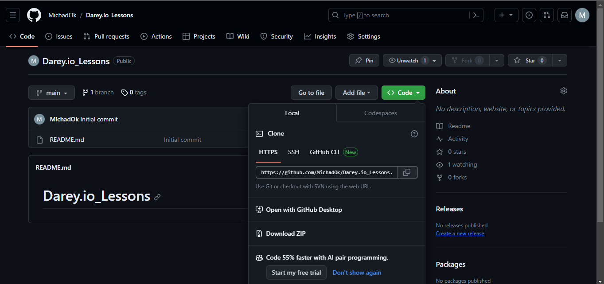
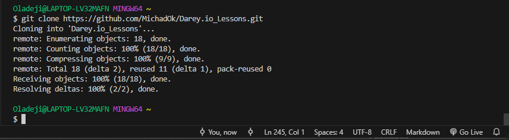

# GIT PROJECT

This project has been carried out to demonstrate an understanding of GIT and an achievement of the following learning objectives:
    - Understanding how to initialize a git repository and make commits

    - Learn how to work with branches

    - Understanding Collaboration and Remote Repositories

## Pre-requisites / Tools:

    - Installation of Git Bash on Computer

    - GitHub

    - Basic understanding of linux/Bash commands.

## **Introduction**

Git is an open source distributed version control system which was developed to aid speedy and efficient handling of different types of projects ranging from small to large projects, enabling source code to be efficiently shared and tracked.

Other technologies exist, like the SVN but the advantage of the GIT over the SVN is in its approach, where rather than developers all trying to work on a single central repository and having to take turns before making changes, GIT allows developers to make their own copies of the central repository and work on the codes separately without tampering with the central repository.

## **Initializing a Repository and Making Commits**

### Initializing a GIT Repository

To initialize a git repository, I followed the following steps:

- Opened the git bash terminal via Visual Studio Code on my computer.

- I used the command `mkdir DevOps` to create a working directory on my terminal.

- I moved into the working directory using the command `cd DevOps`.

- While inside the DevOps folder, I ran the `git init` command to initialize the folder or directory.

    

    

### Making my first Commit

Commit simply means saving the changes you made to your files. The changes could be adding, modifying or deleting files or text. The commit command takes a snapshot of the current state of the repository and saves a copy in the .git folder inside the woorking directory.

To make my first commit, I followed the following steps below:

- Inside my working directory, which is the DevOps folder, I created a file titled 'index.txt' using the command `touch index.txt`.

- I inputted and saved the following text below into the 'index.txt' file using the command

     `echo "Excited to be making my first commit" > index.txt`.

- I added my changes to the git staging area by using the command `git add .`

- I also ran the command `git commit -m "initial commit"` to commit the changes I made to git.

    

        NOTE: The '-m' flag is used to provide a commit message which should be as descriptive as possible.

## **Working with Branches**

A Git Branch is a new or separate version of the main repository. It helps to create a different copy of your source code which you can make changes without directly affecting the original source code.

It is a very important tool for collaboration within remote teams as they can make separate branches while working on the same feature.

### Making my first git branch

The command `git checkout -b` is used to create a new branch.

    NOTE: The `-b` flag helps to create and change into the new branch.

I implemented the following step to create a new branch:

`git checkout -b my-new-branch`

### Listing my Git Branches

To list my git branches, I ran the command below:

`git branch`

### Changing into an Old Branch

To change into an existing or old branch, I used the command below:

`git checkout main`

### Merging a Branch into another Branch

Merging a branch, for example, 'branch A' with another branch 'branch B' is important expecially in scenarios where a change has occurred in one of the branches and there is a need to merge both branches to reflect or add the changes or content of one branch into the other.

For the purpose of this project, I followed the steps below:

- First I added a message into the 'index.txt' file in the main branch.
- Then I checked the status to confirm that a change has been observed by git.
- I staged the change by running the `git add .` command.
- Then, I committed the change by running the command:

     `git commit -m "added a new line to my story"`

    

    

- After committing, I moved out of the main branch and moved into the new branch titled "my-new-branch" using the command:

     `git checkout my-new-branch` 
    
- Finally, I merged the contents of the 'main' branch into 'my-new-branch' using the command:

    `git merge main`

    

### Deleting a GIT Branch

Usually, there may be a need to delete a branch especially when there is no longer a need for it. In order to make changes or add new features to an application, a feature branch is often created and once the codes have been tested and merged into a staging or development environment, the feature branch is deleted.

To delete a branch, for example the "my-new-branch" which was created above, I switched to the main branch then I ran the following command below to delete the new branch.

`git branch -d my-new-branch`

## **Collaboration and Remote Repositories**

One of the major advantages of using git is that it solves the problem of sharing source code and tracking changes made to source code thereby fostering collaboration among teams.
For remote teams, **github** comes into play to aid collaboration as it is a web based platform where git repositories are hosted. Hence, when we host our local git repository on github, it becomes available in the public internet for anyone to access it.

### Creating a Github Account

The following steps below were followed to create a github account:

1. On my browser, I navigated to [github.com](https://github.com/)

2. Clicked on 'Sign up', entered email address, and followed the prompt to create password and username.

    

    

    

3. Next, I clicked on the verify button to verify my identity or account. This involved solving a puzzle.

    

4. Clicked on create account button to create my account.

    

5. I entered the activation code which was sent to the registered email.

    

6. Next step is to choose your preferred personalization. I chose to skip this step for now. Although anyone can choose any type of personalization according to their preference.

    

Once these steps were completed, my github account was created of use.

### Creating my First Repository

The following steps were followed to create my first repository.

Step 1: Clicked on the + sign found among the options towards the top right corner of the github account.

Step 2: A form is displayed where you can fill in a unique repository name, enter a description if you want or not, and then tick the box to chose if you want the repo to be pblic or private, and finally tick the 'add README file' option to add a readme file.

Step 3: After filling the form, click on the green button below to create the repository.

### Pushing my Local Git Repository to my Remote Github Repository

Collaboration is made easy by sharing files and codes from a local repo into a remote github repository, which can then be accessed by allowed participants or persons.

Since I created a local repo (DevOps) earlier and also created my github account, if someone (a friend or a developer) who is located in another country requests to add some information to my story which I inserted in my README file, then I will have to share a copy of my file to my repository on github.

To do this, I will follow these steps to grant him access to the file.

- Add my remote repository to my local repository using the command below:

    `git remote add origin https://github.com/MichadOk/Darey.io_Lessons.git`

    

    NOTE: To get the remote link above, navigate to the green coloured "code" button and click it to view link to remote repo as shown below.

    

- I staged and committed the change I made to link remote repo.

    

- After committing the changes in my local repo, I pushed the content to my remote repository using the command below:

    `git push -u origin main`

    After running this command, the committed changes were pushed to the remote repository.

    

    NOTE: The word 'origin' refers to my remote repository's link, it evaluates to the remote repository's url.

### Cloning Remote Git Repository

The `git clone` command is used to make a local copy of our remote repository in our local machine. A friend or fellow developer can run this command to get a copy of the remote repo, and can then work on codes or files within it.

`git clone https://github.com/MichadOk/Darey.io_Lessons.git`

## **Branch Management and Tagging**

### Introduction to Markdown Syntax

Markdown syntax is a lightweight markup language that is widely used for formatting plain text. It basically describes how text should look on a page. It is a style of writing documents that makes it easy to define what the content should look like; describing the headers, text styles, links and more.

Below are some commonly used markdown syntax elements:

1. _**Headings**_: This is used t o create headings by using the hash symbol at the beginning of the line. It is important to note that the number of hash symbols used will indicate the level of the heading, as shown below.

 # Heading
## Heading
### Heading

2. _**Emphasis**_: To show emphasis or to emphasize on a particular word or statement, asterisk or underscore is used.

    *italic* or _italic_  
    
        Note: single asterisks or single underscores are used before and after the word 'italic' to emphasize it.

    **bold** or __bold__

        Note: double asterisks or single underscores are used before and after the word 'bold' to emphasize it.

3. _**Lists**_:

There are two types of lists mainly **Ordered** and **Unordered** lists.Markdown has support for both types of lists. For the ordered list, every item is numbered but for the unordered list, each item is marked with a bullet.

Examples of the Ordered list are given below:

1. First Item
2. Second Item
3. Third Item

Examples of the unordered list, are given below:

- Item 1
- Item 2
- Item 3

4. _**Links**_:

To create a hyperlink, we use square brackets for the link text followed by parenthesis containing the URL.

Example:

[visit darey.io](https://www.darey.io)

5. _**Images**_:

Inorder to display an image, we use an exclamation mark followed by square brackets for the alt text and parenthesis containing the URL.

Example:

6. _**Code**_:

To display code or code snippets, we use backticks (``) to enclose the code.

Example:

`console.log('Welcome to darey.io')`

End of the Git Project

