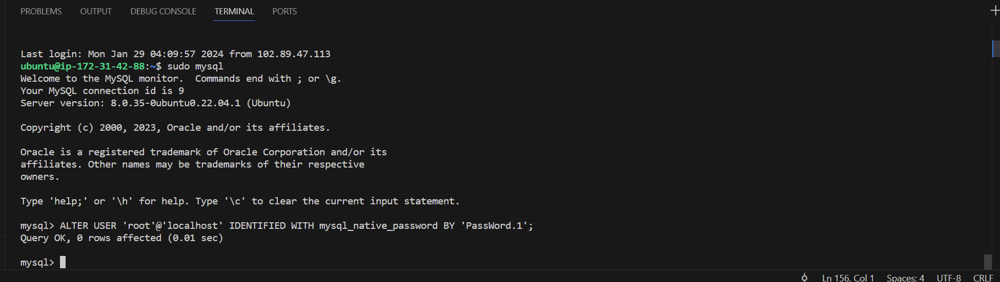
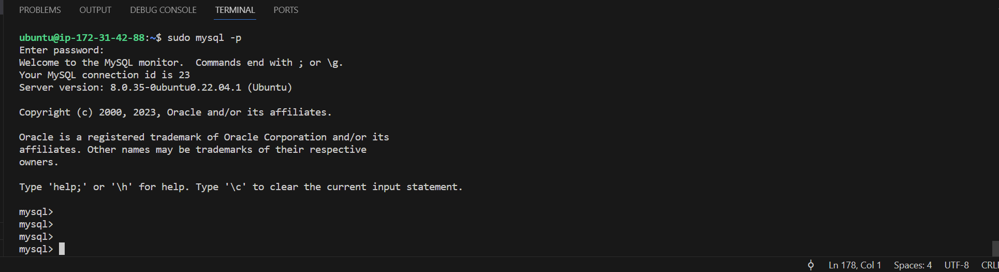
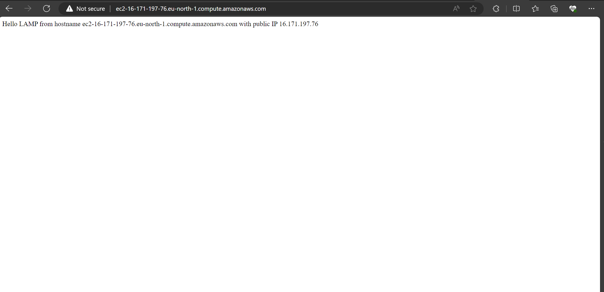

# LAMP STACK IMPLEMENTATION

## OBJECTIVE

To successfully deploy a LAMP Stack website in AWS Cloud.

## INTRODUCTION

A LAMP Stack is a combination of four different technologies used by developers to build websites and web applications. The LAMP is an acronym based on 4 categories which help to implement web applications and websites.

Acronym  &nbsp; &nbsp; &nbsp;   The technology &nbsp; &nbsp; &nbsp; &nbsp; The category
- L &nbsp; &nbsp;&nbsp; -  &nbsp; &nbsp; &nbsp; Linux    &nbsp; &nbsp; &nbsp;&nbsp; &nbsp; &nbsp; &nbsp; &nbsp; &nbsp;-    &nbsp; &nbsp; The Operating system
- A  &nbsp; &nbsp;&nbsp; - &nbsp; &nbsp; &nbsp;Apache &nbsp;&nbsp; &nbsp; &nbsp;&nbsp; &nbsp; &nbsp;&nbsp; -    &nbsp; &nbsp; The webserver
- M  &nbsp; &nbsp;     -   &nbsp; &nbsp;&nbsp; MySQL &nbsp; &nbsp; &nbsp;&nbsp; &nbsp; &nbsp;&nbsp;&nbsp;&nbsp; -  &nbsp; &nbsp;   The database server
- P   &nbsp; &nbsp;&nbsp; -      &nbsp; &nbsp; &nbsp; PHP  &nbsp; &nbsp; &nbsp;&nbsp; &nbsp; &nbsp;&nbsp; &nbsp; &nbsp;&nbsp;&nbsp; - &nbsp; &nbsp;     The programming language

## PREREQUISITES AND TOOLS

- Basic Knowledge of Linux commands
- Set up a free tier account with a Cloud Service Provider (AWS Account)
- Provisioned EC2 instance (Elastic Cloud Compute)

### Launching an EC2 instance
After registering and setting up an account on AWS, the next step is to create a Linux server in the cloud and this is done by creating an EC2 instance and connecting to it, following the steps below:

- On the AWS 'console home', click on EC2 and click on 'Launch instance'.
- Configure server name, select 'Ubuntu' as Operating System to be installed and select 'Free Tier' option.
- Select t3.micro free tier for instance type
- Choose a key pair name
- Leave other parameters as they are at default and click on 'Launch instance'.

Now we are ready to proceed to connect to our instance using the key pair created. In this case, a previous key pair is being used.
Note: Key pair is always saved in the Downloads folder.

### Connecting to the EC2 instance
Select the server and click on 'Connect' in the 'Actions' drop-down menu and follow the directions to connect to the server via SSH Client using the public IP given to access the instance through the terminal.

## INSTALLING APACHE AND UPDATING THE FIREWALL

Apache is a free and open-source cross-platform webserver software released under the Apache License. It is a modular server, which means it can be customized by adding or removing modules. It can be used for hosting static websites, dynamic websites and web applications. It also supports a variety of protocols, including HTTP, HTTPS and FTP.

### Installing Apache using Ubuntu's package manager `apt`

First update a list of packages in package manager using the command below:

`sudo apt update`

Then run apache2 package installation using the commands below:

`sudo apt install apache2`

Then, we can verify that Apache is running as a service on our Operating system by running the commands below:

`sudo systemctl status apache2`

NOTE: If it is green and running as indicated above, then you did everything correctly.

### Setting Inbound Rules on EC2 instance

When the EC2 instance was created earlier, the TCP port 22 was open by default, enabling access to it via SSH.
Now, we need to add a rule to the EC2 configuration to open inbound connections through port 80.

To do this, we go to the running EC2 instance on AWS and click on the security tab and click the security group information.
After that, we click on edit inbound rule and add new rule, while selecting 'HTTP' and '0.0.0.0/0' in the drop-down menu, then save the rule added. Selecting the option '0.0.0.0/0' allows all IP addresses to access the instance, although we need it to allow us access the instance locally. For security reasons, it is better to set the security group to allow access to only known IP addresses.

### Accessing the server locally in our Ubuntu shell

We can check how to access our server locally by running the commands below:

`curl http://localhost:80`

OR

`curl http://127.0.0.1:80`

NOTE: `curl` means Client URL, and it is a command line tool that enables data exchange between a device and a server through a terminal using the supported libcurl library.
Also note that the process of converting a DNS name to IP address is called 'RESOLUTION'.

### Testing our Apache Server

To test how our Apache HTTP server can respond to requests from the internet, we open any web browser of our choice (for example, google chrome), and enter the following URL below:

http://16.171.197.76:80

NOTE: To retrieve the Publiv IP Address, other than checking it in thge AWS Web Console, we can use the following command:

`curl -s http://169.254.169.254/latest/meta-data/public-ipv4`

## INSTALLING MYSQL

Next, we will install a Database Management System (DBMS) to be able to store and manage data for our site in a relational database. MySQL is a popular relational database management system used within PHP environments, and it is going to be our choice DBMS.

### Using `apt` to install MySQL

The following steps will be followed to install the MySQL:

- Use `apt` to acquire and install the software as shown in the command below:

`sudo apt install mysql-server`

### Logging into the MySQL Server

- Log in to the MySQL console by entering the following command:

`sudo mysql`

NOTE: The `sudo` in the command helps you connect to the MySQL server as the administrative database user **root**.

### Running a security script

It is important and recommended to run a pre-installed security script which will remove some insecure default settings and lockdown access to the database system.

Before running the script, it is important to set a password for the **root** user, using the mysql_native_password as default authentication method. The user's password to be defined will be "PassWord.1" 

Exit the MySQL shell using `exit`

**Running the script:**

Next, we start the interactive script by runnning the following command below:

`sudo mysql_secure_installation`

After running the command, it will ask if you want to configure the `VALIDATE PASSWORD PLUGIN`.

NOTE: You can decide whether to enable this feature or not. If enabled, passwords which do not match the specified criteria will be rejected by MySQL with an error. It is safe to leave the validation disabled, but you should always use strong, unique passwords for database credentials.

After this, answer `Y` for yes, or anything else to continue without  enabling.

The purepose of the VALIDATE PASSWORD PLUGIN is to test passwords and improve security. It checks the strength of passwords and allows users to set only those passwords which are secure enough.

**Log in to MySQL**

After running the command above, it is important to also test logging into the MySQL server again using the command below:

`sudo mysql -p`

The `-p` in the command above, prompts for the password after changing the **root** user password.

**Exit MySQL**

Then exit the MySQL server using the `exit` command.

NOTE: For increased security, it is best to have dedicated user accounts with less expansive privileges setup for every database, especially if you plan on having multiple databases hosted on your server.

## INSTALLING PHP

Previously, Apache was installed to serve our web content, MySQL was also installed to store and manage our data, and now, the final setup component in this stack is the "PHP", and this will process the code to display dynamic content to the user.

It is important to note that, in addition to the `php` package to be installed, the following are needed:
-  A PHP module  called `php-mysql`, which allows PHP to communicate with MySQL-databases is needed.
- `libapache2-mod-php` is also needed to enable Apache to handle PHP files.
- Core PHP packages, which will automatically be installed as dependencies.

To install these 3 packages (PHP, `php-mysql` and `libapache2-mod-php`) at once, we run the following command below:

`sudo apt install php libapache2-mod-php php-mysql`

### Confirming PHP Version installed
Once the installation has been completed, the following command can be run to confirm the PHP version we have:

`php -v`

## CREATING A VIRTUAL HOST FOR MY WEBSITE USING APACHE

To implement this, the following are done.

### Domain Choice and Set up
For this project, the chosen domain to be set up is `projectlamp`, but you are free to choose any other name you want.

### Directory structure creation

We create the directory structure for `projectlamp` by using `mkdir` command as follows:

`sudo mkdir /var/www/projectlamp`

### Assigning Ownership

We can then assign ownership of the directory with the `$USER` environment variable which will reference your current system user.
We do this by running the command below:

`sudo chown -R $USER:$USER /var/www/projectlamp`

### Creating New Confiruration Files Or New Virtual Host Files

After assigning ownership, we then create and open a new configuration file in Apache's `sites-available` directory using our preferred command-line editor. In this case, we will be using `vi` or `vim`.

`sudo vi /etc/apache2/sites-available/projectlamp.conf`

By doing this above, a new blank file is created and the following bare-bones configuration is entered or pasted into the file by hitting `i` on the keyboard to enter the insert mode, making it easier to paste or edit the file.

### Checking the new file created

To check or verify or show the new file in the sites-available directory, we can use the `ls` command as shown below:

`sudo ls /etc/apache2/sites-available`

With these above, we have now completed a Virtual Host Configuration which tells Apache to serve `projectlamp` using **/var/www/projectlamp** as its root directory.

### Enabling the new Virtual Host

In order to enable the new virtual host, we use the command `a2ensite` as shown below:

`sudo a2ensite projectlamp`

### Disiabling Default Website on Apache

It is important to disable the default website that comes installed with Apache. This is necesary, especially if we are not using a custom domain name, because Apache's default configuration would overwrite the virtual host we have just created. 

To disable Apache's default website, we use the command `a2dissite` as shown below:

`sudo a2dissite 000-default`

### Check for Syntax Errors

To make sure our configuration does not contain syntax errors, we run the following:

`sudo apache2ctl configtest`

### Reloading Apache

Finally, we reload Apache so that all these changes we have made above will take effect. We do this by running the command below:

`sudo systemctl reload apache2`

Having done all these, our new website is now active, but it is important to note that although the web root **/var/www/projectlamp** has been created, it is still empty. Therefore, we need to create an index.html file in that location so that we can test that the virtual host works as expected.

For this reason, we can do the following below:

`sudo echo 'Hello LAMP from hostname' $(curl -s http://169.254.169.254/latest/meta-data/public-hostname) 'with public IP' $(curl -s http://169.254.169.254/latest/meta-data/public-ipv4) > /var/www/projectlamp/index.html`

Now, we can go to any browser of our choice and try to open our website URL using the IP address below:

`http://16.171.197.76:80`

We can also launch the website using the public DNS name as shown below:

**NOTE:** This file can be left in place as a temporary landing page for our application until we set up an `index.php` file to replace it. Once it is replaced, we need to remember to rename or remove the `index.html` file from our document root, as it would take precedence over an `index.php` file by default.

## ENABLING PHP ON THE WEBSITE

Based on the default **DirectoryIndex** settings on Apache, the file name `index.html` always takes precedence over an `index.php`, which is quite useful for setting up maintenance pages in PHP applications, by creating a temporary `index.html` file containing informative messages to visitors and can be renamed or removed from the document root after the maintenance is over. 

To change this behaviour, we need to edit the **etc/apache2/mods-enabled/dir.conf** file and change the order in which the **index.php** file is listed within the **DirectoryIndex** directive.

To make apache2 open the index.php file and not the index.html file, we run the following commands below:

`sudo vim /etc/apache2/mods-enabled/dir.conf`

Here, you adjust the ordered list to have **index.php** come first on the list before the **index.html**, making it easier for the **index.php** file to be run first or to take precedence over the **index.html** in this case.

Meaning, we edit the list via the vim editor to change the order from 

    DirectoryIndex index.html index.cgi index.pl index.php index.xhtml index.htm

to:

    DirectoryIndex index.php index.html index.cgi index.pl index.xhtml index.htm

After this, we save and close the file.

### Reloading Apache

Once the DirectoryIndex has been re-ordered and saved, we need to reload Apache for the changes to take effect. We can do this using the following command below:

`sudo systemctl reload apache2`

### Creating a PHP Script

Finally, after retsarting the Apache2, we can now create a PHP script to test and confirm that PHP is correctly installed and configured on our server.

Since we now have a custom location to host our website's files and folders, we can then create a PHP test script to confirm that Apache is able to handle and process requests for PHP files.

We do this by running the command below to create a file named `index.php` inside our custom web root folder:

`vim /var/www/projectlamp/index.php`

This command above will open a blank file, and then, we can add the following text, which is a valid PHP code, inside the file, as shown below:

`<?php
phpinfo();`

Ater inputting this text, we save and close by entering `:wq` and pressing the 'enter' button.

It is worthy of note that this page, therefore, provides information about our server from the perspective of PHP. It is useful for debugging and to ensure that our settings are being applied correctly.

Once we can see this page in our browser, then this means that our PHP installation is working correctly as expected.

### Removing the Sensitive PHP file

The information displayed on the webpage contains sensitive and relevant information about our PHP server. For safety, it is best to remove this file we created as it displays sensitive information about our PHP environment and our Ubuntu server.

We can remove this file by running the `rm` command as shown below:

`sudo rm /var/www/projectlamp/index.php`.

Please note, that we can always recreate this page if we ever need to access the information again, later.

**END OF PROJECT 3 (LAMP STACK IMPLEMENTATION)**

