# SHELL SCRIPTING Hands-on Project

## OBJECTIVE

The purpose of this project is to learn and understand what shell scripting is about as well as practice some fundamental tasks which shell scripting can be used to implement like manipulating and navigating directories, file operations and sorting, working with numbers and calculations, as well as File backup and timestamping. 

## **Introduction to shell scripting and User input**

**Shell Scripting** is basically a powerful tool that is used by many organizations to automate tasks, test solutions and improve or increase efficiency of operations.

**A shell script** is a computer program or simply a text file that has been created with the purpose of saving a series or list of commands that are used to instruct an operating system to carryout or perform certain actions or tasks. The shell script is usually created with a `.sh` extension.

It is also a computer program that has been designed for it to be run by a command-line interpreter known as the Unix shell. 

Therefore, a **Shell** is simply a special user program that provides an interface which allows users to make use of an operating system's services.

**Shell Scripting** is especially important in situations where we have to implement multiple or several instances of the same tasks as we can just create a script with the commands or instuctions to carryout that task and just call it to implement it in the number of times it is needed.

## Shell Scripting Syntax Elements

1. **Variables:** These are abstract storage locations with given symbolic names that hold values or data. Variables are defined and values are assigned to them using the **`=`** operator, and it's values can then be called using the variable name preceded by a `$` sign.

    Below, a variable `name` is defined and the value `Segun` is assigned to it using the `=` operator, while `Segun` is then called using the `$` sign. 

    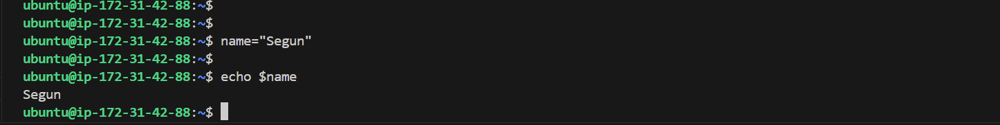

2. **Control Flow:** Control flow helps to determine the order in which commands and instructions are executed. In order to control the flow of execution in our scripts, Bash provides control flow statements like `if-else, for loops, while loops and case statements` to allow us make decisions, iterate over lists and execute different commands based on conditions.

    i. **`if-else`** **Statements**:

    Example: Using the `if-else` statement to execute scripts based on conditions:
    A script with a piece of code as shown below is written and run to allow user input and to check if a number is positive, negative or zero.

        #!/bin/bash

        # Example script to check if a number is positive, negative, or zero

        read -p "Enter a number: " num

        if [ $num -gt 0 ]; then
            echo "The number is positive."
        elif [ $num -lt 0 ]; then
            echo "The number is negative."
        else
            echo "The number is zero."
        fi

    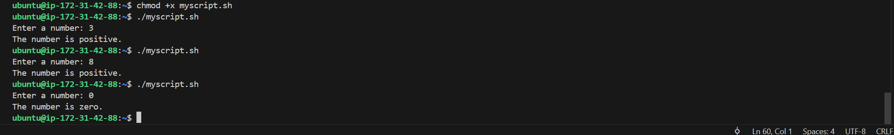

    ii. **`for loop`** **Statements:**

    Example: Iterating through a list using a *for loop*

        #!/bin/bash

        # Example script to print numbers from 1 to 5 using a for loop

        for (( i=1; i<=5; i++ ))
        do
            echo $i
        done

    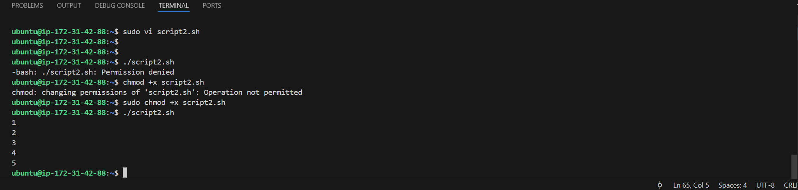

3. **Command Substitution:** This allows us to capture the output of a command and then use it as a value within our script. We can use the 'backtick' or the `$()` syntax for command substitution.

    i. Using backtick for command substituition

        current_date=`date +%Y-%m-%d`

    ii. Using `$()` syntax for command substitution

        current_date=$(date +%Y-%m-%d)

4. **Input and Output:** With Bash, there are several ways to handle input and output.
    i. We can use the **`read`** command to accept user input while we can also use the **`echo`** command to output text to the console.

    ii. We can also redirect input and output using operators like `>` (output to a file), `<` (input from a file), and `|` (to pipe the output of one command as input to another).

    Examples:

    i. To accept user input:

    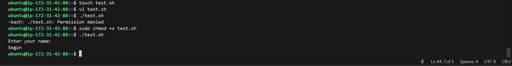   

    ii. To output text to the terminal:

    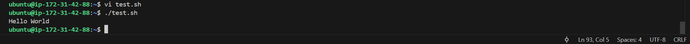

    iii. To output the result of a command to a file:

    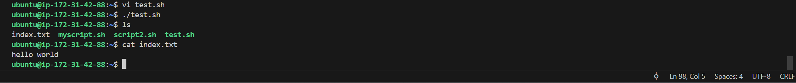

    iv. To pass the content of a file as input to a command:

    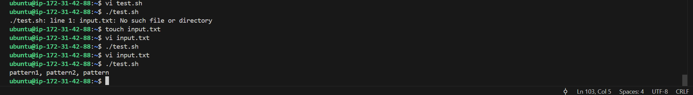

    v. To pass the result of a command as input to another command:

        echo "hello world" | grep "pattern"

    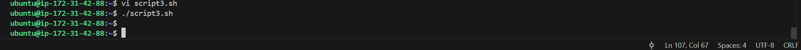 

    In the result, nothing happens because the word "pattern" is not present in the input string "hello world". The grep command searches for a pattern in the given text and if it doesn't find a match, it won't produce any output.

5. **Functions:** Bash allows us to define and use functions to group related commands together. Functions provide a way to modularize our code and make it more reusable. We can define functions by using the function keyword or simply by declaring the function name followed by parentheses.

For example the script below shows a defined function:

    #!/bin/bash

    # Define a function to greet the user
    greet() {
        echo "Hello, $1! Nice to meet you."
    }

    # Call the greet function and pass the name as an argument
    greet "John"

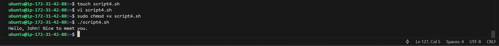

## MY FIRST SHELL SCRIPT

To create my first shell script, the following steps were followed:

**Step 1.** Created a directory or folder titled `shell-scripting` on the terminal using the `mkdir` command.

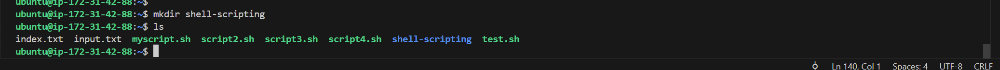

**Step 2.** Used the `touch` command to create the file titled *user-input.sh* as shown below:

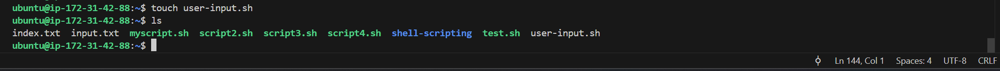

**Step 3.** Next, a block of code is put into the file, and this code is written such that when run, it prompts you (the user) for your name, and after you enter your name, it will use that input to produce a response greeting, as shown below:

        #!/bin/bash

        # Prompt the user for their name
        echo "Enter your name:"
        read name

        # Display a greeting with the entered name
        echo "Hello, $name! Nice to meet you."

Please note that in the above block of code, the `#!/bin/bash` helps to specify the type of bash interpreter to be used to execute the script.

**Step 4.** Saved the file

**Step 5.** Ran the command `sudo chmod +x user-input.sh` to make the file executable.

**Step 6.** Then I ran the script using the command `./user-input.sh`

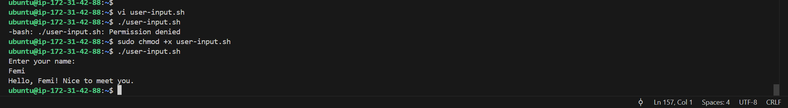

## DIRECTORY MANIPULATION AND NAVIGATION
This section details the task of practising directory manipulation and navigation through shell scripting. To do this, we will write a script which will display the current directory, create a new directory called "my_directory", change to that directory, create two files inside it, list the files, move back one level, remove the "my_directory and its contents, and finally list the files in the current directory again.

To implement this task required the following steps to be followed:

**Step 1:** Opened a file named *navigating-linux-filesystem.sh*

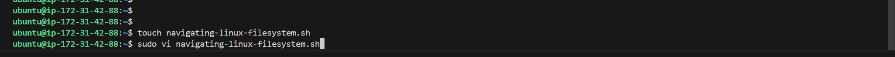

**Step:** Pasted the code block shown below into the file.

    #!/bin/bash

    # Display current directory
    echo "Current directory: $PWD"

    # Create a new directory
    echo "Creating a new directory..."
    mkdir my_directory
    echo "New directory created."

    # Change to the new directory
    echo "Changing to the new directory..."
    cd my_directory
    echo "Current directory: $PWD"

    # Create some files
    echo "Creating files..."
    touch file1.txt
    touch file2.txt
    echo "Files created."

    # List the files in the current directory
    echo "Files in the current directory:"
    ls

    # Move one level up
    echo "Moving one level up..."
    cd ..
    echo "Current directory: $PWD"

    # Remove the new directory and its contents
    echo "Removing the new directory..."
    rm -rf my_directory
    echo "Directory removed."

    # List the files in the current directory again
    echo "Files in the current directory:"
    ls

**Step 3:** I ran the command `sudo chmod +x navigating-linux-filesystem.sh` to set the execute permission on the file.

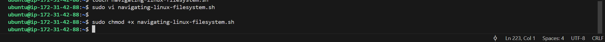

**Step 4:** FInally, I ran the script using the command `./navigating-linux-filesystem.sh`, and below is the output or result.

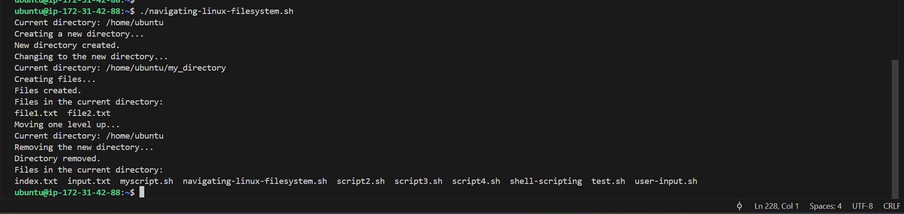

## FILE OPERATIONS AND SORTING

Here, I will be writing a script that focuses on *File Operations and Sorting*.
The script will create three files (file1.txt, file2.txt and file3.txt), display the files in their current order, sorts them alphabetically, saves the sorted files in sorted_files.txt, displays the sorted files, removes the original files, renames the sorted files to sorted_files_sorted_alphabetically.txt, and finally displays the contents of the final sorted file.

To implement this, the following steps are taken:

**Step 1:** Created a file called *sorting.sh* using the `touch` command below:

`touch sorting.sh`

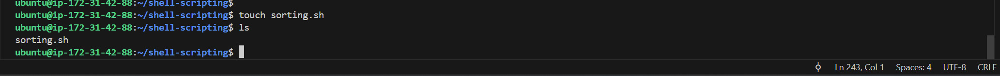

**Step 2:** Entered the following code block into the file via the vi-editor:

    #!/bin/bash

    # Create three files
    echo "Creating files..."
    echo "This is file3." > file3.txt
    echo "This is file1." > file1.txt
    echo "This is file2." > file2.txt
    echo "Files created."

    # Display the files in their current order
    echo "Files in their current order:"
    ls

    # Sort the files alphabetically
    echo "Sorting files alphabetically..."
    ls | sort > sorted_files.txt
    echo "Files sorted."

    # Display the sorted files
    echo "Sorted files:"
    cat sorted_files.txt

    # Remove the original files
    echo "Removing original files..."
    rm file1.txt file2.txt file3.txt
    echo "Original files removed."

    # Rename the sorted file to a more descriptive name
    echo "Renaming sorted file..."
    mv sorted_files.txt sorted_files_sorted_alphabetically.txt
    echo "File renamed."

    # Display the final sorted file
    echo "Final sorted file:"
    cat sorted_files_sorted_alphabetically.txt

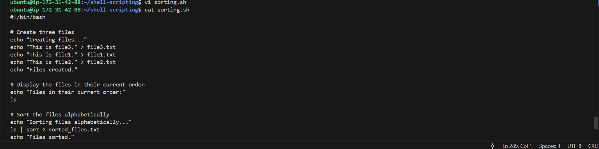

**Step 3:** Then I set the execute permission on the *sorting.sh* file using the command below:

`sudo chmod +x sorting.sh`

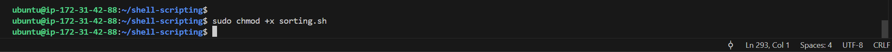

**Step 4:** FInally, I ran the created script with the command `./sorting.sh`

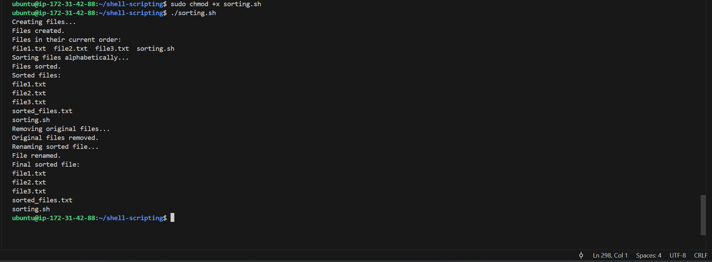

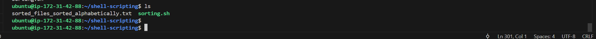

## WORKING WITH NUMBERS AND CALCULATIONS

In this section, we create a script that defines two variables num1 and num2 with numeric values, performs basic arithmetic operations (addition, subtraction, multiplication, division, and modulus), and displays the result. It also performs more complex calculations such as raising num1 to the power of 2 and calculating the square root of num2, and displays those results as well.

The following steps below were followed to implement this:

**Step 1:** Created file called *calculations.sh* using the `touch` command.

`touch calculations.sh`

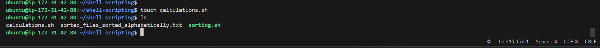

**Step 2:** Entered the following code block below into the file.

    #!/bin/bash

    # Define two variables with numeric values
    num1=10
    num2=5

    # Perform basic arithmetic operations
    sum=$((num1 + num2))
    difference=$((num1 - num2))
    product=$((num1 * num2))
    quotient=$((num1 / num2))
    remainder=$((num1 % num2))

    # Display the results
    echo "Number 1: $num1"
    echo "Number 2: $num2"
    echo "Sum: $sum"
    echo "Difference: $difference"
    echo "Product: $product"
    echo "Quotient: $quotient"
    echo "Remainder: $remainder"

    # Perform some more complex calculations
    power_of_2=$((num1 ** 2))
    square_root=$(echo "sqrt($num2)" | bc)

    # Display the results
    echo "Number 1 raised to the power of 2: $power_of_2"
    echo "Square root of number 2: $square_root"

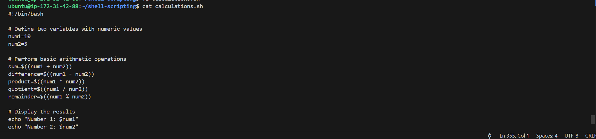

**Step 3:** Set the execute permissions on the calculations.sh using the command `sudo chmod +x calculations.sh`

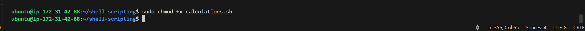

**Step 4:** Ran the script using the command `./calculations.sh`

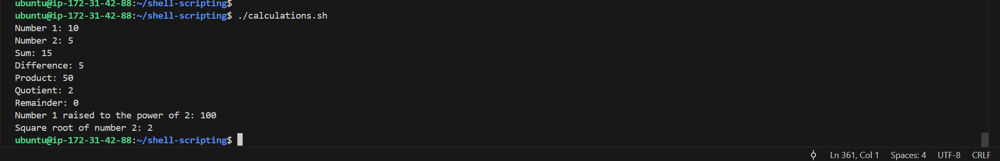

## FILE BACKUP AND TIMESTAMPING

This section displays the tasks and activities of file backup and timestamping. It is very useful as DevOps Engineers especially when having to backup databases and other storage devices.

The script developed in this section defines the source directory and backup directory paths. Then it creates a timestamp using the current date and time, and creates a backup directory with the timestamp appended to its name. After this, the script then copies all files from the source directory to the backup directory using the cp command with the -r option for recursive copying. Finally, it displays a message indicating the completion of the backup process and shows the path of the backup directory with the timestamp.

This was implemented by following the steps below:

**Step 1:** Created and opened a file named *backup.sh* using the `touch` command on the terminal:

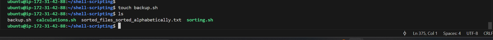

**Step 2:** Entered the code block shown below into the file.

    #!/bin/bash

    # Define the source directory and backup directory
    source_dir="/path/to/source_directory"
    backup_dir="/path/to/backup_directory"

    # Create a timestamp with the current date and time
    timestamp=$(date +"%Y%m%d%H%M%S")

    # Create a backup directory with the timestamp
    backup_dir_with_timestamp="$backup_dir/backup_$timestamp"

    # Create the backup directory
    mkdir -p "$backup_dir_with_timestamp"

    # Copy all files from the source directory to the backup directory
    cp -r "$source_dir"/* "$backup_dir_with_timestamp"

    # Display a message indicating the backup process is complete
    echo "Backup completed. Files copied to: $backup_dir_with_timestamp"

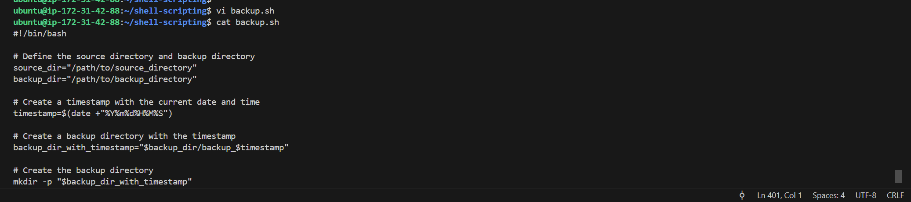

**Step 3:** Next, the execute permission is set on the *backup.sh* file using the command below:

`sudo chmod +x backup.sh`

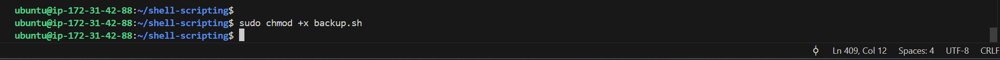

**Step 4:** Finally, the script is run using the following command below:

`./backup.sh`

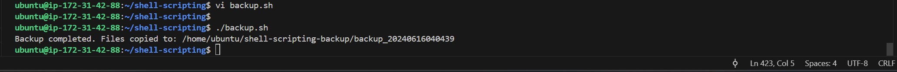

### Checking source directory contents

A check on the source directory was done to confirm contents of the directory as shown below:

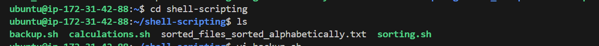

### Confirming no backup done before carrying out the backup

Before the backup was taken, a check on the home directory or expected backup directory was done to verify that the backup had not been done yet.

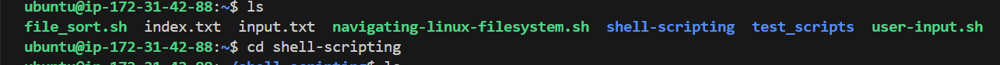

### Confirming the backup and checking to confirm source contents are present in the backup

After the backup was completed, a new backup directory named `shell-scripting-backup` was created in the home directory and also contains the actual backup of the source directory's contents.

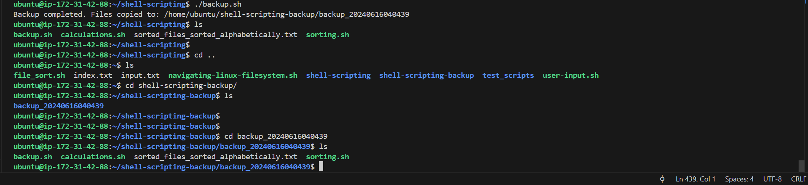

**NOTE:** The source and backup directory's paths had to be clearly defined with the following below:
    
    source directory: /home/ubuntu/shell-scripting
    backup directory: /home/ubuntu/shell-scripting-backup

.

.

**End of Scripting Project**

