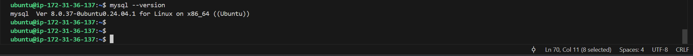

# IMPLEMENTATION OF A CLIENT-SERVER ARCHITECTURE USING MYSQL DATABASE MANAGEMENT SYSTEM

This purpose of this project is to demonstrate an understanding of the Client-Server Architecture by implementing and deploying a basic Client-Server using MySQL RDBMS.

## PRE-REQUISITES AND TOOLS

- Considerable knowledge of what Clients and Server systems are.
- Knowledge of SQL and basic SQL commands.
- Provisioning EC2 instances.
- Knowledge of basic Linux commands.

## INTRODUCTION

A **Client-Server** Architecture is basically a network model in which two or more computers are connected together, to send and receive requests as well as  responses between one another, thereby also allowing applications to exchange data and communicate over the network.

The system of this type of network model is divided into two parts: **Client** and **Server**.

A **Client** is the application or machine that requests for a service from the server by sending what is called *requests* for services such as retrieving or storing data, executing commands and so on.

A **Server** on the other hand, is the application or machine that provides the requested services to the **Client**, such as processing requests, sending responses, or completing actions.

The **Client** and **Server** communicate using predefined protocols such as HTTP, FTP, SMTP and so on.

## IMPLEMENTING THE CLIENT SERVER ARCHITECTURE USING MYSQL RDBMS

To demonstrate a basic client-server using MySQL RDBMS, the following steps and actions were followed:

### 1. Created 2 Servers via EC2 instance Provisioning:
Created and configured two Linux-based virtual servers with EC2 instances in AWS as shown below. The two virtual servers were named as:

- Server A name - `mysql server`
- Server B name - `mysql client`

First, the launch instance button was clicked to begin provisioning 2 instances to be used, as shown in the screenshots below;

**NOTE:** 

In **Arrow 1** - indicates that no name was stated since the intention was two launch multiple instances with same requirements at the same time.

In **Arrow 2** - The OS selected was Ubuntu.

In **Arrow 3** - Free Tier selected for the purpose of this project. Other Tiers may be selected depending on requirements.

In **Arrow 4** - The required number of instances was chosen.

In **Arrow 5** - Instances launched.

### 2. Installed the MySQL Server Software 
Installed the MySQL Server Software on the Linux Server named `mysql_server` as shown below using the following command:

`sudo apt install mysql-server`

Then, confirmed that the installed MySQL Server was up and running as shown below:

`sudo systemctl list-units --type=service | grep mysql` 

and 

`sudo systemctl status mysql`

### 3. Installed the MySQL Client Software 
Installed the MySQL Client Software on the Linux Server named `mysql_client` as shown below using the following command:

- `sudo apt-get-update`
- `sudo apt-get upgrade`

These above are run to ensure that the system's packages and dependencies are up-to-date with the latest versions to maintain stability and security of the system.

`sudo apt install mysql-client`

Confirmin that the mysql client software has been installed:

`mysql --version`

### SECURING THE MYSQL INSTALLATIONS ON THE MYSQL SERVER

After installing the mysql server, it is very important to secure our server installation, so I ran the command `sudo mysql_secure_installation` as shown below:

 

### 4. SETTING INBOUND RULES TO ALLOW MySQL PORT 3306

Communication between the two EC2 virtual servers using local IP addresses is easily possible because by default, the two servers are located in the same local virtual network. So in order for a connection to be established, the local IP address of the `mysql server` will be used from the `mysql client`.

To do this, the following steps were followed:

- **Set the In-bound rules:** By default, the MySQL server uses TCP port 3306, so we opened it by creating a new entry in 'in-bound rules' section of the 'Security Groups' of the MySQL server.

**NOTE:** It is important to note that to ensure extra security, **only** the local/private IP address of the **mysql-client** is granted acces. **Never** allow all IP addresses to get access to your **mysql-server** for security and safety reasons.

### 5. CONFIGURING MYSQL SERVER TO GRANT / ALLOW CONNECTIONS FROM REMOTE HOSTS

The next step is to get into the mysql server's configuration directory `mysql.conf.d` then we open the MySQL database server configuration file known as the `mysqld.cnf` file, and from there we configure the server to be able to allow connections from remote hosts by changing the bind address from `127.0.0.1` to `0.0.0.0`. 

The MySQL server usually connects or binds to the localhost on IP `127.0.0.1 by default, making it accessible only locally, but since we want to allow remote access, we then modify the configuration as shown below:

`sudo vi /etc/mysql/mysql.conf/mysqld.cnf`

After this is done, save the file and exit the editor.

### 6. CREATING A REMOTE USER TO CONNECT TO THE SERVER

Before any connection can be established towards the server, it is important to create a user or users which is required to access the MySQL server remotely, and also grant the user or users specific privileges as required.

The following steps have to be followed to do this:

- **Access the Server as Root user:** We have to first log in to the MySQL Server as the root user using the command below:

`sudo mysql -u root -p`

The `-p` is used to prompt for password, so enter your root password.

- **Create User on Server and grant privileges:** Then, run the following syntax commands to create a user and grant privileges, as shown below:

        CREATE USER 'remote_user'@'%' IDENTIFIED BY 'password';
        GRANT ALL PRIVILEGES ON *.* TO 'remote_user'@'%' WITH GRANT OPTION;
        FLUSH PRIVILEGES;
        EXIT;

**NOTE:** You need to replace **'remote_user'** with your desired username and also replace **'password'** with your desired password for the user. In this case I have created a user named 'Oladeji'.

Also **note** that **`'%'`** symbol is used to refer to **all hosts**.

#### RESTART SERVER

After all these changes, it is best to restart so that these changes will take effect.

### 7. CONNECTING TO THE MYSQL SERVER USING THE MYSQL UTILITY 

After executing all the configurations above, we can now test our connection to the mysql server from the mysql client, using the mysql utility as shown below:

On the MySQL Client, run the following command below:

`mysql -h <remote_host> -P<remote_port> -u <remote_user> -p`

In this case, you have to replace **'remote_user'** with *`your username`* or the *`remote username`*. The **'remote_port'** is `3306` by default for MySQL and the **'remote_host'** is to be replaced with the *`hostname`* or *`MySQL_Server's_EC2_Private_IP Address`* 

**OBSERVATION, ISSUES AND RESOLUTION**

While attempting to connect to the server from the client, using the mysql utility, I observed that it presented an error below:

This error above shows that connection was not possible via the expected socket `/var/run/mysql/mysqld.sock`. 

To troubleshoot, I did the following on the MySQL Server:
- Confirmed MySQL was up and running with the command: `sudo systemctl status mysql`. This confirmed it was `active (running)`

- Since the MySQL was running, next was to verify the socket configuration.

To do this, I ran the command `cat /etc/mysql/mysql.conf.d/mysqld.cnf` file to check if the line socket = /var/run/mysqld/mysqld.sock is present and uncommented.

I discovered that the socket line was yet to be uncommented, hence a pointer to why there was the `ERROR: 2002` when I tried connecting earlier. 

**RESOLUTION:**

- I uncommented the line socket = /var/run/mysqld/mysqld.sock by removed or deleting the `#` which appears before the word 'socket' under the `[mysqld] section.

Then I saved and exited the editor.

- Next, I restarted the MySQL.

`sudo systemctl restart mysql`

#### CONNECTING AND TESTING THE CONNECTION TO THE MYSQL SERVER

Finally, after restarting the mysql server, I connected to the mysql server through the mysql client, using the mysql utility as shown below:

`mysql -h <remote_host> -P<remote_port> -u <remote_user> -p`

**END OF CLIENT-SERVER PROJECT**

