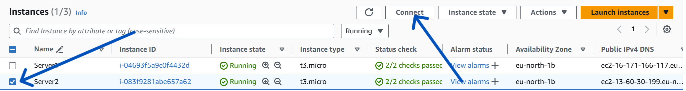
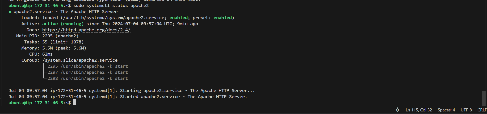

# **IMPLEMENTING LOAD BALANCERS WITH NGINX**

## OBJECTIVE:
The objective of this project is to discover, learn and implement the art of load balancing with Nginx.

## INTRODUCTION

**Load Balancing** is the process of distributing a set of tasks over a set of resources, with the aim of making their overall processing more efficient.

Therefore then, a **Load Balancer** is a device or software that evenly distributes network or application traffic across multiple servers or resources to optimize performance, reliability, and availability.

## SETTING UP A BASIC LOAD BALANCER

To set up a basic load balancer, we will follow the steps below.

First, we will provision two EC2 instances running Ubuntu 22.04 and install Apache webserver on them.
Then we will open port 8000 to allow traffic from anywhere and then, finally update the default page of the webservers to display their public IP Address.

Next, we will provision another EC2 instance running Ubuntu 24.04, and this time we will install Nginx and configure it to act as a load balancer distributing traffic across the webservers.

### **Step 1:** **Provisioning EC2 Instance:**

#### Provisioning EC2 instances for 'Server1' and 'Server2':
Two new instances named 'Server1' and 'Server2' were created as shown below:

The provisioned EC2 instances are named as *Server1* and *Server2*, as shown below:

#### Provisioning EC2 instances for the 'Load Balancer':

Another EC2 instance is created to serve as the load balancer as shown below:

### **Step 2:** **Opening ports and setting Inbound rules:**

#### On Webservers:
For our two webservers, we will open port 8000 as we will be running our webservers on port 8000. The purpose of opening port 8000 on the webservers is to allow traffic from anywhere, and inorder to do this, we need to add a rule to the security group of each of our webservers, as shown below:

Next, we scroll down and click on the security tab, as shown below:

Then, under the 'security groups' section, click on the listed security group with a 'launch-wizard' title appended at its end, as shown below:

Now, click on 'edit inbound rules' to configure the ports.

Now add your rules following the steps shown in the screenshot below and save:

### **Step 3:** **Installing Apache Webserver:**

After we have completed the provisioning of our servers and opened the necessary ports, the next thing is to install Apache software on both of our servers.
In order to do this, we must first connect to each of our webservers via ssh, then we can run commands on the terminal of our webservers.

#### Connecting to the webservers:
To do this, return to 'instances' page, then select the webserver you wish to connect to and click on 'connect' button at the top of the page as shown below:

- **For Server1:**

- **For Server2:**

#### Installing Apache Software:

Next, we will install Apache on the two servers with the commands below:

`sudo apt update -y &&  sudo apt install apache2 -y`

- **On Server1:**

- **On Server2:**

#### Verifying Apache is running:

Then we verify that the installed apache software is running using the command below:

`sudo systemctl status apache2`

- **On Server1:**

- **On Server2:**

### **Step 4:** **Configuring to serve a webpage showing its public IP:**

Here, we will start by configuring **Apache** webserver to serve content on port 8000 instead of on its default which is port 80. 

Next, we will create a new **index.html** file, which will contain code to display the public IP of the EC2 instance. 

Then, we will override apache webserver's default html file with our new file.

- **Configuring Apache to serve content on port 8000:**

    1. Using the text editor (vi-editor), we open the file `/etc/apache2/ports.conf`, using the command below:

        `sudo vi /etc/apache2/ports.conf`

        

    2. Next, we add a new Listen directive for port 8000: We do this by first tying the letter **i** to switch the editor to insert mode, then we add the listen directive, and finally save our file as shown below:

        

        **NOTE:** We must ensure we do the same for both servers.

    3. After doing the steps above, next, we will open the file `/etc/apache2/sites-available/000-default.conf` and change port 80 in the virtualhost to 8000 like in the screenshot we have below:

        To do this, we will run the following command below on both servers and change port configs.

        `sudo vi /etc/apache2/sites-available/000-default.conf`

        - **On both Server1 and Server2:**

        

        

    4. The files are closed on the two servers by pressing **`esc`** button on the keyboard and then entering the command below the save the file:

        `:wqa!`

    5. Next, we restart apache to load the new configuration using the command below:

    `sudo systemctl restart apache2`

    

    
 

- **Creating our new html file:**

    We do this by following the steps below:

    1. First, we open a new **index.html** file on each server using the command below:

        `sudo vi index.html`

    2. Then, we switch the vi-editor to insert mode and enter the following into the file.

            <!DOCTYPE html>
            <html>
            <head>
                <title>My EC2 Instance</title>
            </head>
            <body>
                <h1>Welcome to my EC2 instance</h1>
                
Public IP: YOUR_PUBLIC_IP

            </body>
            </html>

        **On Server1:**

        

        

        **On Server2:**

        

        

    

    3. **Changing File Ownership:**

        Next, we will change the file ownership of the index.html file using the command below:

        `sudo chown www-data:www-data ./index.html`

        

        

        This command above uses the **`sudo`** command which is a "superuser do" that allows us to execute our command with administrative privileges, the **`chown`** stands for ""change owner" and is used to change ownership of files or directories, while the **`www-data:www-data`** specifies both the user and the group that will be assigned as the owners. In this case, both the user and the group are named "www-data". 
        
        Finally, the **`./index.html`** indicates the path to the file you want to change ownership for. In this example, it references a file called "index.html" located in the current directory ("./").

        - **Overriding the Default HTML file of Apache Webserver:**

        We can then override the default html file of the apache webservers by executing the following steps below:

        1. Replace the default html on both servers with our new html file using the command below:

            `sudo cp -f ./index.html /var/www/html/index.html`

            

            
            
            
            This command above uses the "sudo" (superuser do) to copy the file "index.html" from the current directory to the directory "/var/www/html/" and overwrite any existing file named "index.html" in that directory.
            
            The flag `-f` in the command above forces the copy of the file, therby overriding any existing file with the same name in the destination directory without prompting for confirmation.
        
        2. Next, we restart the webserver to load the new configuration using the command below:

            `sudo systemctl restart apache2`

            

            

        3. **Confirming webservers on browser:**

            

            

### **Step 5:** **Configuring Nginx as a Load Balancer**

To configure Nginx as a Load Balancer, the following step below have to be followed:

- **EC2 Provisioning:**

    First, we have to provision an EC2 instance running ubuntu 24.04. As already shown earlier above, we have already provisioned an EC2 instance and named it "Load_Balancer". This is also shown below again for reference:

    

    

- **Setting inbound rules and Opening port 80:**

    Next, we set the inbound rules by opening port 80 to accept traffic from anywhere as shown below:

    

    

    

    Preview the inbound rules configuration:

    

- **SSH into the Load_Balancer instance:**

    The next step is for us to SSH into the EC2 instance for the Load_Balancer as shown below:

    

    

    Using the **ssh details**, we can then go to our terminal and access our load_balancer, as shown below:

    

- **Installing Nginx on EC2 instance:**

    After sshing into the EC2 instance meant for the load balancer, we then need to install the Nginx software into the instance so that it can be configured to serve as our load balancer.

    The Nginx software is installed by running the command below:

    `sudo apt update -y && sudo apt install nginx -y`

    

- **Verifying Nginx installation:**

    We verify that the Nginx software was successfully installed by running the command below:

    `sudo systemctl status nginx`

    

- **Opening Nginx Configuration File:**

    Next, we open the nginx's load balancer configuration file using the command below:

    `sudo vi /etc/nginx/conf.d/loadbalancer.conf`

- **Edit Configuration File:**
    Then, you can type in or paste the following sample configurations below into the file. Take care to edit or replace the IP addresses for the two webservers and the load balancer with the actual public IP addresses of your servers and load balancer from the details of your EC2 instances created for these servers and load balancer.

            
        upstream backend_servers {

            # your are to replace the public IP and Port to that of your webservers
            server 127.0.0.1:8000; # public IP and port for webserser 1
            server 127.0.0.1:8000; # public IP and port for webserver 2

        }

        server {
            listen 80;
            server_name <your load balancer's public IP addres>; # provide your load balancers public IP address

            location / {
                proxy_pass http://backend_servers;
                proxy_set_header Host $host;
                proxy_set_header X-Real-IP $remote_addr;
                proxy_set_header X-Forwarded-For $proxy_add_x_forwarded_for;
            }
        }
    

    

    **NOTE:**

    - **upstream backend_servers** which is stated in the configurations above, defines the backend servers. 

    - The **server** lines inside the **upstream** block lists the addresses and ports of the backend servers.

    - The **proxy_pass** inside the location block sets up the load balancing, passing the requests to the backend servers.

    - The **proxy_set_header** lines pass necessary headers to the backend servers to correctly handle the requests.

- **Testing Our Configuration:**

    To test our configurations so far, we use the command below:

    `sudo nginx -t`

    

- **Restarting Nginx:**

    After testing our configuration, if there are no errors and our test is successful, then we can restart Nginx to load the new configuration with the command below:

    `sudo systemctl restart nginx`

    

- **Testing and Confirming the Load Balancer is functional:**

    To do this, we will paste the public IP address of the Nginx Load Balancer into our web browser to see if we will be served with the same web pages served by our two webservers. 

    Here below, the load balancer serves the webpage from the first webserver:

    

    On refreshing the page, the same load balancer serves the webpage from the second server:

    

 

                                **END OF PROJECT**
 
 

**NOTE:** Below are some additional information that are important to know and understand.

  

## **LOAD BALANCING ALGORITHMS:**

A load balancing algorithm is the set of rules that a load balancer follows to determine the best server for each of the different client requests.

Load balancer algorithms are also techniques used to distribute incoming network traffic or workload across multiple servers, ensuring efficient utilization of resources and improving overall system performance, reliability and availability.

**Types Of Load Balancing ALgorithms**

Load balancing algorithms fall into two main categories namely:

1. ***`Static Load Balancing`*** and 
2. ***`Dynamic Load Balancing`***.

These two are explained further below:

1. **Static Load Balancing:** Static load balancing algorithms are algorithms that follow fixed rules and are independent of the current server state. The following are examples of static load balancing.

    - ***Round-robin method:***
    Round-robin load balancing method distributes traffic to a list of servers in rotation using the Domain Name System (DNS). An **authoritative nameserver** will have a list of different `A records` for a domain and provides a different one in response to each DNS query.
    This means that the authoritative name server does the load balancing instead of specialized hardware or software.
    
        To implement a round-robin load balancing algorithm on your Nginx load balancer, you can use the following configuration below:

            upstream backend {
                server webserver1.example.com;
                server webserver2.example.com;
                # Add more backend servers as needed
    
                # Use the round-robin distribution method
                least_conn;
            }

            server {
                listen 80;
                server_name example.com;

                location / {
                    proxy_pass http://backend;
                    proxy_set_header Host $host;
                    proxy_set_header X-Real-IP $remote_addr;
                    proxy_set_header X-Forwarded-For $proxy_add_x_forwarded_for;
                }
            }

    - ***Weighted round-robin method:***
    In weighted round-robin load balancing, servers are assigned different weights based on their priority, capability or capacity. Servers with higher weights will receive more incoming application traffic from the name server.

    - ***IP Hash method:***
    In the IP hash method, the load balancer performs a mathematical computation, called hashing, on the client IP address. It converts the client IP address to a number, which is then mapped to individual servers.

2. **Dynamic Load Balancing:** These types of algorithms examine the current state of the servers before distributing traffic. The following are some examples of dynamic load balancing algorithms: 

    - ***Least connection method:***
    This type of algorithm or method checks which servers have the fewest or least active connections open at the time and sends traffic to those servers. This assumes all connections require roughly equal processing power. This is effective when servers have varying capacities or workloads, as it helps to distribute traffic to the least busy server.

    - ***Weighted least connection:*** This method gives administrators the ability to assign different weights to each server, assuming that some servers can handle more connections than others.

    - ***Weighted response time:*** This type of algorithm or method averages the response time of each server, and combines that with the number of connections each server has open to determine where to send traffic. By sending traffic to the servers with the quickest response time, the algorithm ensures faster service for users.

    - ***Resource-based:*** In the resource-based method, load balancers distribute traffic by analyzing the current server load. The load is distributed based on what resources each server has available at the time. Specialized software (called an "agent") running on each server measures that server's available CPU and memory, and the load balancer queries the agent before distributing traffic to that server.
   
   

## **SSL TERMINATION AND HTTPS LOAD BALANCING**

### **SSL/TLS:** 
This stands for secure sockets layer and transport layer security. It is a protocol or communication rule that allows computer systems to talk to each other on the internet safely.  

**Secure Sockets Layer (SSL)** or **Transport Level Security (TLS)** is a protocol for securing, encrypting, and decrypting network traffic.

**SSL termination:**
This is the process of decrypting traffic before it is passed on another server such as Access Gateway.
  
It is the process of decrypting encrypted SSL/TLS traffic at the point of entry, allowing the system to inspect the traffic in plaintext before re-encrypting it for further communication. This process enhances security monitoring and performance optimization.

  **Benefits of SSL Termination**  
  SSL termination enables organizations to offload SSL/TLS processing from backend servers, improving performance and reducing server overhead. It also allows for the implementation of security measures such as deep packet inspection and content filtering.

### **ENCRYPTION:**
  Encryption is at the heart of TLS/SSL, and it is the process of converting plain, readable data or **plaintext** into an unreadable format called **ciphertext**.  
  The purpose of encryption is to ensure data confidentiality and protect sensitive information from unauthorized access or interception.

  In encryption, an algorithm known as `cryptographic algorithm` and a `secret key` are used to transform the plaintext into ciphertext. Only those who posses the correct key can decrypt the ciphertext and convert it back to its original plaintext form.
  
####  **TYPES OF ENCRYPTION:**
Encryption can be classified into several types based on various criteria, such as the encryption process, the key used and the level of security provided. Below are some types of encryption used in modern cryptography:

1. **Symmetric-Key Encryption**:
   - Also known as secret-key encryption.
   - Uses a single shared key between the sender and receiver to encrypt and decrypt data.
   - Examples include AES (Advanced Encryption Standard), DES (Data Encryption Standard), and Blowfish.

2. **Asymmetric-Key Encryption (Public-Key Encryption)**:
   - Also known as public-key encryption.
   - Uses a pair of keys: a public key for encryption and a private key for decryption.
   - Examples include RSA, ECC (Elliptic Curve Cryptography), and DSA (Digital Signature Algorithm).

3. **Hashing**:
   - A one-way cryptographic function that converts data into a fixed-size, unique output called a hash value.
   - Used for data integrity, password storage, and digital signatures.
   - Examples include SHA (Secure Hash Algorithm) and MD5 (Message Digest 5).

4. **Block Ciphers**:
   - Encrypt fixed-size blocks of data (e.g., 128 bits) using a symmetric-key algorithm.
   - Examples include AES, DES, and Blowfish.

5. **Stream Ciphers**:
   - Encrypt data by combining it with a pseudorandom stream of bits.
   - Examples include ChaCha20, RC4, and AES-CTR.

6. **Authenticated Encryption**:
   - Combines encryption and authentication to provide both confidentiality and integrity.
   - Examples include AES-GCM, ChaCha20-Poly1305, and AES-CCM.

These encryption types serve different purposes and are used in various applications, such as secure communication, data storage, and digital signatures, to protect information from unauthorized access and ensure its confidentiality, integrity, and authenticity.
 

### **SSL/TLS Certificate**
An SSL/TLS certificate is a digital object that allows systems to verify the identity & subsequently establish an encrypted network connection to another system using the Secure Sockets Layer/Transport Layer Security (SSL/TLS) protocol.

**PURPOSE OF SSL/TLS CERTIFICATE:**

- The main purpose of SSL/TLS certificate is to encrypt the data transmitted between the webserver and the client. This ensures that sensitive information such as login credentials, personal data, or credit card details, remains confidential and protected from eavesdropping.
- A secondary benefit is to establish trust between webservers and their client.
- SSL/TLS certificates allow web browsers to identify and establish encrypted network connections to web sites using the SSL/TLS protocol.

**HOW TLS/SSL WORKS:**
TLS/SSL works with hybrid encryption, and this means that both Symmetric and Asymmetric encryption in TLS/SSL. Before data is transmitted between the client and the server, the process of **TLS Hansdshake** is carried out.  
During this TLS Handshake, the server shares with the client its digital certificate. The digital certificate contains the public key of the server.  
The client (browser) verifies the validity of the server's public key using the public key of the **Certificate Authority** CA. If valid, the client encrypts its encryption key using the server's public key. This encrypted key is then sent to the server.

The client generates its encryption key using symmetric encryption. The implication is that it uses the same key for both encryption and decryption hence the need to encrypt its key using the server's public key.

Since the server is the only entity in possession of its private key, it is able to decrypt the client's encrypted key..

After the handshake process is completed, the client encrypts every data it sends to the server. The server is then able to decrypt the data with the client's encryption key. This ensures that only the server is able to make sense of the data shared by the client.

## **ADVANCED LOAD BALANCING FEATURES**
Advanced features of load balancing help to enhance the capabilities and efficiency of load balancers in handling complex scenarios and optimizing application performance. Below are some key advanced features:

- SSL Off-Loading/termination
- Session persistence/Sticky Sessions
- Health Checks and Automatic Server Failover
- Global Server Load Balancing (GSLB)
- Application Layer Load Balancing
- Dynamic Load Balancing
- Anycast Load Balancing
- Rate Limiting and Traffic Shaping
- Web Application FIrewall (WAF) Integration

All these advanced features above make load balancers powerful tools for optimizing application performance, ensuring high availability,  and protecting applications from various threats and failures. They are essential components in modern, scalable, and robust IT infrastructures.

