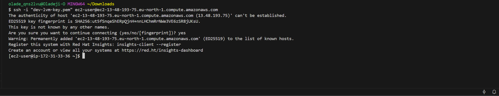
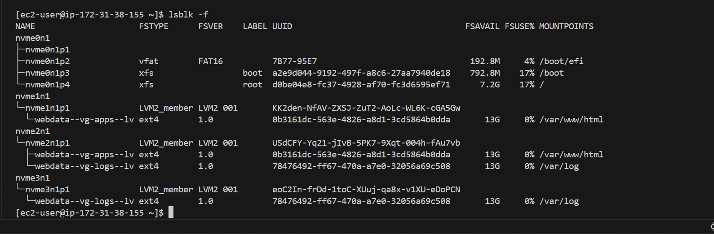
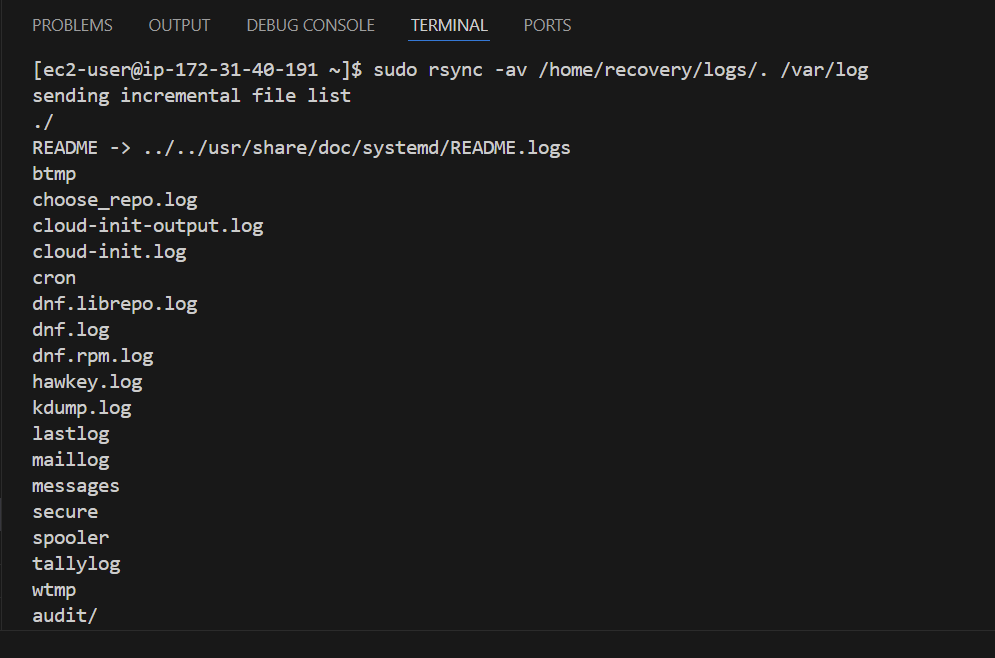
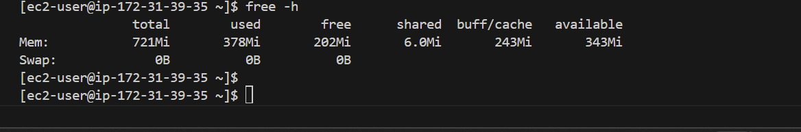
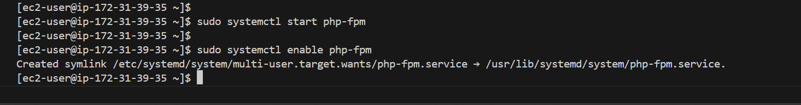
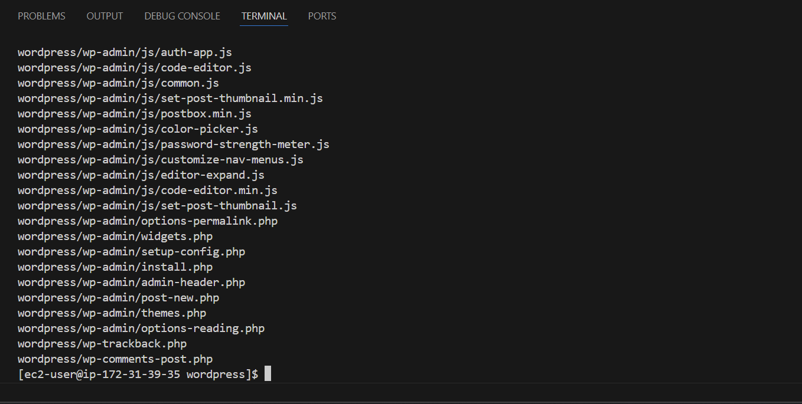

# IMPLEMENTING WORDPRESS WEBSITE WITH LVM STORAGE MANAGEMENT

## OBJECTIVE
The objective of this project is to learn and understand how to to build, deploy and maintain a WordPress website on AWS EC2 using LVM storage management. To do this, two important tasks will be implemented:

- Configuring storage subsystem for web and Database servers based on Linux OS. This is to practically learn how to work with disks, partitions and volumes in Linux.
- Installing WordPress and connecting to a remote MySQL database server. This is to solidify our skills in deploying Web and DB tiers of Web solutions. 

## INTRODUCTION

**WordPress** is a free and open-source content management system written in PHP and paired MySQL or with MaraDB as its backend Relational Database Management System (RDBMS).

Implementing a WordPress website on AWS EC2 with LVM storage management involves deploying WordPress, a PHP and MySQL-based content management system, to an Amazon EC2 instance. Additionally, it includes utilizing Logical Volume Management (LVM) for efficient disk management.

## UNDERSTANDING THREE-TIER ARCHITECTURE

Three-Tier Architecture is a client-server software architecture pattern that comprises of three separate layers.

1. **The Presentation Layer (PL):** This layer is the user interface such the client server or browser on your laptop or computer system.

2. **Application Layer or Business Logic (BL):** This is the backend program that implements business logic, application or webserver.

3. **Data Access or Management Layer (DAL):** This is the layer for computer data storage and data access. Database server or File System Server such as FTP Server or NFS Server. 

 

**Requirements / Tools for the 3-Tier set up:**

1. A Laptop or PC to serve as the client.
2. An EC2 linux server to serve as the webserver where WordPress will be installed.
3. An EC2 linux server as the database (DB) server.
4. Any linux distribution of your choice can be used but for the purpose of this project, the **`RedHat Operating System`** will be used.

## IMPLEMENTING LVM ON LINUX SERVERS (WEB AND DATABASE SERVERS)

To implement LVM on linux servers, the following steps are followed:

### **Step 1:** Prepare a webserver: 

1. **An EC2 instance named `LVM_Webserver` is launched to serve as the webserver as shown below:**

    

    Then, we create 3 EBS volumes in the same **`availability zone`** as our webserver, with each one having a size of 10GiB, as shown below:

    

    

    

2. **Next, we attach each of the three EBS volumes to the webserver's EC2 instance, one after the other, as shown below:**

    

    

    

3. **The next step is to open up the linux terminal to begin configuration:**

4. **Verifying the blocks are attached to the webserver's EC2 instance:**

In order to do this, we use the `lsblk` command to check or inspect what block devices are attached to the webserver.

It is important to know that all devices in Linux reside in the /dev/ directory, so we will inspect it with the command `ls /dev/` below, to make sure that all 3 newly created block devices are there.

`ls /dev/`

5. **Checking mounts and free space.** 
Next, we check to see all mounts and free space on our server using the command `df -h`.

6. **Creating Partitions:**

Then, we use the `gdisk` utility to create a single partition on each of the 3 disks, using the command `sudo gdisk /dev/nvme1n1`

**NOTE:** When the `gdisk` utility or command is run, at the first prompt, type in `p` and press enter (this prints the current partition table), at the second prompt, type in `n` and press enter (this creates a new partition), at the next four prompts, press enter to select the default settings, and finally at the seventh prompt, type in `w`, then type `y` and the following prompt to confirm the writing of the changes to the disk and exit the `gdisk` utility.

Following the steps above, partitions were also created for disks `nvme2n1` and `nvme3n1` as shown below:

7. **Installing **`lvm2`** package.**

Next, we install the `lvm2` package using the `sudo yum install lvm2` Then we run `lvmdiskscan` command to check for available partitions, as shown below:

`sudo yum install lvm2`

Running `sudo lvmdiskscan`:

8. **Marking the 3 disks as physical volumes:**

Here, we will use the `pvcreate` utility to mark the 3 disks as physical volumes (PV) to be used by LVM, using the following commands below:

`sudo pvcreate /dev/nvme1n1p1`

`sudo pvcreate /dev/nvme2n1p1`

`sudo pvcreate /dev/nvme3n1p1`

9. **Verifying Physical volumes:**

Next, we verify that our physical volumes have been created successfully by running the command `sudo pvs`

10. **Adding the 3 PVs to a Volume Group:**

We will use the `vgcreate` utility to add all the 3 physical volumes (PV) to a Volume Group (VG), while also naming tne Volume Group as **`webdata-vg`**.

To do this, we will run the command below:

`sudo vgcreate webdata-vg /dev/nvme1n1p1 /dev/nvme2n1np1 /dev/nvme3n1p1`

11. **Next, we verify that the volume group (VG) has been created successully by running the command below:**

`sudo vgs`

12. **Creating 2 logical volumes:**

Next, we will use the `lvcreate` utility to create 2 logical volumes:

- First logical volume will be **`apps-lv`**, and we will use half of the PV size for this.
- Second logical volume will be **`logs-lv`**, and we will use the remaining space of the PV size for this.

**Purpose of the Logical Volumes:**

- The **`apps-lv`** will be used to store the data for the website, while
- The **`logs-lv`** will be used to store data for logs.

These logical volumes will be implemented by using the following commands below:

`sudo lvcreate -n apps-lv -L 14G webdata-vg`

`sudo lvcreate -n logs-lv -L 14G webdata-vg`

13. **Verifying logical volumes created:**

We can then verify our two logical volumes have been successfully created by running the command `sudo lvs`.

14. **Verifying the entire setup:**

Now we verify the entire setup by running the following commands below:

`sudo vgdisplay -v #view complete setup - VG, PV, and LV`

`sudo lsblk` 

15. **Formatting the logical volumes with `EXT4` file system:**

Next, we will use the `mkfs.ext4` command to format the logical volumes with `ext4`, filesystem as shown below:

`sudo mkfs -t ext4 /dev/webdata-vg/apps-lv`

`sudo mkfs -t ext4 /dev/webdata-vg/logs-lv`

16. **Creating /var/www/html directory to store website files:**

We do this by running the command below:

`sudo mkdir -p /var/www/html`

17. **Creating /home/recovery/logs to store backup of log data:**

This is done by running the command below:

`sudo mkdir -p /home/recovery/logs`

18. **Mounting /var/www/html on apps-lv logical volume:**

The next step is to mount the **`/var/www/html`** directory on the **`apps-lv`** logical volume using the command below:

`sudo mount /dev/webdata-vg/apps-lv /var/www/html/`

19. **Backing up files in the log directory:**

We will use the `rsync` utility to backup all the files in the log directory **/var/log** into **/home/recovery/logs**. 
**NOTE:** This activity is very important and is most required before mounting the file system.

We do this by running the command below:

`sudo rsync -av /var/log/. /home/recovery/logs/`

20. **Mounting /var/log on logs-lv:**

Next, we will mount the **/var/log** on to the **logs-lv** logical volume. 
**NOTE:** You will notice here that all the existing data on /var/log will be deleted. This is exactly why we had to carryout a backup of the **/Var/log** into the **/home/recovery/logs** earlier in step 18 above.

To mount the **/var/log** on the **logs-lv** logical volume, we run the command below:

`sudo mount /dev/webdata-vg/logs-lv /var/log`

21. **Restoring log files back into /var/log directory:**

We do this by running the command below:

`sudo rsync -av /home/recovery/logs/. /var/log`

22. **Updating the `/etc/fstab` file:**

Here, we will update the `/etc/fstab` file so that the mounted configuration will persist after restart of the server.

The UUID of the device will be used to update the `/etc/fstab` file:

The following commands below are run to get this done:

`sudo blkid`

We can also run another command to get a better view to the UUIDs to make it easier to extract the UUID information we need for us to update the `/etc/fstab` file.

We therefore run the command below:

`lsblk -f`

Now, in the output above, we can clearly see all the UUIDs given including a list of the partitions. It is then easier to pick the UUIDs we need to fill into our `/etc/fstab` file.

Next, we open the `/etc/fstab` file using the command below:

`sudo vi /etc/fstab`

23. **Testing the configuration and Reloading the daemon:**

Next step is for us to test the configuration and then reload the daemon. To test the configuration we run the command `sudo mount -a` and to reload the daemon, we use the command `sudo systemctl daemon-reload`, as shown below:

24. **Verifying the setup:**

Now, we have to verify the setup by running the command `df -h`.

## INSTALLING WORDPRESS AND CONFIGURING IT TO USE MYSQL DATABASE

### Step 2: Preparing the database:

1. **Launching EC2 instance for DB_server:**
    First, we launch an EC2 instance and name it "DB_server" as shown below:

   

   

   Then, we create 3 EBS volumes in the same Authorized Zone "AZ" as the DB_server's EC2 instance, with 10GiB sizes each, as shown below:

   

   

**Next we attaching all three volumes one after the other to the DB_server's EC2 instance.**

2. Opening up the linux terminal to begin configuration.

3. Next, we inspect what block devices are attached to the DB_server using the `lsblk` command.

`lsblk`

    

4. Next, we use the `df -h` command to see all mounts and free space on the DB_server.

    `df -h`

    

5. **Creating Partitions:**

    Now, we will create a single partition on each of the 3 disks EBS volumes using the `gdisk` utility.

    `sudo gdisk /dev/nvme1n1`

    

    The same process and steps above were repeated to create single partitions on disks-2 (nvme2n1) and disks-3 (nvme3n1) for the DB_server

6. We use the `lsblk` utility to view the newly configured partition on the 3 disks.

    

    

7. **Installing the `lvm2` package using the command `sudo yum install lvm2`. Then, we will run the command `sudo lvmdiskscan` to check for available partitions.

    `sudo yum install lvm2`

    

    `sudo lvmdiskscan`

    

8. **Marking the 3 disks as physical volumes (PV) to be used by LVM, using the `pvcreate` utility:**

    Here we use the `pvcreate` utility to mark each of the three disks as physical volumes (PV) to be used by LVM.

    `sudo pvcreate /dev/nvme1n1p1`
    `sudo pvcreate /dev/nvme2n1p1`
    `sudo pvcreate /dev/nvme3n1p1`

    

9. Next, we verify that our physical volumes have been created by running `sudo pvs`.

    `sudo pvs`

    

10. Now, we will use the `vgcreate` utility to add all 3 physical volumes (PVs) to a volume group (VG). Then we will name the volume group (VG) as **`dbdata-vg`**

    We will do this by running the command below:

    `sudo vgcreate dbdata-vg /dev/nvme1n1p1 /dev/nvme2n1p1 /dev/nvme3n1p1`

    

11. Next, we verify that the volume group has been created successfully using the command below:

    `sudo vgs`

    

12. At this stage, we need to create two logical volumes using the `lvcreate` utility. 

    The two logical volumes will be:
    - **`db-lv`** (we will allocate half of the 'physical volume' or 'PV' size to it)
    - **`logs-lv`** (we will allocate the remaining space of the PV size to it).

    **NOTE:** The **`db-lv`** will be used to store data for the database, while the **`logs-lv`** will be used to store the data for the logs.

    We will do this by running the following commands below:

    `sudo lvcreate -n db-lv -L 14G dbdata-vg`
    `sudo lvcreate -n logs-lv -L 14G dbdata-vg`

13. We verify that our two logical volumes have been created using the command below?

    `sudo lvs`

    

14. **Verifying the entire setup:**

    We verify the entire setup we have made by running the commands below:

    `sudo vgdisplay -v #view complete setup - VG, PV, and LV`

    

    

   
   
   **`sudo lsblk`**

    

15. **Formatting the logical volumes with `EXT4` file system:**

    We will use the `mkfs.ext4` command to format the created logical volumes with `ext4`, filesystem as shown below:

    `sudo mkfs -t ext4 /dev/dbdata-vg/db-lv`

    

    `sudo mkfs -t ext4 /dev/dbdata-vg/logs-lv`

    

16. **Creating /db directory to store database files:**

    We do this by running the command below:

    `sudo mkdir -p /db`

    

17. **Creating /home/recovery/logs to store backup of log data:**

    This is done by running the command below:

    `sudo mkdir -p /home/recovery/logs`

    

18. **Mounting /db on db-lv logical volume:**

    The next step is to mount the **`/db`** directory on the **`db-lv`** logical volume using the command below:

    `sudo mount /dev/dbdata-vg/db-lv /db/`

    

19. **Backing up files in the log directory:**

    We will use the `rsync` utility to backup all the files in the log directory **/var/log** into **/home/recovery/logs**. 
    **NOTE:** This activity is very important and is most required before mounting the file system.

    We do this by running the command below:

    `sudo rsync -av /var/log/. /home/recovery/logs/`

    

20. **Mounting /var/log on logs-lv:**

    Next, we will mount the **/var/log** on to the **logs-lv** logical volume. 
    **NOTE:** You will notice here that all the existing data on /var/log will be deleted. This is exactly why we had to carryout a backup of the **/var/log** into the **/home/recovery/logs** earlier in step 18 above.

    To mount the **/var/log** on the **logs-lv** logical volume, we run the command below:

    `sudo mount /dev/dbdata-vg/logs-lv /var/log`

    

21. **Restoring log files back into /var/log directory:**

We do this by running the command below:

`sudo rsync -av /home/recovery/logs/. /var/log`

22. **Updating the `/etc/fstab` file:**

Here, we will update the `/etc/fstab` file so that the mounted configuration will persist after restart of the server.

The UUID of the device will be used to update the `/etc/fstab` file:

The following commands below are run to get this done:

`sudo blkid`

Next, we open the `/etc/fstab` file using the command below:

`sudo vi /etc/fstab`

23. **Testing the configuration and Reloading the daemon:**

Next step is for us to test the configuration and then reload the daemon. To test the configuration we run the command `sudo mount -a` and to reload the daemon, we use the command `sudo systemctl daemon-reload`, as shown below:

24. **Verifying the setup:**

Now, we have to verify the setup by running the command `df -h`.

### Step 3: INSTALLING WORDPRESS ON THE WEBSERVER'S EC2 INSTANCE:

To install WordPress on the webserver's EC instance, the following steps were followed:

1. Update the repository using the command below:

Since the RedHat Operating System is RHEL 9.
    `sudo dnf update`

    

2. Install wget, Apache and its dependencies:

    For RHEL 8 systems, you can use 
    
    `sudo yum -y install wget httpd php php-mysqlnd php-fpm php-json` command, 
    
    but in my case, I am using a RHEL 9 (RedHat Enterprise Linux 9) system, therefore the command above was not necessary, but rather the command below was used. 

    `sudo dnf install -y wget httpd php php-mysqlnd php-fpm php-json`

    

3. Then, we start Apache using the commands below:

    `sudo systemctl enable httpd`
    `sudo systemctl start httpd`

    

4. Next, we need to install PHP and its dependencies. To do this, we use the following commands below:

    If you are using Older RHEL systems (RHEL 8) or CentOS systems, you will need to run the following commands below:

    `sudo yum install https://dl.fedoraproject.org/pub/epel/epel-release-latest-8.noarch.rpm` 
    `sudo yum module list php` 
    `sudo yum module reset php` 
    `sudo yum module enable php:remi-7.4` 
    `sudo yum install php php-opcache php-gd php-curl php-mysqlnd` 
    `sudo systemctl start php-fpm` 
    `sudo systemctl enable php-fpm` 
    `setsebool -P httpd_execmem 1` 

But in my case, I am using a RedHat Enterprise Linux (RHEL 9.4) system, so the following commands below are to be used:

    sudo dnf install -y epel-release
    sudo dnf install -y https://rpms.remirepo.net/enterprise/remi-release-9.rpm
    sudo dnf module list php
    sudo dnf module reset php
    sudo dnf module enable php:remi-8.0  (or remi-8.1, if you so choose)
    sudo dnf install -y php php-opcache php-gd php-curl php-mysqlnd
    sudo systemctl start php-fpm
    sudo systemctl enable php-fpm
    sudo setsebool -P httpd_execmem 1`

`sudo dnf install epel-release`

When this command was first run, it failed as it was killed, so I had to resolve this issue in the following steps below:

First, I updated the package list with the following commands below:

`sudo dnf clean all`
`sudo dnf update`

**NOTE:** Since the `epel-release` process was killed, we can try to enable the EPEL Repository manually using the command below:

**Enabling the EPEL Repository Manually:**

`sudo dnf install -y https://dl.fedoraproject.org/pub/epel/epel-release-latest-$(rpm -E %rhel).noarch.rpm`

Once this is done, we can now try to install the EPEL repository again and continue our installation following the steps below:

i. **Install EPEL Repository:** We enable EPEL (Extra Packages for Enterprise Linux) repository using the command below:

`sudo dnf install epel-release`

ii. **Install Remi Repository:**

Next, we install the Remi Repository. 
For RHEL 9, we use the following command to install the Remi repository:

`sudo dnf install -y https://rpms.remirepo.net/enterprise/remi-release-9.rpm`

In the scrrenshot above, we can see that the installation was killed which was due to possible low memory issue with the instance, but to verify and resolve this issue, the following steps were followed:

a. **Confirm available Memory using the command below:**

`free -h`

From the above capture, we can see that our instance has only 721 MiB of RAM, with about 378 MiB currently used and no swap space configured. This low memory situation is likely causing the installation process to be killed.

To resolve this issue, we do the following:

b. **Create Swap Space:**

We create a swap space by doing the following steps:

- **Create a 1GB swap file**

    `sudo fallocate -l 1G /swapfile`

- **Set the correct permissions**

    `sudo chmod 600 /swapfile`

- **Set up the swap area**

    `sudo mkswap /swapfile`

- **Enable the swap file**

    `sudo swapon /swapfile`

    

**Verify Swapfile:** Using the command `free -h`

- **Make Swap Space Permanent:**

To ensure the swap space is available after a reboot, we will add it to /etc/fstab using the command below:

`echo '/swapfile swap swap defaults 0 0' | sudo tee -a /etc/fstab`

**RETRYING THE REMI INSTALLATION:**

After executing the processes above, we can now retry the installation again to see if it works:

`sudo dnf install -y https://rpms.remirepo.net/enterprise/remi-release-9.rpm`

Now, we can see that our installation is successful.

iii. **Enable the Remi Module:**
    
Next, we list available PHP modules with the command below:

`sudo dnf module list php`

iv. **Reset the PHP module and enable the desired version (e.g., 7.4 or 8.0).** 

In this case, I have chosen  remi-8.0:

`sudo dnf module reset php`

`sudo dnf module enable php:remi-8.0` 

**NOTE:** You can change it to remi-8.1 if you want PHP 8.1.

v. **Install PHP 8.0 and Dependencies/Extensions:**

Now, we install PHP along with the necessary extensions:

`sudo dnf install -y php php-opcache php-gd php-curl php-mysqlnd`

vi. **Start and Enable PHP-FPM:**

Start the PHP-FPM service and enable it to run on boot using the commands below:

`sudo systemctl start php-fpm`
`sudo systemctl enable php-fpm`

vii. **Set SELinux Boolean (if necessary):**

Next, we can set the SELinux Boolean, If we need to allow Apache to execute memory. In this case, we will run the command below to set it:

`sudo setsebool -P httpd_execmem 1`

5. Next we restart Apache using the command below:

`sudo systemctl restart httpd`

6. Now, we download wordpress and copy wordpress to `/var/www/html`

        mkdir wordpress
        cd   wordpress
        sudo wget http://wordpress.org/latest.tar.gz
        sudo tar xzvf latest.tar.gz
        sudo rm -rf latest.tar.gz
        sudo cp wordpress/wp-config-sample.php wordpress/wp-config.php
        sudo cp -R wordpress /var/www/html/

 

i. **Downloading and Extracting WordPress:**

The first three commands were run as shown in the screenshot below:

        mkdir wordpress
        cd   wordpress
        sudo wget http://wordpress.org/latest.tar.gz

`sudo tar xzvf latest.tar.gz`

`sudo rm -rf latest.tar.gz`

        

ii. **Copying Wordpress to `/var/www/html`:**

We then copy the wordpress to `/var/ww/html` directory using the commands below:

`sudo cp wordpress/wp-config-sample.php wordpress/wp-config.php`

`sudo cp -R wordpress/* /var/www/html/`

7. **Set Permissions and configure SELinux Policies:**

Now, we can set the permissions and configure the SELinux policies with the following commands below:

**NOTE:** Before setting permissions, I had to create the 'wordpress' subdirectory into the html directory:

`sudo mkdir /var/www/html/wordpress`

Then, move all the files expected to be in the worpress directory from the html into the wordpress directory by first checking the list of files before moving them:

`ls /var/www/html`

**Moving the files to wordpress directory:**

    sudo mv /var/www/html/index.php /var/www/html/wp-activate.php /var/www/html/wp-blog-header.php /var/www/html/wp-config.php /var/www/html/wp-content /var/www/html/wp-includes /var/www/html/wp-load.php /var/www/html/wp-mail.php /var/www/html/wp-signup.php /var/www/html/xmlrpc.php /var/www/html/license.txt /var/www/html/readme.html /var/www/html/wp-admin /var/www/html/wp-comments-post.php /var/www/html/wp-config-sample.php /var/www/html/wp-cron.php /var/www/html/wp-links-opml.php /var/www/html/wp-login.php /var/www/html/wp-settings.php /var/www/html/wp-trackback.php /var/www/html/wordpress/

 

**Verifying that the files have been moved successfully:**

i. **Change Ownership of the New Directory and set permissions:**

**Change Ownership:**

After moving the files, we need to change the ownership of the `wordpress` directory and its contents to Apache using the command below:

`sudo chown -R apache:apache /var/www/html/wordpress`

**Set SELinux Policy:**

Next, we set the SELinux context or policy for the wordpress directory and its contents, allowing the Apache web server to read and write to that directory. We do this by running the command below:

`sudo chcon -t httpd_sys_rw_content_t /var/www/html/wordpress -R`

**Verifying the SELinux context configuration:**

To verify that the context has been set correctly, we use the following command:

`ls -Z /var/www/html/wordpress`

**Setting the SELinux Settings:**

Now, we configure SELinux (Security-Enhanced Linux) settings to allow the Apache web server to initiate network connections, using the command below:

`sudo setsebool -P httpd_can_network_connect=1`

**Update the Apache Configuration:**

At this point, we have to ensure that our virtual host points to the new wordpress directory.
We do this by opening our virtual host configuration file (/etc/httpd/conf.d/your-site.conf) and updating the `DocumentRoot`:

### Step 4: INSTALLING MYSQL ON THE DB SERVER'S EC2:

i. **Update the package:**

First we update the package:

`sudo dnf update -y`

ii. **Installing the Mysql server:**

We do this by using the command below:

`sudo dnf install msql-server`

iii. **Verifying the service is up and running:**

`sudo systemctl status mysqld`

iv. **Enabling the mysql service:**

From the output above, it is obvious that the service is not up as it shows that it is disabled. Therefore, we need to restart the service and enable it so that it will be up and running even after reboot. To do this, the following commands will be run:

`sudo systemctl restart mysqld` and 
`sudo systemctl enable mysqld`

### Step 5:  CONFIGURING THE DB TO WORK WITH WORDPRESS:

i. **Accessing the mysql:**

`sudo mysql`

ii. **Creating the database:**

`CREATE DATABASE wordpress;`

iii. **Create user and password:**

CREATE USER `oladeji`@`172.31.39.35` IDENTIFIED BY 'mypass';

iv. **Flush privileges and show databases:**

v. **Exit the mysql database:**

Using the cammand **`exit`**, we then exit the database server.

### Step 6: CONFIGURE WORDPRESS TO CONNECT TO THE REMOTE DATABASE:

**Set the Inbound Rule on DB EC2 instance:**

i. **Installing Mysql client on webserver:**

First we have to install Mysql client on the webserver and then test that we can connect from our webserver to the Database server by using mysql-client. To do this, we run the following commands below:

`sudo dnf install mysql`

`sudo mysql -u admin -p -h 172.31.29.198`

ii. **Test by checking the list of databases:**

We do this by running the command:

`SHOW DATABASES;`

iii. **Changing permissions and configuration so Apache can use Wordpress:**

`sudo chmod -R 755 /var/www/html/wordpress`

iv. **Setting Inbound rule and enabling TCP Port 80 on webserver:**

v. **Accessing the site link from the browser:**

# END OF PROJECT 9

