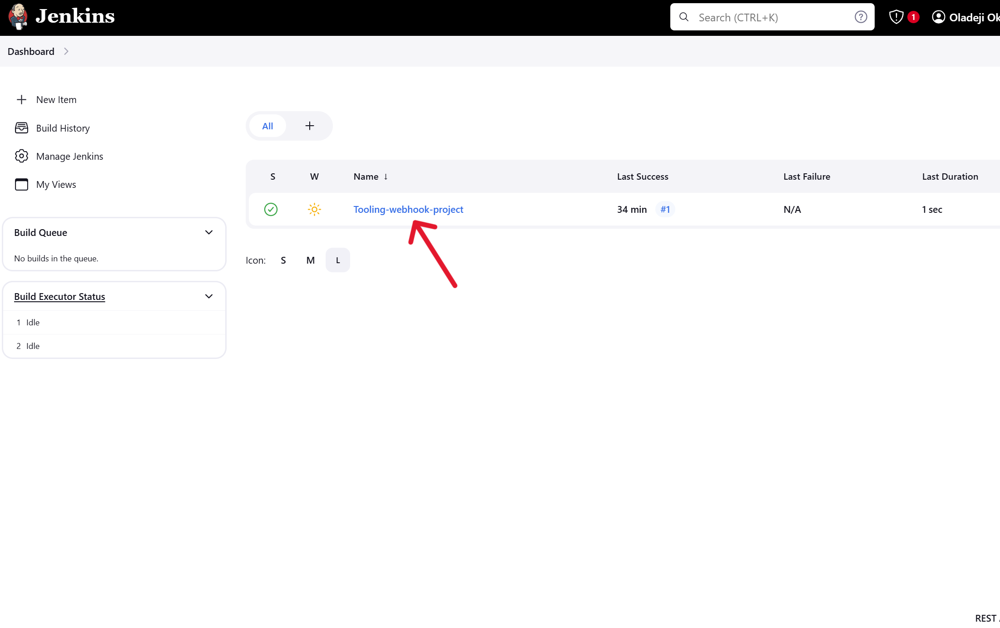
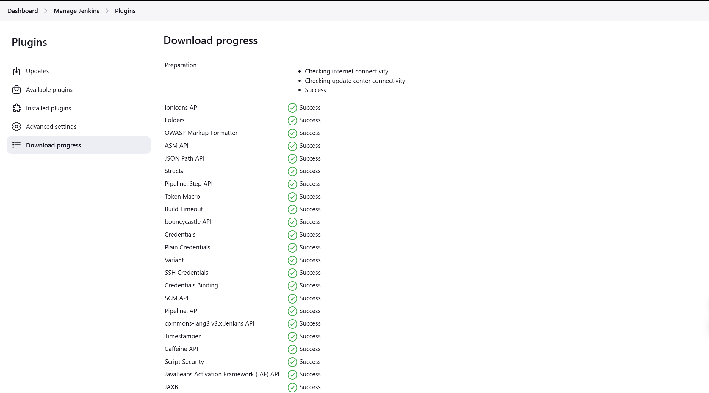

# TOOLING WEBSITE DEPLOYMENT AUTOMATION WITH CONTINUOUS INTEGRATION USING JENKINS

## OBJECTIVE:
The objective of this project is to implement our first Continous Integration solution to automate the DevOps Tooling website deployment (from Project 10), using Jenkins CI. We will enhance the architecture prepared in Project 10 by adding a Jenkins server, configure a job to automatically deploy source codes changes from Git to NFS server.

## INTRODUCTION

DevOps is about Agility, and speedy release of software and web solutions. One of the ways to guarantee fast and repeatable deployments is Automation of routine tasks.
In this project we are going to start automating part of our routine tasks with a free and open source automation server - Jenkins. It is one of the most popular CI/CD tools, it was created by a former Sun Microsystems developer Kohsuke Kawaguchi and the project originally had a named "Hudson".
Acording to Circle CI, Continuous integration (CI) is a software development strategy that increases the speed of development while ensuring the quality of the code that teams deploy. Developers continually commit code in small increments (at least daily, or even several times a day), which is then automatically built and tested before it is merged with the shared repository.
In this project, we are going to utilize Jenkins CI capabilities to make sure that every change made to the source code in GitHub https://github.com/Oladeji-Okuns/tooling will be automatically updated to the Tooling Website.

### WHAT IS CONTINUOUS INTEGRATION AND CONTINUOUS DELIVERY (CI/CD)?
Continuous Integration (CI) and Continuous Delivery (CD) are essential practices in software development that enhance efficiency and reliability. Jenkins, an open-source automation server, plays a crucial role in facilitating CI/CD by automating various stages of the software development lifecycle.

### WHAT IS JENKINS?

Jenkins is an open-source automation server that facilitates Continuous Integration (CI) and Continuous Delivery (CD) in software development. It allows developers to automate the building, testing, and deployment of applications, streamlining the software development process. Jenkins supports a wide range of plugins that enhance its functionality, enabling integration with various tools and services. This flexibility makes it a popular choice for managing complex software projects, allowing teams to deliver high-quality software more efficiently and reliably.

In the previous project (DevOps Tooling Website), we established a 3-Tier Web Application architecture featuring a Network File System/Storage (NFS) that served as a file server for three web servers. Additionally, we provisioned a database to support these web servers and deployed a web application sourced from a GitHub repository.

In this current project, we will implement a Jenkins server to automate the deployment process of the same application. This automation will trigger deployments whenever developers make changes to the source code, whether by adding new features or fixing bugs. The update architecture should then look something like this below, at the end of this project.

## **STEP 1 - INSTALL JENKINS SERVER:**

### **1. Creating AWS EC2 Instance based on Ubuntu Server 22.04 and naming it "Jenkins":**

We will install Jenkins on an EC2 instance that is running Ubuntu Server 22.04. I will be either be using the T2.micro (but with adjustments to the memory) or the T2.small instance type instead of the T2.micro. This is because the T2.micro may start lagging or hanging based on experience from past projects. For this reason, it may become quite slow depending on the Jenkins tasks it is handling, unless the memory issue is handled. 
So to get this done, first, we will provision the EC2 instance and then SSH into the server.

##### Resolving T2.micro low memory issue before installations:

Due to the low memory availability of the EC2 instance, it is important to perform the following below, to avoid the instance having hanging issues during installations:

To resolve this issue, we do the following:

a. **Create Swap Space:**

We create a swap space by doing the following steps:

- **Create a 1GB swap file**

    sudo fallocate -l 1G /swapfile

b. **Set the correct permissions**

    sudo chmod 600 /swapfile

c. **Set up the swap area**

    sudo mkswap /swapfile

d. **Enable the swap file**

    sudo swapon /swapfile

**Verify Swapfile:** Using the command `free -h`

e. **Make Swap Space Permanent:**

To ensure the swap space is available after a reboot, we will add it to /etc/fstab using the command below:

    echo '/swapfile swap swap defaults 0 0' | sudo tee -a /etc/fstab

 

### **2. Installing JDK:**

Once in the Linux console, we will execute the following commands to install Jenkins and its dependencies.  
**NOTE:** Java is a key prerequisite for installing Jenkins.

    sudo apt update -y
    sudo apt install openjdk-17-jdk

Then, we confirm the java is installed using below command

    #Confirm Java installation
    java --version

### **3. Installing Jenkins:**

This is going to be done by following the procedure or instructions given in the [**official Jenkins documentation**](https://www.jenkins.io/doc/book/installing/linux/#debianubuntu).

    sudo wget -O /usr/share/keyrings/jenkins-keyring.asc \
    https://pkg.jenkins.io/debian-stable/jenkins.io-2023.key
    echo "deb [signed-by=/usr/share/keyrings/jenkins-keyring.asc]" \
    https://pkg.jenkins.io/debian-stable binary/ | sudo tee \
    /etc/apt/sources.list.d/jenkins.list > /dev/null
    
    sudo apt-get update
    sudo apt-get install jenkins

These sets of commands or information above are specific for Debian/Ubuntu machines and were gotten from [**wwww.Jenkins.io**](https://www.jenkins.io/doc/book/installing/linux/#debianubuntu).

**Confirming that Jenkins is installed:**

### **4. Setting the Inbound rule:**

By default Jenkins server uses TCP port 8080, so we will open it by creating a new Inbound Rule in our EC2 instance's Security Group, as shown below:

### **5. Performing initial Jenkins setup:**

From our browser, we will access http://<Jenkins-Server-Public-IP-Address-or-Public-DNS-Name>:8080, and in this case, our Jenkins Server's public IP address is `34.254.160.61`. Therefore, we will be typing `http://34.254.160.61:8080` into our web browser.

### **6. Obtaining password for first login attempt:**

We will be prompted to provide a default admin password for our initial login, and to get it, we will need to retrieve the passowrd from our server, using the command below:

    sudo cat /var/lib/jenkins/secrets/initialAdminPassword

Obtain the password and enter it into the the password box.

### **7. Choosing the plugins to install:**

Next, we will be asked to choose which plugings we intend to install. In this case, we will choose **`Install suggested plugins`**.

Once the plugin is installed, we will see a page that requests us to create our **First Admin User** and we will need to do this so as to set up the admin account. Once we create our user/admin account, it is important to take note of the username and password we created, as we will need them for future logins to Jenkins.

After the account creation, the following page will display the Jenkins URL, an in this case it is shown as below:

**NOTE:** Keep in mind that the the URL shown here is the EC2 public address and it may change, but go ahead and save your settings to complete the setup.

## **STEP 2 - CONFIGURE JENKINS TO RETRIEVE SOURCE CODES FROM GITHUB USING WEBHOOKS:**

In this section, we will discover how to set up a basic Jenkins job (the terms job and project can be used interchangeably). This job will be activated by GitHub **webhooks** and will perform a build task to pull code from GitHub and save it on the Jenkins server.

    A webhook is a way to enhance or change the functionality of a web page or application through custom callbacks. These callbacks can be managed and modified by third-party users who are not necessarily connected to the original site or application.

In GitHub, webhooks allow repositories to notify external systems about events such as pushes, pull requests, and issues. They enable automatic actions by sending an HTTP POST payload to a specified URL (like a Jenkins server) when relevant events occur, eliminating the need for manual polling. This means Jenkins can be configured to automatically build code whenever a developer commits changes to the repository. Now, let’s proceed with configuring webhooks in GitHub.

### FORK THE TOOLING REPOSITORY FROM DAREY.IO:

First, we will fork the tooling solution from [Darey.io-tooling-repository](https://github.com/darey-io/tooling), by clicking on the fork button to fork the repository, and on the following page, ensure to **uncheck** the portion that says "Copy the `master` branch only. This is to ensure that all the branches including the master branch are copied. Do this as shown below:  
**NOTE:** Ensure you are also signed in to your github account in another window beside the `[Darey.io-tooling-repository]`, if not, there would be difficulty in forking the repository since your own repository will not be available to be forked to. 

### 1. ENABLING WEBHOOKS IN OUR GITHUB REPOSITORY SETTINGS:

Next, we will enable webhooks in our GitHub repository settings by heading over to the forked repository in our GitHub account. Once there, we will look for the settings option in the top menu, and then choose `WebHooks` from the menu on the left side of the page. Then, we click on **`Add webhook`**.  
On the Webhook page, we will input our Jenkins server URL followed by **`github-webhook/`** in the **payload URL** section, and choose **`application/json`** for the **content-type**. See below results for these steps:

**NOTE:** The public IP address you put into the `payload-URL` will not be fixed and will change, especially if you do not have a fixed public IP address or if you don't have an **`elastic IP address`** as in the case of AWS EC2 instances.

### 2. CONNECTING JENKINS TO GITHUB AND CREATING A FREESTYLE PROJECT:

In configuration of our Jenkins freestyle project, we choose Git repository, provide the link to your Tooling GitHub repository and credentials (user/password) so Jenkins could access files in the repository. The credentials is necessary if our github repository is not `public` but `private`. To do this, we follow the steps or instructions below:

**Creating the Freestyle Project:**

To create a freestyle project, we will need to head over to the Jenkins console page and click on **`+ New Item`** and select **`Freestyle project`**, while choosing any name of your preference, and then clicking ok.  Then, we go back to our tooling repository in Github to copy the URL of our tooling repository.

 

We head over to our tooling repository in github and connect our github account to jenkins by copying the **`HTTP URL`** of our forked `tooling` repository, and pasting it into the `Repository URL` field under the **`Source Code Management`** section in our Jenkins console,  as shown below:

    Take note to ensure you select "Git ?" option under `Source Code Management`. In the "Credentials" section, leave it blank and do not provide any credentials since this github repository entered is hosted using a public access, but if your github is having a private access setting, then you will need to provide the credentials needed to allow access to Jenkins.

**Save the configuration:**

After doing all these above, just click on `save`.

**Building the code:**

On the next page after clicking save, you should click on `Build Now`. For now, we can only do it manually. If we have configured everything correctly, the build will be successfull and we will see it under `#1`

As earlier said, once the job is built, we'll see build number **`#1`** on the lower left side of the page. A green indicator means success, while red indicates failure. Click on build #1, then select "Console Output" by clicking on the green tick sign or indicator beside the `#1`, to view the results, which should resemble the image below:

We can open the build and check in "Console Output" if it has run successfully as shown below:

With this result we have gotten above, we have just successfully made our very first **Jenkins build** and our Jenkins is also successfully connected to the GitHub repository, but this build does not produce anything and it runs only when we trigger it manually. Hence, we will need to fix it.

### 3. CONFIGURING THE JOB/PROJECT WE CREATED TO BE TRIGGERED TO BUILD AUTOMATICALLY AS CHANGES OCCUR IN OUR TOOLING REPOSITORY:

In this section, we will configure triggering of the job from GitHub webhook. We have to configure our job/project to build automatically whenever there is a change to our tooling repository. We can do this by doing the following:

- First, we head back or navigate to the Jenkins console dashboard and click on the job we created.

- Next, we will click on **`Configure`** on the left hand side of the page. When the page comes up, scroll down to the **`Build Triggers`**  and click on **`GitHub hook trigger for GITScm polling ?`**

 

**Configure "Post-build Actions" to archive all the files:** 

    Files resulted from a build are called "artifacts".  

Now, we scroll down to the **`Post-build Actions`** section on the same page. Click the dropdown arrow and choose **`Archive the artifacts`**. In the provided text box, enter `**` and then click **`Save`**.

**TESTING CONFIGURATION BY MAKING CHANGES TO OUR CODE:**

Now, let’s modify our source code, commit the changes, and observe the job automatically build the code from the GitHub repository as soon as it receives a notification of the changes. To do this, we will execute the following steps:

- First we need to pull/clone the tooling repository to any computer (either oru local computer or Jenkins server) to enable us make changes to the repository. 

**NOTE:** To clone the repository, do the following:

**Open GitHub:** Go to GitHub account or log in to your account if you haven't.

**Navigate to the Repository:** Find and open the Tooling repository you want to clone.

**Copy the URL:**

Do this by click the green "Code" button.
Then, copy the URL provided (either HTTPS or SSH, depending on your setup).

 

**Open Terminal or Command Prompt:** On your local machine or Jenkins server, open your terminal (Linux/Mac) or Command Prompt (Windows).

**Use the Git Clone Command:** Type the following command, replacing <repository-url> with the URL you copied:

        git clone <repository-url>

**Press Enter:** This will clone the repository to your current directory.

 

- **Cloning the repository:**

After cloning the repository, we navigate to the HTML folder and create a new HTML file, which I named `jenkins-job.html`. 

- **Creating new html file:**

We open the html file and enter the following content or information:

    <!DOCTYPE html>
    <html lang="en">
    <head>
        <meta charset="UTF-8">
        <meta name="viewport" content="width=device-width, initial-scale=1.0">
        <title>Jenkins Build Test</title>
        
    </head>
    <body>
        <h1>Testing My First Jenkins CI/CD Build</h1>
        
This is a simple HTML page to confirm that the build was successful.

    </body>
    </html>

- **Committing and Pushing:**

Next, we commit and push the changes we just made (new html file created) to the remote repository.

Now we, have successfully committed and pushed our changes to the github repository. 

    NOTE: We can also alternatively make changes to the repository by editing and effecting the changes (like creating a new file) directly in teh repository on github, and then save the changes.

- **Checking the results on our Jenkins Server:**

Now, let's access our Jenkins server. Without any additional actions, you'll notice that a new build will be launched automatically (by webhook), and you can see its results - artifacts, saved on Jenkins server.   
To view the time and other details of this build, select the job number `#2` and click on the "Polling Log" in the build details.

- **Locating the build jobs:**

It is important to know that by default, all the artifacts are stored locally on the Jenkins server. You can access them by going to **`/var/lib/jenkins/jobs`**. This directory contains all the jobs created, along with the files for each build.

We can dig deeper into the particular build by using the command:

    ls /var/lib/jenkins/jobs/Tooling-webhook-project/builds/<build_number>/archive/

We have now successfully configured an automated Jenkins job that receives files from GitHub by webhook trigger (this method is considered as 'push' because the changes are being 'pushed' and files transfer is initiated by GitHub). There are also other methods: trigger one job **(downstream)** from another **(upstream)**, poll GitHub periodically and others.

 

## **STEP 3 - CONFIGURE JENKINS TO COPY FILES TO NFS SERVER VIA SSH:**

Now, we have our artifacts saved locally on Jenkins server, the next step is to copy them to our NFS server to `/mnt/apps` directory.
Jenkins is a highly extensible application with over 1,400 available plugins. We will need to install the "Publish Over SSH" plugin. 

Keep in mind that automation is fundamental to our work in Jenkins. Previously, in the **`DevOps Tooling Website Solution`** project, we created a new file on our local machine and pushed it to GitHub. However, our web application is hosted on a web server located in a distant AWS data center. In this section, we will configure Jenkins to download the file we created and transfer it to the NFS server we set up in the last project for storing our web application files. Let’s get started.

### **1. INSTALL **`Publish Over SSH`** PLUGIN:**

First, we need to install the **`Publish Over SSH`** plugin in Jenkins. 

To do this, go to the dashboard, select **`Manage Jenkins`**, and then click on **`Manage Plugins`**. Under the `Available plugins` tab, search for the **`Publish Over SSH`** plugin.

 

### **2. CONFIGURING THE JOB/PROJECT TO COPY ARTIFACTS OVER TO THE NFS SERVER:**

After installing the plugin, return to the main dashboard and click on **`Manage Jenkins`** once more. This time, select **`System`** from the System Configuration menu.

Then, scroll down to the `Publish Over SSH` plugin configuration section or option, so that we can configure the plugin to be able to establish a connection to our NFS server automatically.

 

#### **1. Provide a private key (content of .pem file that you use to connect to NFS server via SSH/Putty):**

First, we must provide the security key used for logging into the NFS server via SSH. You can either copy and paste the contents of the key file into the key textbox or save a copy of that key file in a secure location on the Jenkins server. I prefer the second option, so let's proceed with that.

Navigate to the `/var/lib/jenkins` directory on your Jenkins server, create a directory named "keys," and save a copy of the key in that folder. Please see below.

#### **2. Now, return to Jenkins site and complete configuration by providing the path to the ssh key file:**

Enter the path below into the Jenkins page

    /var/lib/jenkins/keys/nfs-key.pem

    We can use this method above, OR we can also use this method below:

**Check for existing keys on Jenkins:**

To do this, go to your Jenkins server, and run the command below to check for existing SSH keys on your Jenkins server:

    ls -al ~/.ssh

Look for files like `id_rsa` and `id_rsa.pub`. If they exist, you can use the public key **(id_rsa.pub)**.

If the keys do not exist, then generate new ssh keys by doing the step below:

**Generate a New SSH Key:**

You can generate a new SSH key by running the command below:

    ssh-keygen -t rsa -b 4096 -C "your_email@example.com"
OR

    ssh-keygen -t rsa -b 2048 -f /var/lib/jenkins/.ssh/maka-key

Then press Enter to accept the default file location and follow the prompts.

 

**Next, copy the Public Key:**

After generating the key, copy the contents of the public key file using the command below:

    cat ~/.ssh/id_rsa.pub

This command will print out or display the ssh key on the terminal, so copy the key.

**Add the Public Key to the NFS Server:**

We need to add this public key to the `~/.ssh/authorized_keys` file on your NFS server. This allows the Jenkins server to authenticate with the NFS server without a password.

    This is another method of creating ssh keys for connection of the Jenkins server to the NFS server

- Next, click on `Add SSH Server` and enter the following details:

- **Name:** Enter NFS_Server.
- **Hostname:** Insert the private IP address of your NFS_SERVER.
- **Username:** Enter `ec2-user`, since we are using a RedHat Server for our NFS, the login username is `ec2-user`.
- **Remote Directory:** Specify `/mnt/apps`, which is the directory we created on our server to store files for the web application. Also our Web Servers use it as a mounting point to retrieve files from the NFS server.

Before saving and exiting the window, test the connection to ensure it is functioning properly.

Once we confirm that the connection is successful, we save our changes and return to the previously created job, then select `Configure`.  
Scroll down and add another post-build action. This time, choose `Send build artifacts over SSH`, with the NFS_Server automatically selected.

In the transfer set's Source file section, enter ** to copy all files from the Git repository to the previously specified location, /mnt/apps.

Finally, save the configuration and make any modification of your preference to the `jenkins-job.html` file created earlier.

      <!DOCTYPE html>
      <html lang="en">
      <head>
        <meta charset="UTF-8">
        <meta name="viewport" content="width=device-width, initial-scale=1.0">
        <title>CI/CD Deployment Dashboard</title>
        
    </head>
    <body>
          

              <h1>Welcome to Our CI/CD Deployment Dashboard</h1>
            

                  We are thrilled to announce the successful deployment of our application 
                directly from GitHub to our NFS server, streamlining our development process 
                without the need for manual server access.
              

            

                  Our Jenkins job is fully automated, triggering on every code change made 
                by developers, ensuring a seamless integration and delivery pipeline.
            

            

                  For more information on our CI/CD practices, visit our <a href="#">documentation</a>.
            

        

         

              &copy; 2024 Dej Technologies inc. All rights reserved.
        

    </body>
    </html>

   - Now, we can save, commit, and push the file to GitHub. Then, return to the Jenkins site and observe that a third build has started automatically.

